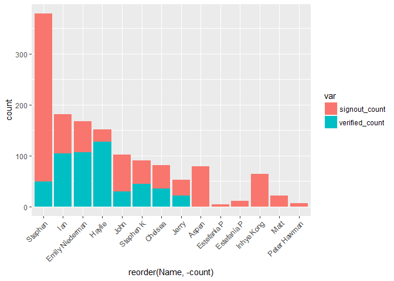
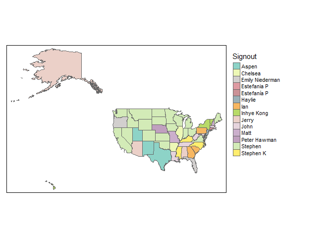
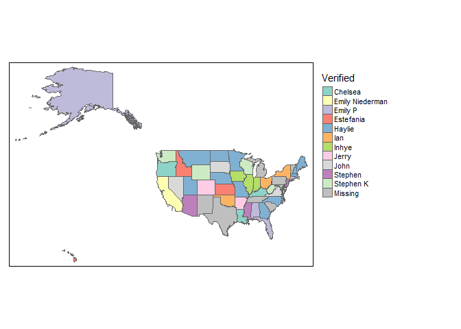

Digitization race
================

Digitizing the election data--mapping our work
----------------------------------------------

The googlesheets package provides an easy way to import data from Google Sheets. Let's pull in the list of folks who did the work of digitizing. First, we'll load the right packages

``` r
library(tidyverse)
library(googlesheets)
library(sf)
```

Then we'll load the data. You generally can only do this with sheets that you "own," but if you know the key of a public document you can access it that way. \[<http://www.coolheadtech.com/blog/use-data-from-other-google-spreadsheets>\] (Here's a link) to how to find that key. They key for our voting document is listed below. There's then a command to extract just the first five columns of the first tab.

``` r
sheet<-gs_key("1pr4d0LDWJcIJEfMLB2DEe9m3ruuBlZcb6NLUnRIP-kM")
```

    ## Sheet successfully identified: "districts_votes"

``` r
gs_ws_ls(sheet) #Tab names
```

    ## [1] "Overview"           "district1992_votes" "district2016_votes"

``` r
results<-sheet %>% 
  gs_read("Overview") %>%
  select(1:5)
```

    ## Accessing worksheet titled 'Overview'.

    ## Warning: Missing column names filled in: 'X6' [6], 'X8' [8]

    ## Parsed with column specification:
    ## cols(
    ##   State = col_character(),
    ##   Districts_1992 = col_integer(),
    ##   Districts_2016 = col_integer(),
    ##   Signout = col_character(),
    ##   Verified = col_character(),
    ##   X6 = col_character(),
    ##   `Instructions: "Sign out" a state by placing your name next to it.` = col_character(),
    ##   X8 = col_character()
    ## )

``` r
head(results) #Look at the first few rows
```

    ## # A tibble: 6 x 5
    ##        State Districts_1992 Districts_2016 Signout        Verified
    ##        <chr>          <int>          <int>   <chr>           <chr>
    ## 1    Alabama              7              7   Jerry         Emily P
    ## 2     Alaska              1              1   Jerry         Emily P
    ## 3    Arizona              6              9   Jerry         Stephen
    ## 4   Arkansas              4              4 Chelsea           Jerry
    ## 5 California             52             53 Stephen Emily Niederman
    ## 6   Colorado              6              7 Stephen           Jerry

From here, we can simply tally votes by each person.

``` r
tally_signout<-results %>%
  group_by(Signout) %>%
  summarise(signout_count=sum(Districts_1992)+sum(Districts_2016)) %>%
  rename("Name"=Signout)

tally_verified<-results %>%
  group_by(Verified) %>%
  summarise(verified_count=sum(Districts_1992)+sum(Districts_2016)) %>%
  rename("Name"=Verified)

tally_all<-left_join(tally_signout,tally_verified) %>%
  mutate(total_count<-signout_count+verified_count)
```

    ## Joining, by = "Name"

``` r
tally_all
```

    ## # A tibble: 14 x 4
    ##               Name signout_count verified_count
    ##              <chr>         <int>          <int>
    ##  1           Aspen            79             NA
    ##  2         Chelsea            46             35
    ##  3 Emily Niederman            60            107
    ##  4     Estefania P             4             NA
    ##  5     Estefanía P            11             NA
    ##  6          Haylie            25            127
    ##  7             Ian            77            104
    ##  8      Inhye Kong            64             NA
    ##  9           Jerry            31             21
    ## 10            John            72             30
    ## 11            Matt            21             NA
    ## 12    Peter Hawman             6             NA
    ## 13         Stephen           330             49
    ## 14       Stephen K            46             44
    ## # ... with 1 more variables: `total_count <- signout_count +
    ## #   verified_count` <int>

Visualize the results as bar graph.

``` r
tally_all_long<-gather(tally_all,signout_count:verified_count,key="var",value="count")

ggplot(tally_all_long,aes(x=reorder(Name,-count),y=count,fill=var)) +
  geom_bar(stat="identity") +
  theme(axis.text.x = element_text(angle = 45, hjust = 1))
```

    ## Warning: Removed 6 rows containing missing values (position_stack).



Lastly, we can join our count data to a state shapefile.

``` r
states<-st_read("https://github.com/jshannon75/geog4300/raw/master/Data/USstates.geojson") %>%
  rename("State"=STATE_NAME) %>%
  st_transform(5070)
```

    ## Reading layer `USstates' from data source `https://github.com/jshannon75/geog4300/raw/master/Data/USstates.geojson' using driver `GeoJSON'
    ## Simple feature collection with 51 features and 12 fields
    ## geometry type:  MULTIPOLYGON
    ## dimension:      XY
    ## bbox:           xmin: -178.2176 ymin: 18.92179 xmax: -66.96927 ymax: 71.40624
    ## epsg (SRID):    4326
    ## proj4string:    +proj=longlat +datum=WGS84 +no_defs

``` r
statecount<-left_join(states,results)
```

    ## Joining, by = "State"

    ## Warning: Column `State` joining factor and character vector, coercing into
    ## character vector

Here's our map of those who entered data:

``` r
library(tmap)

tm_shape(statecount)+
  tm_polygons("Signout")+
  tm_layout(legend.outside=TRUE)
```



Here's the map of those who verified that data:

``` r
tm_shape(statecount)+
  tm_polygons("Verified")+
  tm_layout(legend.outside=TRUE)
```


