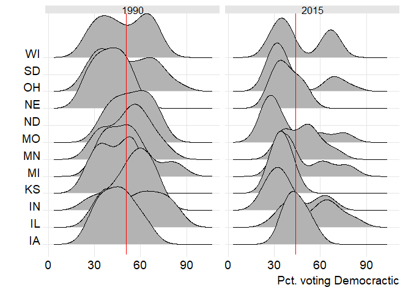
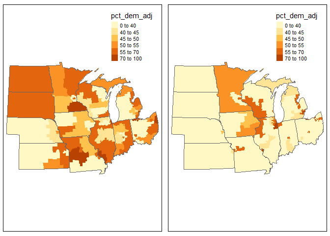
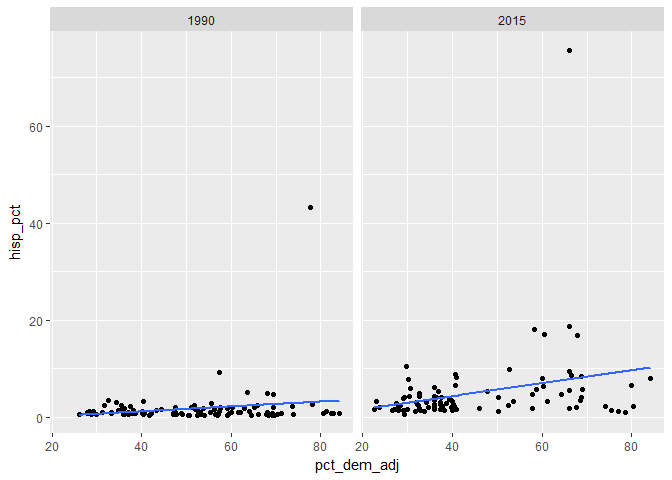
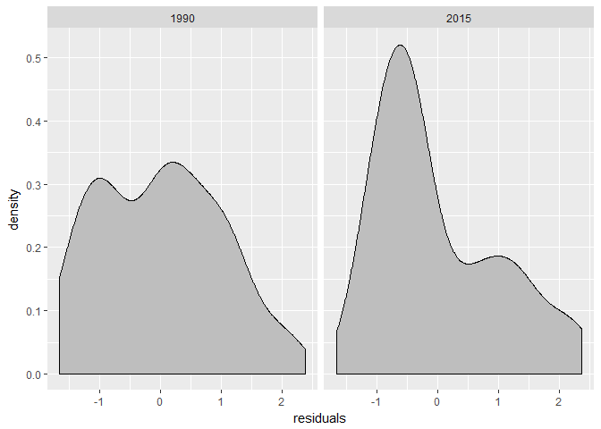
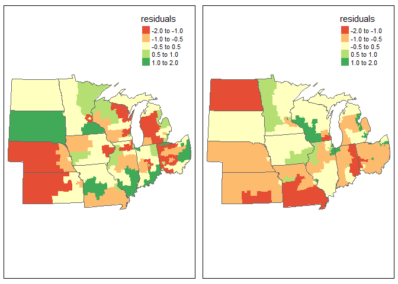

Final project
================

Overview
--------

In this final project, your team will analyze the relationship between three demographic variables and the congressional vote in the 1992 and 2016 elections in one of the four major census regions. Those three variables will be percentage of the population NOT classified as white, non-Hispanic, percentage with a bachelor's degree or higher, and median household income. In each time period, the district value for these variables is the median tract value from the 1990 decennial census and 2011-15 ACS.

Within your group, each person will choose one variable to analyze. You'll look at the statistical and spatial distribution of this variable by state and use regression to analyze the association between it and the House election in each year.

Together, your group will also create a "first difference" model for states in your region, understanding how changes in the district demographics were associated with changes in the states efficiency gap.

The data for this project includes two shapefiles and a csv file. You'll need to download the shapefiles to your computer and unzip: *insert link*. Create a new project in R and unzip this file to that new project folder. The csv can be loaded using the link below.

``` r
library(tidyverse)
library(sf)

proj_region="Midwest Region"

district_data<-read_csv("https://github.com/jshannon75/district_change/raw/master/districts_data_all.csv") %>%
  mutate(year=as.character(year))
```

This shape file includes political districts in both 1992 and 2016 (1990 and 2015 in the year field), a variety of demographic variables, and results for the U.S. House elections in both years. There's also some dummy variables for elections that were uncontested (uncon\_r and uncon\_d), elections with no vote totals (missing), and states with 2 or less districts (dist\_omit).

The three demographic variables you're interested in are % not classifed as white, non-hispanic (nonwht\_pct), median household income (medhhinc), and % with a BA degree or higher (badeg\_pct).

### Descriptive analysis

First, you should look at the statistical and spatial distribution of your specific variable. As an example, plotting the percent voting for the democratic candidate in the South Region on a ridge plot would look like this. (Note that you'll first need to install the ggridges package. Find more about it (<https://cran.r-project.org/web/packages/ggridges/vignettes/introduction.html>)\[in this vignette\]). We'll also add a line showing the median value across the region.

Before plotting these data, we will remove all districts with missing data, which have -99 as the vote total. We will also top and bottom code uncontested races, using the figure from Stephanopoulis and McGhee (2015) of 66% of the vote being Democractic in uncontested Democratic races and 36% of the vote being Democratic in uncontested Republican races.

``` r
library(ggridges)
districts_select<-district_data %>%
  filter(Region==proj_region) %>%
  group_by(year) %>%
  mutate(median_dem=mean(pct_dem),
         pct_dem_adj=ifelse(uncontest_r==1,66,ifelse(uncontest_d==1,36,pct_dem))) %>%
  filter(total_vote!=-99)

ggplot(districts_select,aes(x=pct_dem_adj,y=st_abbr))+
  geom_density_ridges(scale=3)+
  theme_ridges()+
  geom_vline(aes(xintercept = median_dem),col="red")+
  facet_wrap(~year)+
  xlab("Pct. voting Democractic")+
  ylab("")
```



You can also map the data by year using tmap, also filtering out districts with missing data. We will add in state boundaries as well from the shapes statefile, removing the border lines for individual districts.

``` r
library(tmap)

districts<-st_read("https://github.com/jshannon75/district_change/raw/master/districts_all.geojson",stringsAsFactors=FALSE) 
```

    ## Reading layer `districts_all' from data source `https://github.com/jshannon75/district_change/raw/master/districts_all.geojson' using driver `GeoJSON'
    ## Simple feature collection with 877 features and 2 fields
    ## geometry type:  MULTIPOLYGON
    ## dimension:      XY
    ## bbox:           xmin: -179.1489 ymin: -14.5487 xmax: 179.7785 ymax: 71.36516
    ## epsg (SRID):    4326
    ## proj4string:    +proj=longlat +datum=WGS84 +no_defs

``` r
districts_join<-left_join(districts,districts_select) %>%
  filter(st_abbr!="AK" & st_abbr!="HI")

states<-st_read("https://github.com/jshannon75/district_change/raw/master/USstates_48.geojson") %>% filter(Region==proj_region)
```

    ## Reading layer `USstates_48' from data source `https://github.com/jshannon75/district_change/raw/master/USstates_48.geojson' using driver `GeoJSON'
    ## Simple feature collection with 48 features and 8 fields
    ## geometry type:  MULTIPOLYGON
    ## dimension:      XY
    ## bbox:           xmin: -124.7328 ymin: 24.95638 xmax: -66.96927 ymax: 49.37173
    ## epsg (SRID):    4326
    ## proj4string:    +proj=longlat +datum=WGS84 +no_defs

``` r
districts_1990<-districts_join %>% filter(year=="1990" & Region==proj_region)
districts_2015<-districts_join %>% filter(year=="2015" & Region==proj_region)

map1<-tm_shape(districts_1990,projection="2163") +
  tm_polygons("pct_dem_adj", breaks=c(0,40,45,50,55,70,100),border.alpha=0)+
  tm_shape(states) + tm_borders()

map2<-tm_shape(districts_2015,projection="2163") +
  tm_polygons("pct_dem_adj", breaks=c(0,40,45,50,55,70,100),border.alpha=0)+
  tm_shape(states) + tm_borders()

tmap_arrange(map1,map2)
```



### Modeling

Now that we've done some descriptive analysis, let's model the relationship between our variable and the democratic vote, adjusted to account for uncontested races.

``` r
model1990<-lm(pct_dem_adj~hisp_pct,data=districts_1990)
summary(model1990)
```

    ## 
    ## Call:
    ## lm(formula = pct_dem_adj ~ hisp_pct, data = districts_1990)
    ## 
    ## Residuals:
    ##     Min      1Q  Median      3Q     Max 
    ## -24.928 -13.298   0.181  11.089  32.969 
    ## 
    ## Coefficients:
    ##             Estimate Std. Error t value Pr(>|t|)    
    ## (Intercept)  50.6757     1.5862  31.948   <2e-16 ***
    ## hisp_pct      0.6480     0.3469   1.868   0.0646 .  
    ## ---
    ## Signif. codes:  0 '***' 0.001 '**' 0.01 '*' 0.05 '.' 0.1 ' ' 1
    ## 
    ## Residual standard error: 15.09 on 103 degrees of freedom
    ## Multiple R-squared:  0.03278,    Adjusted R-squared:  0.02339 
    ## F-statistic:  3.49 on 1 and 103 DF,  p-value: 0.06457

``` r
model2015<-lm(pct_dem_adj~hisp_pct,data=districts_2015)
summary(model2015)
```

    ## 
    ## Call:
    ## lm(formula = pct_dem_adj ~ hisp_pct, data = districts_2015)
    ## 
    ## Residuals:
    ##     Min      1Q  Median      3Q     Max 
    ## -21.238 -11.800  -6.015  13.040  37.477 
    ## 
    ## Coefficients:
    ##             Estimate Std. Error t value Pr(>|t|)    
    ## (Intercept)  42.5517     1.9109  22.268  < 2e-16 ***
    ## hisp_pct      0.5324     0.1997   2.666  0.00907 ** 
    ## ---
    ## Signif. codes:  0 '***' 0.001 '**' 0.01 '*' 0.05 '.' 0.1 ' ' 1
    ## 
    ## Residual standard error: 15.85 on 92 degrees of freedom
    ## Multiple R-squared:  0.07171,    Adjusted R-squared:  0.06162 
    ## F-statistic: 7.107 on 1 and 92 DF,  p-value: 0.009068

We can also plot each model with ggplot.

``` r
ggplot(districts_select,aes(x=pct_dem_adj,y=hisp_pct)) + 
  geom_point()+
  geom_smooth(method = "lm", se = FALSE)+
  facet_wrap(~year)
```



We can map out the location of residuals to better understand the model results. To help interpret the residual values, we will use the scale function to convert them to a z score.

``` r
districts_1990$residuals<-as.numeric(scale(residuals(model1990)))
districts_2015$residuals<-as.numeric(scale(residuals(model2015)))
districts_combine<-rbind(districts_1990,districts_2015)

ggplot(districts_combine,aes(x=residuals))+
  geom_density(fill="grey")+
  facet_wrap(~year)
```



``` r
map3<-tm_shape(districts_1990,projection="2163") +
  tm_polygons("residuals", breaks=c(-2,-1,-0.5,0.5,1,2),border.alpha=0)+
  tm_shape(states) + tm_borders()

map4<-tm_shape(districts_2015,projection="2163") +
  tm_polygons("residuals", breaks=c(-2,-1,-0.5,0.5,1,2),border.alpha=0)+
  tm_shape(states) + tm_borders()

tmap_arrange(map3,map4)
```



### List of requirements for the individual document (30 points total)

1.  **Descriptive analysis:** Ridge plots and maps of your variable, along with your interpretation. You are free to calculate additional analysis (e.g., state median values) as needed. (10 points)
2.  **Models:** Linear regression models with a scatterplot and fit line as shown above. Interpret the strength of your models based on the regression output, the scatterplot, and any needed additional information you can get from the data frame itself. Focus on the magnitude, direction, and significance of your model output. (10 points)
3.  **Diagnostics:** Density plots and maps of model residuals as shown above, along with your interpretation of the output (10 points).

### Group chapter: combined variables

In addition to your individual chapter, you should also write a final chapter as a group. That chapter should do two things.

First, you should combine your individuals models and create one final model with all your variables included, also using the stargazer package. Your final table should have eight models--the three indivdual models for each year and an additional model in each year with all three variables. You should interpret the result of each combined model, noting changes in the model coefficients compared to the original model and changes in measures showing overall model strength.

Second, you will create a *first differences model* at the state level with the efficency gap as your dependent variable. To do so, you'll need to calculate the mean values for each variable in each year and then calculate change from each year. Load this file with the state efficiency gaps based on our house data. A negative value shows an efficiency gap in favor of Democrats. A positive value favors Republicans.

``` r
states_effgap<-st_read("https://github.com/jshannon75/district_change/raw/master/USstates_48_effgap.geojson")
```

    ## Reading layer `USstates_48_effgap' from data source `https://github.com/jshannon75/district_change/raw/master/USstates_48_effgap.geojson' using driver `GeoJSON'
    ## Simple feature collection with 76 features and 12 fields
    ## geometry type:  MULTIPOLYGON
    ## dimension:      XY
    ## bbox:           xmin: -124.7328 ymin: 24.95638 xmax: -69.91778 ymax: 49.37173
    ## epsg (SRID):    4326
    ## proj4string:    +proj=longlat +datum=WGS84 +no_defs

Then calculate mean values for your variables in each year at state level. Here's an example with the hisp\_pct variable, then join to the states dataset. This creates new variables showing the change between the 1992 and 2016 elections

``` r
district_data_mean<-district_data %>%
  group_by(year,st_abbr) %>%
  summarise(hisp_mean=mean(hisp_pct))

states_effgap_data<-left_join(states_effgap,district_data_mean) %>%
  select(st_abbr,year,hisp_mean,eff_gap) %>%
  gather(hisp_mean,eff_gap,key="var",value="value") %>%
  spread(year,value) %>%
  mutate(chg=`2015`-`1990`) %>%
  select(-`2015`,-`1990`) %>%
  spread(var,chg)
```

    ## Joining, by = c("st_abbr", "year")

    ## Warning: Column `st_abbr` joining factor and character vector, coercing
    ## into character vector

    ## Warning: Column `year` joining factor and character vector, coercing into
    ## character vector

You can then run a model with these variables.

``` r
fd_model<-lm(eff_gap~hisp_mean,data=states_effgap_data)
summary(fd_model)
```

    ## 
    ## Call:
    ## lm(formula = eff_gap ~ hisp_mean, data = states_effgap_data)
    ## 
    ## Residuals:
    ##      Min       1Q   Median       3Q      Max 
    ## -0.32757 -0.10857  0.00207  0.09293  0.34358 
    ## 
    ## Coefficients:
    ##              Estimate Std. Error t value Pr(>|t|)   
    ## (Intercept)  0.155560   0.045918   3.388  0.00172 **
    ## hisp_mean   -0.016536   0.007224  -2.289  0.02806 * 
    ## ---
    ## Signif. codes:  0 '***' 0.001 '**' 0.01 '*' 0.05 '.' 0.1 ' ' 1
    ## 
    ## Residual standard error: 0.1692 on 36 degrees of freedom
    ## Multiple R-squared:  0.127,  Adjusted R-squared:  0.1028 
    ## F-statistic: 5.239 on 1 and 36 DF,  p-value: 0.02806

Create a first difference model with your three variables as independent variables and efficency gap as the dependent variable. Interpret the results.

This final chapter will be graded out of 10 points, and this will be added to each individuals' grade assuming equal participation.
