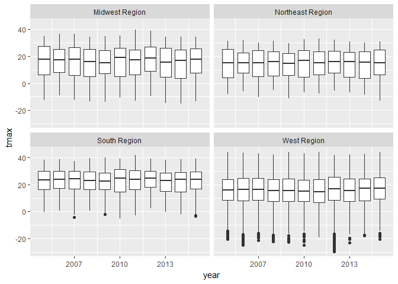
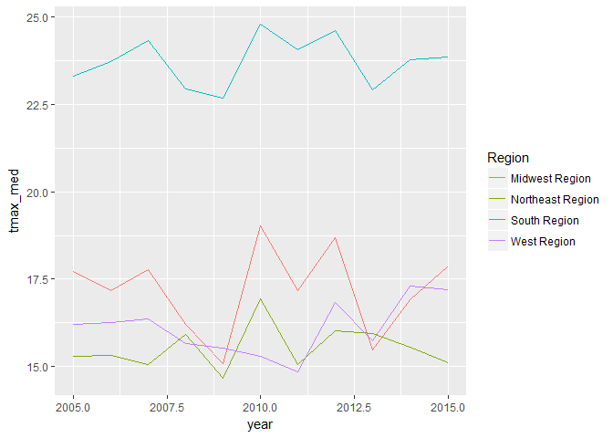
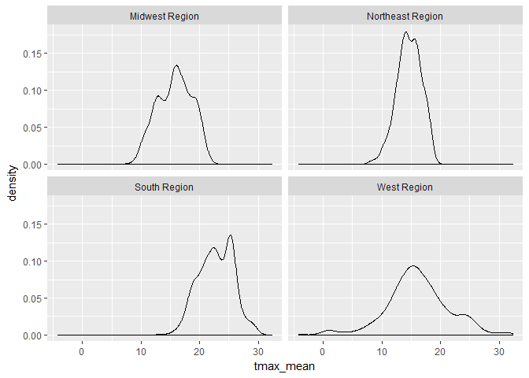

Geog4/6300: Lab 1
================

Loading data into R, data transformation, and summary statistics
----------------------------------------------------------------

**Due:** Monday, Sept. 18

**Value:** 30 points

**Overview:**

This lab is intended to assess your ability to use R to load data and to generate basic descriptive statistics. You'll be using monthly weather data from the Daymet climate database (<http://daymet.ornl.gov>) for all counties in the United States over a 10 year period (2005-2015). These data are available on the Github repo for our course. The following variables are provided:

-   gisjn\_cty: Code for joining to census data
-   year: Year of observation
-   month: Month of observation
-   dayl: Mean length of daylight (in seconds)
-   srad: Mean solar radiation per day
-   tmax: Mean maximum recorded temperature (Celsius)
-   tmin: Mean minimum recorded temperature (Celsius)
-   vap\_pres: Mean vapor pressure (indicative of humidity)
-   prcp: Total recorded prcpitation (mm)
-   cty\_name: Name of the county
-   state: state of the county
-   region: Census region (map: <https://www2.census.gov/geo/pdfs/maps-data/maps/reference/us_regdiv.pdf>)
-   division: Census division
-   lon: Longitude of the point
-   lat: Latitude of the point

These labs are meant to be done collaboratively, but your final submission should demonstrate your own original thought (don’t just copy your classmate’s work or turn in identical assignments). Your answers to the lab questions should be typed in the provided RMarkdown template and turned in using the Assignment Dropbox on the ELC site.

**Procedure:**

Load the tidyverse package and import the data from GitHub:

``` r
library(tidyverse)
Daymet_Cty_Summary_2005_2015 <- read_csv("https://github.com/jshannon75/geog4300/raw/master/Labs/Lab%201_%20Descriptive%20stats/Daymet_Cty_Summary_2005_2015.csv")
```

    ## Parsed with column specification:
    ## cols(
    ##   gisjn_cty = col_character(),
    ##   year = col_integer(),
    ##   month = col_character(),
    ##   dayl = col_double(),
    ##   srad = col_double(),
    ##   tmax = col_double(),
    ##   tmin = col_double(),
    ##   vap_pres = col_double(),
    ##   prcp = col_integer(),
    ##   CTY_NAME = col_character(),
    ##   State = col_character(),
    ##   Region = col_character(),
    ##   Division = col_character(),
    ##   Lon = col_double(),
    ##   Lat = col_double()
    ## )

After loading the file into R, closely examine each variable.

***Question 1 (4 points):** Provide an example of nominal, ordinal, interval, and ratio data within this dataset. Explain why each fits in the level of measurement you chose in a sentence or two . If you cannot find an example for one of these four data types (no nominal variables, for example), given an example of climate data that would fit this type.*

There are a lot of observations here, 413,820 to be exact. To get a better grasp on it, we can use group\_by and summarise in the tidyverse package. Here's an example.

``` r
Daymet_Cty_Summary_2005_2015 %>% 
  group_by(Region) %>% 
  summarise(mean_srad=mean(srad))
```

    ## # A tibble: 4 x 2
    ##             Region mean_srad
    ##              <chr>     <dbl>
    ## 1   Midwest Region  319.4705
    ## 2 Northeast Region  312.1818
    ## 3     South Region  344.1628
    ## 4      West Region  342.4914

This command returns the mean value of solar radiation received by counties in each census region during our study period. You could replace “mean” with “sd” to get a similar summary of standard deviation. You may want to change the new variable name ("mean\_srad") above as well.

Now try a VERY simple model of climate change. Let’s say that 100 years from now, temperatures in these cities will be warmer by exactly 2 degrees Celsius. You can create a new variable showing the projected new minimum temperatures. The command below uses the mutate function from the tidyverse to create a new variable (tmin\_new) with values two degrees higher than the old one (tmin). It then uses select to get just our variables of interest.

``` r
daymet_climatechg<-Daymet_Cty_Summary_2005_2015 %>% 
  mutate(tmin_new=tmin+2) %>% 
  select(tmin,tmin_new)
daymet_climatechg
```

    ## # A tibble: 413,820 x 2
    ##          tmin  tmin_new
    ##         <dbl>     <dbl>
    ##  1  9.4666667 11.466667
    ##  2 22.0322581 24.032258
    ##  3  0.1774194  2.177419
    ##  4  5.4107143  7.410714
    ##  5  3.5483871  5.548387
    ##  6 22.0483871 24.048387
    ##  7 19.7500000 21.750000
    ##  8  5.5645161  7.564516
    ##  9 13.6129032 15.612903
    ## 10  6.8666667  8.866667
    ## # ... with 413,810 more rows

***Question 2 (3 points):** Use the commands shown above, calculate the mean and standard deviation for the original minimum temperature variable and a new one two degrees higher. How do these compare? Explain any similarities or differences you find.*

You can also create a table showing summary statistics for each variable. For example, if you wanted to know the mean, median, standard deviation coefficient of variation (CV), and IQR for the tmax variable, you can use group\_by and summarise:

``` r
daymet_summarystats<-Daymet_Cty_Summary_2005_2015 %>% 
  group_by(Region) %>%
  summarise(tmax_mean=mean(tmax),
            tmax_med=median(tmax),
            tmax_sd=sd(tmax),
            tmax_cv=tmax_sd/tmax_mean,
            tmax_iqr=IQR(tmax))
daymet_summarystats
```

    ## # A tibble: 4 x 6
    ##             Region tmax_mean tmax_med   tmax_sd   tmax_cv tmax_iqr
    ##              <chr>     <dbl>    <dbl>     <dbl>     <dbl>    <dbl>
    ## 1   Midwest Region  15.74354 17.26667 11.236738 0.7137364 19.37500
    ## 2 Northeast Region  14.64101 15.51613  9.991482 0.6824312 18.10000
    ## 3     South Region  22.78074 23.75806  8.338996 0.3660547 13.48387
    ## 4      West Region  16.11225 16.12500 10.504552 0.6519604 16.38602

***Question 3 (6 points):** Adapting the command above, create a table that shows the mean, median, standard deviation, CV, and IQR for the prcp variable. Based on this table, are these data skewed or roughly normal in distribution? Which measures of central tendency and dispersion should you use as a result?*

We can also look at variables over time. For instance, we can use facet\_wrap with boxplot to see how the distribution of maximum temperatures varies by region:

``` r
ggplot(Daymet_Cty_Summary_2005_2015, aes(x=year,y=tmax,group=year))+
  geom_boxplot()+
  facet_wrap(~Region)
```



Suppose we are just interested in the median. We would then want to create a dataset where the value of tmax is summarized by each year for each census division. You can do so using the combination of group\_by and summarise, similar to the command above.

``` r
daymet_summary_region<-Daymet_Cty_Summary_2005_2015 %>% 
  group_by(Region, year) %>% 
  summarise(tmax_med=median(tmax))
daymet_summary_region
```

    ## # A tibble: 44 x 3
    ## # Groups:   Region [?]
    ##            Region  year tmax_med
    ##             <chr> <int>    <dbl>
    ##  1 Midwest Region  2005 17.70968
    ##  2 Midwest Region  2006 17.18333
    ##  3 Midwest Region  2007 17.77876
    ##  4 Midwest Region  2008 16.20000
    ##  5 Midwest Region  2009 15.10000
    ##  6 Midwest Region  2010 19.03333
    ##  7 Midwest Region  2011 17.16129
    ##  8 Midwest Region  2012 18.69677
    ##  9 Midwest Region  2013 15.48333
    ## 10 Midwest Region  2014 16.90000
    ## # ... with 34 more rows

Notice how much smaller this dataset is already. Plot it out using ggplot:

``` r
ggplot(daymet_summary_region, aes(x=year,y=tmax_med, group=Region, colour=Region))+
  geom_line()
```



Suppose you wanted to see the distribution of the average maximum temperatures of all counties by region. You can summarise that in this way:

``` r
daymet_summary_county <- Daymet_Cty_Summary_2005_2015 %>% 
  group_by(Region,gisjn_cty) %>% 
  summarise(tmax_mean=mean(tmax))
daymet_summary_county
```

    ## # A tibble: 3,135 x 3
    ## # Groups:   Region [?]
    ##            Region gisjn_cty tmax_mean
    ##             <chr>     <chr>     <dbl>
    ##  1 Midwest Region    G17001  17.10559
    ##  2 Midwest Region    G17003  20.22032
    ##  3 Midwest Region    G17005  18.53646
    ##  4 Midwest Region    G17007  14.33828
    ##  5 Midwest Region    G17009  17.15056
    ##  6 Midwest Region    G17011  15.60495
    ##  7 Midwest Region    G17013  18.11706
    ##  8 Midwest Region    G17015  14.95555
    ##  9 Midwest Region    G17017  17.20915
    ## 10 Midwest Region    G17019  16.70861
    ## # ... with 3,125 more rows

You can then create a density plot of these mean values by region, again using facet\_wrap to separate them.

``` r
ggplot(daymet_summary_county, aes(x=tmax_mean))+geom_density()+facet_wrap(~Region)
```



We can use the filter command to further specify things, selecting only a single month for comparison over this timeframe.

``` r
daymet_july<-Daymet_Cty_Summary_2005_2015 %>% 
     filter(month=="July")
daymet_july
```

    ## # A tibble: 34,485 x 15
    ##    gisjn_cty  year month     dayl     srad     tmax     tmin vap_pres
    ##        <chr> <int> <chr>    <dbl>    <dbl>    <dbl>    <dbl>    <dbl>
    ##  1    G01001  2005  July 50045.13 350.2452 31.37097 22.04839 2649.032
    ##  2    G01001  2006  July 50045.13 386.4774 34.29032 21.54839 2567.742
    ##  3    G01001  2007  July 50045.13 378.6323 31.96774 21.00000 2122.581
    ##  4    G01001  2008  July 50045.13 387.9226 33.01613 20.53226 2427.097
    ##  5    G01001  2009  July 50045.13 370.8903 31.45161 20.03226 2352.258
    ##  6    G01001  2010  July 50045.13 382.7613 34.37097 22.40323 2710.968
    ##  7    G01001  2011  July 50045.13 349.2129 33.25806 21.88710 2600.000
    ##  8    G01001  2012  July 50045.13 370.0645 33.83871 21.51613 2565.161
    ##  9    G01001  2013  July 50045.13 337.9613 30.04839 20.80645 2454.194
    ## 10    G01001  2014  July 50045.13 398.9677 31.70968 20.29032 2393.548
    ## # ... with 34,475 more rows, and 7 more variables: prcp <int>,
    ## #   CTY_NAME <chr>, State <chr>, Region <chr>, Division <chr>, Lon <dbl>,
    ## #   Lat <dbl>

***Question 4 (3 points):** Adapt the above command to create a new data frame, changing “July” to a month of your choosing and using tmin (rather than tmax) as your variable of interest. You'll need two commands--one to create the data frame and another to "call" it, just like you see above.*

***Question 5 (9 points):** With your subsetted data, create the three graphs below using the graphs listed earlier as a guide. You may need to further transform the data in order to make each graph.*

-   *Create a box plot showing the value distribution for tmin in each of the four regions over all 10 years.*
-   *Create a line chart showing the median value of tmin for each region over all 10 years.*
-   *Create a faceted density plot like the one above showing the distribution of median minimum temperatures for all regions.*

Don’t worry about things like column names or customization for now—these will be addressed in lab 2.

***Question 6 (5 points):** Each of the three graphics you created above tells a particular story about the data. Summarize what you think we learn about regional differences or trends from each graphic. Concentrate on the "headlines" from each one, using details to illustrate your points and also noting exceptions to the trend. Which do you think tells the most compelling story?*
