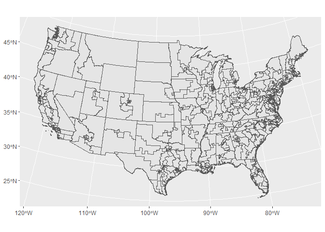
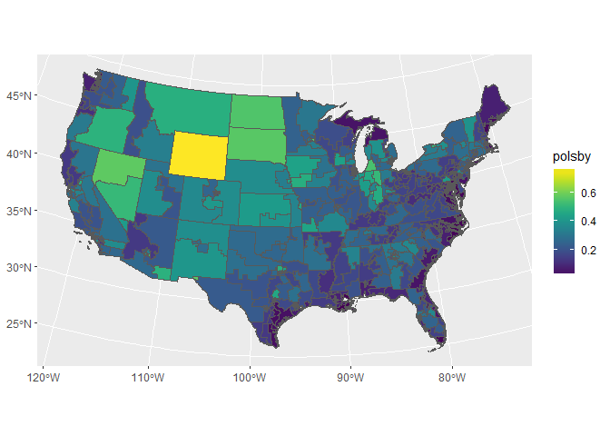

Geog 4/6300: Lab 5
================

Correlation and regression
--------------------------

**Due:** Wednesday, Nov. 29

**Value:** 30 points

**Overview:** This lab introduces you to NHGIS and the type of analysis you'll be doing in your final project this semester. You'll also be applying techniques for correlation and OLS regression. Think of this as the first part of your final project.

### Part 1: Importing data and descriptive statistics

For this lab, we'll be looking at American Community Survey data for congressional precincts from the 2011-2015 pooled sample. You can access this and pretty much all census data through the IPUMS NHGIS website: <https://www.nhgis.org>. For this lab, the data's already been downloaded for you. The boundary file has also been simplified to speed plotting of the data.

There's three file for you to use in this analysis: [a codebook with metadata](), a csv file, and a GIS boundary file in geojson format. You can load the two files using the following commands. You'll also need to load the development version of ggplot for plotting spatial data.

``` r
devtools::install_github("tidyverse/ggplot2") #Allows mapping of sf objects
```

    ## Skipping install of 'ggplot2' from a github remote, the SHA1 (ffb40f3f) has not changed since last install.
    ##   Use `force = TRUE` to force installation

``` r
library(sf)
```

    ## Linking to GEOS 3.6.1, GDAL 2.2.0, proj.4 4.9.3

``` r
library(tidyverse)
```

    ## Loading tidyverse: ggplot2
    ## Loading tidyverse: tibble
    ## Loading tidyverse: tidyr
    ## Loading tidyverse: readr
    ## Loading tidyverse: purrr
    ## Loading tidyverse: dplyr

    ## Conflicts with tidy packages ----------------------------------------------

    ## filter(): dplyr, stats
    ## lag():    dplyr, stats

``` r
census_data<-read_csv("nhgis0052_ds215_20155_2015_cd113th-114th.csv")
```

    ## Parsed with column specification:
    ## cols(
    ##   .default = col_integer(),
    ##   GISJOIN = col_character(),
    ##   YEAR = col_character(),
    ##   REGIONA = col_character(),
    ##   DIVISIONA = col_character(),
    ##   STATE = col_character(),
    ##   STATEA = col_character(),
    ##   COUNTYA = col_character(),
    ##   COUSUBA = col_character(),
    ##   PLACEA = col_character(),
    ##   TRACTA = col_character(),
    ##   BLKGRPA = col_character(),
    ##   CONCITA = col_character(),
    ##   AIANHHA = col_character(),
    ##   RES_ONLYA = col_character(),
    ##   TRUSTA = col_character(),
    ##   AITSCEA = col_character(),
    ##   ANRCA = col_character(),
    ##   CBSAA = col_character(),
    ##   CSAA = col_character(),
    ##   METDIVA = col_character()
    ##   # ... with 17 more columns
    ## )

    ## See spec(...) for full column specifications.

``` r
census_shape<-st_read("districts_2012.geojson")
```

    ## Reading layer `districts2012' from data source `C:\Users\jshannon\Dropbox\Jschool\Teaching\Courses\Geog4300_6300 Fall 17\Labs_old\Lab 5_ Correlation and regression\districts_2012.geojson' using driver `GeoJSON'
    ## Simple feature collection with 433 features and 20 fields
    ## geometry type:  MULTIPOLYGON
    ## dimension:      XY
    ## bbox:           xmin: -124.7536 ymin: 24.5231 xmax: -66.94983 ymax: 49.38436
    ## epsg (SRID):    4326
    ## proj4string:    +proj=longlat +datum=WGS84 +no_defs

The development version of ggplot allows you to map sf data. See how it works in this example. Notice that coord\_sf allows you to set a projection for the data (Albers equal area conic in this example, which has a crs number of 5070).

``` r
ggplot(census_shape) +
  geom_sf()+
  coord_sf(crs=st_crs(5070))
```



Working with the data file, select only the following variables needed for your analysis. Refer to the codebook document to find the variable names in the dataset:

-   Race: Total population, Non-Hispanic White, Non-Hispanic Black/African-American, and Hispanic or Latino
-   Poverty: Total population, Population at 200% or more of the poverty line

Now create rates from these data, using the raw counts and the total population. The mutate function should allow you to do this. You should end up with the following variables:

-   % non-Hispanic white
-   % non-Hispanic black
-   % Hispanic/Latino
-   % &lt; 200% of the poverty line

Create a summary of your new data, showing mean, median, standard deviation and IQR (see lab 1).

**Question 1 (2 points)** *List the code you used to create your new variables and call the resulting table.*

You can now use left\_join to connect your table with the geographic boundaries you imported in question 1. After doing so, you can plot each variable separately using ggplot (as shown at the beginning of this lab). For example, if you were plotting just the compactness score in the geographic data, you would use the following command:

``` r
library(viridis)
```

    ## Loading required package: viridisLite

``` r
ggplot(census_shape)+
  geom_sf(aes(fill=polsby))+
  coord_sf(crs=st_crs(5070))+
  scale_fill_viridis()
```



Note that here, we're using scale\_fill\_viridis from the viridis library, which imports the color schemes of Matlab. You can use that as well if you'd like.

Since these varaibles have difference ranges, we also need to scale them to z scores to plot them. This can be done with tidyverse commands. For example, to scale and map the polsby variable in the shapefile, we could do the following:

``` r
census_shape <- census_shape %>%
  mutate(polsby_scale=as.numeric(scale(polsby)))

ggplot(census_shape)+
  geom_sf(aes(fill=polsby_scale))+
  coord_sf(crs=st_crs(5070))+
  scale_fill_viridis()
```


**Question 2 (4 points)** *Use left\_join to connect your district table from question 1 with the geographic boundaries you imported in question 1. Use select to choose the four census rate variables and the polsby variable. Scale the census variables to create z scores. Then use gather to transform the four scaled census variables to long format so you can plot them.*

**Question 3 (2 points)** *Using facet\_wrap with ggplot, plot the distribution of each of the four scaled census variables on a single small multiples map using the Albers conic projection.*

**Question 4 (3 points)** *Based on the map from question 3, summarise two main patterns you see in the spatial distribution of these data. Be sure to make specific references to your data to illustrate your points.*

### Part 2: Correlation

The geographic data file you loaded has an additional variable: precinct compactness using the Polsby-Popper statistic ([more info here](https://www.azavea.com/blog/2016/07/11/measuring-district-compactness-postgis/).

Using R’s rcorr command, found in the Hmisc package, assess the correlation of your socioeconomic variables with each other and this compactness score. Subset your data first so you have a data frame with just these five variables. Make sure to use st\_geometry(data)&lt;-NULL to remove the geographic variable in these data.

You’ll also have to test whether these variables are normally distributed or not and use the appropriate test (Pearson’s r or Spearman’s rho). You’ll also need to make sure your data are in a matrix format—see the in class example.

**Question 5 (3 points):** *Using just the raw rates (not z scores), test your five variables of interest for normality, using qq plots and the shapiro-wilcox test on each one. Explain how your results suggest the use of parametric or non-parametric staistical tests.*

To create a correlation matrix, you'll need to remove the geometry column from your dataset. Here's an example of how to do so:

``` r
census_shape_null<-census_shape #duplicate the boundaries
st_geometry(census_shape_null)<-NULL #remove the geometry column
```

**Question 6 (4 points)** *Create a data frame with just your five variables of interest (raw census rates plus polsby). Then use rcorr to create a correlation matrix with the appropriate measure based on your findings in question 5 (Pearson or Spearman). Interpret the results these matrices show, focusing on both the magnitude and direction of the correlation.*

### Part 3: OLS Regression

Lastly, we'll use regression to determine how the census variables in this dataset are associated with the compactness of political districts.

**Question 7 (3 points)** *Create a data frame that has the five variables of interest and the geometry column. Create an OLS regression model from this data frame that has the compactness score as the dependent variable and the others as dependent variables. Call the model so your results appear in the response document.*

**Question 8 (3 points)** *Interpret your regression model, focusing on the magnitude, direction, and significance of model coefficients and the overall power of the model.*

**Question 9 (3 points)** *Check your for the normality of residuals and heterosketasticity using the tests described in class. Add the residuals as a new variable in your model data and plot their spatial distribution using ggplot.*

**Question 10 (3 points)** *Based on your results, assess how either the spatial/statistical distribution of residuals or heterosketasticity may show a problem with this model.*
