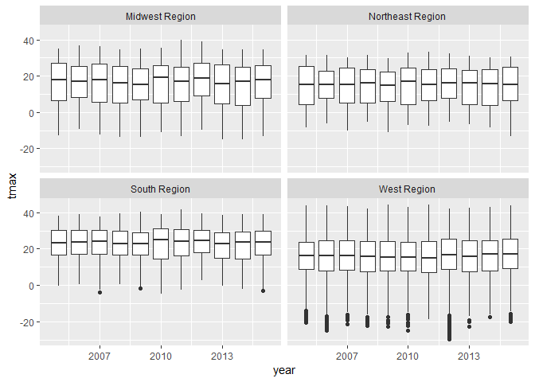
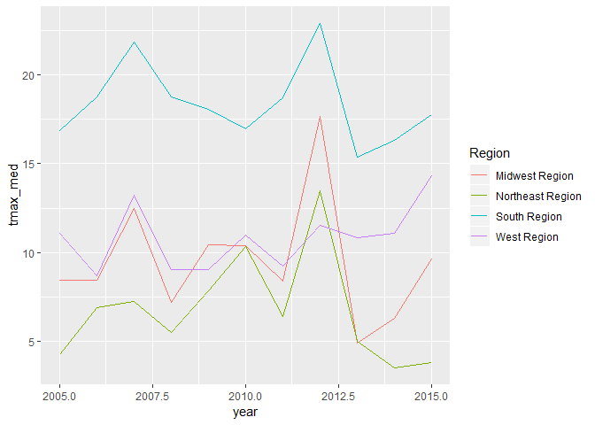
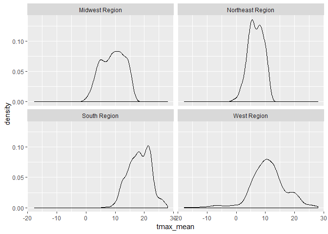

Geog4/6300: Lab 1
================

Loading data into R, data transformation, and summary statistics
----------------------------------------------------------------

**Due:** Monday, Sept. 18

**Value:** 30 points

**Overview:**

This lab is intended to assess your ability to use R to load data and to generate basic descriptive statistics. You'll be using monthly weather data from the Daymet climate database (<http://daymet.ornl.gov>) for all counties in the United States over a 10 year period (2005-2015). These data are available on the Github repo for our course. The following variables are provided:

-   gisjn\_cty: Code for joining to census data
-   year: Year of observation
-   month: Month of observation
-   dayl: Mean length of daylight (in seconds)
-   srad: Mean solar radiation per day
-   tmax: Mean maximum recorded temperature (Celsius)
-   tmin: Mean minimum recorded temperature (Celsius)
-   vap\_pres: Mean vapor pressure (indicative of humidity)
-   prcp: Total recorded prcpitation (mm)
-   cty\_name: Name of the county
-   state: state of the county
-   region: Census region (map: <https://www2.census.gov/geo/pdfs/maps-data/maps/reference/us_regdiv.pdf>)
-   division: Census division
-   lon: Longitude of the point
-   lat: Latitude of the point

These labs are meant to be done collaboratively, but your final submission should demonstrate your own original thought (don’t just copy your classmate’s work or turn in identical assignments). Your answers to the lab questions should be typed in the provided RMarkdown template. You'll then "knit" this to an HTML document and upload it to your class Github repo.

### Procedure:

Load the tidyverse package and import the data from GitHub:

``` r
library(tidyverse)
daymet_cty_2005_2015 <- read_csv("https://github.com/jshannon75/geog4300/raw/master/labs/lab1_%20descriptive_stats/Daymet_Cty_Summary_2005_2015.csv")
```

    ## Parsed with column specification:
    ## cols(
    ##   gisjn_cty = col_character(),
    ##   year = col_integer(),
    ##   month = col_character(),
    ##   dayl = col_double(),
    ##   srad = col_double(),
    ##   tmax = col_double(),
    ##   tmin = col_double(),
    ##   vap_pres = col_double(),
    ##   prcp = col_integer(),
    ##   CTY_NAME = col_character(),
    ##   State = col_character(),
    ##   Region = col_character(),
    ##   Division = col_character(),
    ##   Lon = col_double(),
    ##   Lat = col_double()
    ## )

After loading the file into R, closely examine each variable.

***Question 1 task (4 points):** Provide an example of nominal, ordinal, interval, and ratio data within this dataset. Explain why each fits in the level of measurement you chose in a sentence or two . If you cannot find an example for one of these four data types (no nominal variables, for example), given an example of climate data that would fit this type.*

### Question 2

There are a lot of observations here, 413,820 to be exact. To get a better grasp on it, we can use group\_by and summarise in the tidyverse package. Here's an example.

``` r
cty_summary<-daymet_cty_2005_2015 %>% 
  group_by(Region) %>% 
  summarise(mean_srad=mean(srad))
kable(cty_summary)
```

| Region           |  mean\_srad|
|:-----------------|-----------:|
| Midwest Region   |    319.4705|
| Northeast Region |    312.1818|
| South Region     |    344.1628|
| West Region      |    342.4914|

This command returns the mean value of solar radiation received by counties in each census region during our study period. You could replace “mean” with “sd” to get a similar summary of standard deviation. You may want to change the new variable name ("mean\_srad") above as well.

We can also create new variables. For example, the following script creates a new variable showing maximum temperature in degrees Fahrenheit.

``` r
daymet_climatechg<-daymet_cty_2005_2015 %>% 
  mutate(tmax_f=(tmax*1.8)+32)
```

    ## Warning: package 'bindrcpp' was built under R version 3.4.4

``` r
kable(head(daymet_climatechg))
```

| gisjn\_cty |  year| month |      dayl|      srad|      tmax|        tmin|  vap\_pres|  prcp| CTY\_NAME | State   | Region       | Division                    |        Lon|     Lat|   tmax\_f|
|:-----------|-----:|:------|---------:|---------:|---------:|-----------:|----------:|-----:|:----------|:--------|:-------------|:----------------------------|----------:|-------:|---------:|
| G01001     |  2005| Apr   |  46137.60|  420.6933|  23.13333|   9.4666667|  1210.6667|   195| Autauga   | Alabama | South Region | East South Central Division |  -86.64257|  32.535|  73.64000|
| G01001     |  2005| Aug   |  47380.65|  364.3871|  31.58065|  22.0322581|  2649.0323|   150| Autauga   | Alabama | South Region | East South Central Division |  -86.64257|  32.535|  88.84516|
| G01001     |  2005| Dec   |  35663.77|  258.5806|  13.33871|   0.1774194|   637.4194|    69| Autauga   | Alabama | South Region | East South Central Division |  -86.64257|  32.535|  56.00968|
| G01001     |  2005| Feb   |  39028.11|  297.2571|  16.60714|   5.4107143|   935.7143|   152| Autauga   | Alabama | South Region | East South Central Division |  -86.64257|  32.535|  61.89286|
| G01001     |  2005| Jan   |  36444.06|  261.5742|  15.75806|   3.5483871|   855.4839|    75| Autauga   | Alabama | South Region | East South Central Division |  -86.64257|  32.535|  60.36452|
| G01001     |  2005| July  |  50045.13|  350.2452|  31.37097|  22.0483871|  2649.0323|   284| Autauga   | Alabama | South Region | East South Central Division |  -86.64257|  32.535|  88.46774|

\***Question 2 task (4 points):** Let's make a very basic climate change model. Create a new variable (tmax\_new), that adds two degrees Celsius to the existing maximum temperature for each county. Calculate the mean and standard deviation for the original maximum temperature variable and a new one two degrees higher, grouping these by each census region as shown above. How do these compare? Explain any similarities or differences you find.

### Question 3-4

You can also create a table showing summary statistics for each variable. For example, if you wanted to know the mean, median, standard deviation coefficient of variation (CV), and IQR for the tmax variable, you can use group\_by and summarise:

``` r
daymet_summarystats<-daymet_cty_2005_2015 %>% 
  group_by(Region) %>%
  summarise(tmax_mean=mean(tmax),
            tmax_med=median(tmax),
            tmax_sd=sd(tmax),
            tmax_cv=tmax_sd/tmax_mean,
            tmax_iqr=IQR(tmax))
kable(daymet_summarystats)
```

| Region           |  tmax\_mean|  tmax\_med|   tmax\_sd|   tmax\_cv|  tmax\_iqr|
|:-----------------|-----------:|----------:|----------:|----------:|----------:|
| Midwest Region   |    15.74354|   17.26667|  11.236738|  0.7137364|   19.37500|
| Northeast Region |    14.64101|   15.51613|   9.991482|  0.6824312|   18.10000|
| South Region     |    22.78074|   23.75806|   8.338996|  0.3660547|   13.48387|
| West Region      |    16.11225|   16.12500|  10.504552|  0.6519604|   16.38602|

***Question 3 task (4 points):** Adapting the script above, create a data frame that shows the mean, median, standard deviation, CV, and IQR for the ***prcp*** variable. Based on these data, are these data skewed or roughly normal in distribution? Which measures of central tendency and dispersion should you use as a result?*

***Question 4 task (3 points):** Explain the code you used to calculate statistics for question 3 in plain English. What is happening in each function?*

### Questions 5-9

We can also look at variables over time. For instance, we can use facet\_wrap with boxplot to see how the distribution of maximum temperatures varies by region:

``` r
ggplot(daymet_cty_2005_2015, aes(x=year,y=tmax,group=year))+
  geom_boxplot()+
  facet_wrap(~Region)
```



***Question 5 task (3 points):** Create a box plot similar to the one above for the **tmin** variable. Identify two notable patterns evident in this plot.*

We can use the filter command to further specify things, selecting only a single month for comparison over this timeframe.

``` r
daymet_month<-daymet_cty_2005_2015 %>% 
     filter(month=="Mar")
daymet_month
```

    ## # A tibble: 34,485 x 15
    ##    gisjn_cty  year month   dayl  srad  tmax  tmin vap_pres  prcp CTY_NAME
    ##    <chr>     <int> <chr>  <dbl> <dbl> <dbl> <dbl>    <dbl> <int> <chr>   
    ##  1 G01001     2005 Mar   42464.  383.  18.7  5.56     946.   225 Autauga 
    ##  2 G01001     2006 Mar   42464.  402.  20.9  6.92    1044.   122 Autauga 
    ##  3 G01001     2007 Mar   42464.  407.  23.7  7.42    1080.    41 Autauga 
    ##  4 G01001     2008 Mar   42464.  400.  20.9  4.95     916.   156 Autauga 
    ##  5 G01001     2009 Mar   42464.  353.  20.7  7.84    1116.   288 Autauga 
    ##  6 G01001     2010 Mar   42464.  376.  17.3  4.37     862.   137 Autauga 
    ##  7 G01001     2011 Mar   42464.  351.  21.3  7.39    1062.   272 Autauga 
    ##  8 G01001     2012 Mar   42464.  378.  24.5 11.7     1426.   187 Autauga 
    ##  9 G01001     2013 Mar   42464.  402.  17.0  3.24     804.    88 Autauga 
    ## 10 G01001     2014 Mar   42464.  375.  18.8  5.03     897.   199 Autauga 
    ## # ... with 34,475 more rows, and 5 more variables: State <chr>,
    ## #   Region <chr>, Division <chr>, Lon <dbl>, Lat <dbl>

***Question 6 task (2 points):** Adapt the above command to create a new data frame, changing "Mar" to a month of your choosing and using **tmin** (rather than tmax) as your variable of interest. You'll need two commands--one to create the data frame and another to "call" it, just like you see above.*

Suppose we are just interested in the median. We would then want to create a dataset where the value of tmax is summarized by each year for each census division. You can do so using the combination of group\_by and summarise, similar to the command above. Remember, this command summarises our data in the month of March.

``` r
daymet_summary_region<-daymet_month %>% 
  group_by(Region, year) %>% 
  summarise(tmax_med=median(tmax))
kable(daymet_summary_region)
```

| Region           |  year|  tmax\_med|
|:-----------------|-----:|----------:|
| Midwest Region   |  2005|   8.435484|
| Midwest Region   |  2006|   8.435484|
| Midwest Region   |  2007|  12.483871|
| Midwest Region   |  2008|   7.225807|
| Midwest Region   |  2009|  10.419355|
| Midwest Region   |  2010|  10.370968|
| Midwest Region   |  2011|   8.387097|
| Midwest Region   |  2012|  17.645161|
| Midwest Region   |  2013|   4.919355|
| Midwest Region   |  2014|   6.306452|
| Midwest Region   |  2015|   9.645161|
| Northeast Region |  2005|   4.290323|
| Northeast Region |  2006|   6.911290|
| Northeast Region |  2007|   7.282258|
| Northeast Region |  2008|   5.508064|
| Northeast Region |  2009|   7.846774|
| Northeast Region |  2010|  10.322581|
| Northeast Region |  2011|   6.419355|
| Northeast Region |  2012|  13.483871|
| Northeast Region |  2013|   5.000000|
| Northeast Region |  2014|   3.548387|
| Northeast Region |  2015|   3.846774|
| South Region     |  2005|  16.870968|
| South Region     |  2006|  18.741936|
| South Region     |  2007|  21.838710|
| South Region     |  2008|  18.741936|
| South Region     |  2009|  18.048387|
| South Region     |  2010|  16.983871|
| South Region     |  2011|  18.693548|
| South Region     |  2012|  22.870968|
| South Region     |  2013|  15.354839|
| South Region     |  2014|  16.306452|
| South Region     |  2015|  17.774193|
| West Region      |  2005|  11.112903|
| West Region      |  2006|   8.677419|
| West Region      |  2007|  13.241936|
| West Region      |  2008|   9.048387|
| West Region      |  2009|   9.064516|
| West Region      |  2010|  10.967742|
| West Region      |  2011|   9.225806|
| West Region      |  2012|  11.532258|
| West Region      |  2013|  10.822581|
| West Region      |  2014|  11.080645|
| West Region      |  2015|  14.338710|

Notice how much smaller this dataset is already. Plot it out using ggplot:

``` r
ggplot(daymet_summary_region, aes(x=year,y=tmax_med, group=Region, colour=Region))+
  geom_line()
```



***Question 7 task (3 points):** Create a line plot similar to the one above for the **tmin** variable in the month you have chosen.*

Suppose you wanted to see the distribution of the mean maximum temperatures of all counties by region in March, rather than the median. You can summarise that in this way:

``` r
daymet_summary_county <- daymet_month %>% 
  group_by(Region,gisjn_cty) %>% 
  summarise(tmax_mean=mean(tmax))
kable(daymet_summary_county)
```

| Region           | gisjn\_cty |   tmax\_mean|
|:-----------------|:-----------|------------:|
| Midwest Region   | G17001     |   11.0102639|
| Midwest Region   | G17003     |   14.8753666|
| Midwest Region   | G17005     |   12.6173021|
| Midwest Region   | G17007     |    7.0689150|
| Midwest Region   | G17009     |   10.9662757|
| Midwest Region   | G17011     |    8.8885630|
| Midwest Region   | G17013     |   12.4486804|
| Midwest Region   | G17015     |    7.9721408|
| Midwest Region   | G17017     |   11.0483871|
| Midwest Region   | G17019     |   10.4648094|
| Midwest Region   | G17021     |   11.6099707|
| Midwest Region   | G17023     |   12.1055718|
| Midwest Region   | G17025     |   12.6260997|
| Midwest Region   | G17027     |   13.0131965|
| Midwest Region   | G17029     |   11.4736070|
| Midwest Region   | G17031     |    8.2771261|
| Midwest Region   | G17033     |   12.5762463|
| Midwest Region   | G17035     |   11.9985337|
| Midwest Region   | G17037     |    7.3709677|
| Midwest Region   | G17039     |   10.6085044|
| Midwest Region   | G17041     |   11.0131965|
| Midwest Region   | G17043     |    8.2243402|
| Midwest Region   | G17045     |   11.1568915|
| Midwest Region   | G17047     |   13.1876833|
| Midwest Region   | G17049     |   11.9662757|
| Midwest Region   | G17051     |   11.9398827|
| Midwest Region   | G17053     |    9.6627566|
| Midwest Region   | G17055     |   13.5527859|
| Midwest Region   | G17057     |   10.4002933|
| Midwest Region   | G17059     |   13.9882698|
| Midwest Region   | G17061     |   12.0703812|
| Midwest Region   | G17063     |    8.8548387|
| Midwest Region   | G17065     |   13.4662757|
| Midwest Region   | G17067     |   10.6656892|
| Midwest Region   | G17069     |   14.3607038|
| Midwest Region   | G17071     |   10.0425220|
| Midwest Region   | G17073     |    9.0953079|
| Midwest Region   | G17075     |    9.5835777|
| Midwest Region   | G17077     |   14.1217009|
| Midwest Region   | G17079     |   12.5498534|
| Midwest Region   | G17081     |   12.8768328|
| Midwest Region   | G17083     |   12.4912023|
| Midwest Region   | G17085     |    7.2023460|
| Midwest Region   | G17087     |   14.4970674|
| Midwest Region   | G17089     |    7.7258065|
| Midwest Region   | G17091     |    8.9369501|
| Midwest Region   | G17093     |    8.3577713|
| Midwest Region   | G17095     |    9.7346041|
| Midwest Region   | G17097     |    6.8357771|
| Midwest Region   | G17099     |    8.8973607|
| Midwest Region   | G17101     |   12.9794721|
| Midwest Region   | G17103     |    7.9310850|
| Midwest Region   | G17105     |    9.4648094|
| Midwest Region   | G17107     |   11.1319648|
| Midwest Region   | G17109     |   10.4193548|
| Midwest Region   | G17111     |    6.9105572|
| Midwest Region   | G17113     |   10.0000000|
| Midwest Region   | G17115     |   11.1876833|
| Midwest Region   | G17117     |   12.0733138|
| Midwest Region   | G17119     |   13.1744868|
| Midwest Region   | G17121     |   12.2536657|
| Midwest Region   | G17123     |    9.7199413|
| Midwest Region   | G17125     |   11.0982405|
| Midwest Region   | G17127     |   14.7199413|
| Midwest Region   | G17129     |   11.1642229|
| Midwest Region   | G17131     |    9.2903226|
| Midwest Region   | G17133     |   13.8079179|
| Midwest Region   | G17135     |   12.0821114|
| Midwest Region   | G17137     |   11.4222874|
| Midwest Region   | G17139     |   11.1832845|
| Midwest Region   | G17141     |    7.6818182|
| Midwest Region   | G17143     |   10.1466276|
| Midwest Region   | G17145     |   13.6554252|
| Midwest Region   | G17147     |   10.8328446|
| Midwest Region   | G17149     |   11.2609971|
| Midwest Region   | G17151     |   14.4076246|
| Midwest Region   | G17153     |   14.7067449|
| Midwest Region   | G17155     |    9.3856305|
| Midwest Region   | G17157     |   14.0205279|
| Midwest Region   | G17159     |   12.8870968|
| Midwest Region   | G17161     |    9.2360704|
| Midwest Region   | G17163     |   13.8709677|
| Midwest Region   | G17165     |   14.1715543|
| Midwest Region   | G17167     |   11.4926686|
| Midwest Region   | G17169     |   10.7551320|
| Midwest Region   | G17171     |   11.5410557|
| Midwest Region   | G17173     |   11.5219941|
| Midwest Region   | G17175     |    9.3929619|
| Midwest Region   | G17177     |    7.5601173|
| Midwest Region   | G17179     |   10.5351906|
| Midwest Region   | G17181     |   14.3782991|
| Midwest Region   | G17183     |   10.6348974|
| Midwest Region   | G17185     |   13.1686217|
| Midwest Region   | G17187     |    9.7653959|
| Midwest Region   | G17189     |   13.1950147|
| Midwest Region   | G17191     |   12.9149560|
| Midwest Region   | G17193     |   13.4633431|
| Midwest Region   | G17195     |    8.5425220|
| Midwest Region   | G17197     |    8.5454545|
| Midwest Region   | G17199     |   14.2551320|
| Midwest Region   | G17201     |    7.2419355|
| Midwest Region   | G17203     |    9.9545455|
| Midwest Region   | G18001     |    8.7331378|
| Midwest Region   | G18003     |    8.5205279|
| Midwest Region   | G18005     |   11.9076246|
| Midwest Region   | G18007     |    9.4296188|
| Midwest Region   | G18009     |    9.1407625|
| Midwest Region   | G18011     |   10.1114370|
| Midwest Region   | G18013     |   11.8563050|
| Midwest Region   | G18015     |    9.6994135|
| Midwest Region   | G18017     |    9.3372434|
| Midwest Region   | G18019     |   13.5674487|
| Midwest Region   | G18021     |   11.7873900|
| Midwest Region   | G18023     |    9.8167155|
| Midwest Region   | G18025     |   13.5439883|
| Midwest Region   | G18027     |   13.1026393|
| Midwest Region   | G18029     |   11.7624633|
| Midwest Region   | G18031     |   11.3592375|
| Midwest Region   | G18033     |    8.1099707|
| Midwest Region   | G18035     |    9.4486804|
| Midwest Region   | G18037     |   13.4853372|
| Midwest Region   | G18039     |    8.3724340|
| Midwest Region   | G18041     |   10.5483871|
| Midwest Region   | G18043     |   13.2580645|
| Midwest Region   | G18045     |   10.6656891|
| Midwest Region   | G18047     |   11.1158358|
| Midwest Region   | G18049     |    8.7199413|
| Midwest Region   | G18051     |   13.5571848|
| Midwest Region   | G18053     |    9.2126100|
| Midwest Region   | G18055     |   12.5219941|
| Midwest Region   | G18057     |   10.1700880|
| Midwest Region   | G18059     |   10.2492669|
| Midwest Region   | G18061     |   13.6876833|
| Midwest Region   | G18063     |   10.5894428|
| Midwest Region   | G18065     |    9.6217009|
| Midwest Region   | G18067     |    9.3504399|
| Midwest Region   | G18069     |    8.9017595|
| Midwest Region   | G18071     |   12.6436950|
| Midwest Region   | G18073     |    8.8343109|
| Midwest Region   | G18075     |    9.1348974|
| Midwest Region   | G18077     |   12.5307918|
| Midwest Region   | G18079     |   12.2595308|
| Midwest Region   | G18081     |   11.1935484|
| Midwest Region   | G18083     |   12.9706745|
| Midwest Region   | G18085     |    8.6158358|
| Midwest Region   | G18087     |    7.9310850|
| Midwest Region   | G18089     |    8.3431085|
| Midwest Region   | G18091     |    8.0865103|
| Midwest Region   | G18093     |   12.6876833|
| Midwest Region   | G18095     |    9.7653959|
| Midwest Region   | G18097     |   10.8753666|
| Midwest Region   | G18099     |    8.4032258|
| Midwest Region   | G18101     |   12.9384164|
| Midwest Region   | G18103     |    9.2521994|
| Midwest Region   | G18105     |   11.8401760|
| Midwest Region   | G18107     |   10.3460411|
| Midwest Region   | G18109     |   11.3299120|
| Midwest Region   | G18111     |    9.0307918|
| Midwest Region   | G18113     |    8.1891496|
| Midwest Region   | G18115     |   12.0674487|
| Midwest Region   | G18117     |   13.0733138|
| Midwest Region   | G18119     |   11.6466276|
| Midwest Region   | G18121     |   11.1129032|
| Midwest Region   | G18123     |   13.7756598|
| Midwest Region   | G18125     |   13.5718475|
| Midwest Region   | G18127     |    8.1876833|
| Midwest Region   | G18129     |   13.7463343|
| Midwest Region   | G18131     |    8.7668622|
| Midwest Region   | G18133     |   11.0395894|
| Midwest Region   | G18135     |    9.2302053|
| Midwest Region   | G18137     |   11.6700880|
| Midwest Region   | G18139     |   10.4838710|
| Midwest Region   | G18141     |    8.1715543|
| Midwest Region   | G18143     |   13.0718475|
| Midwest Region   | G18145     |   11.0351906|
| Midwest Region   | G18147     |   14.0014663|
| Midwest Region   | G18149     |    8.5000000|
| Midwest Region   | G18151     |    7.4266862|
| Midwest Region   | G18153     |   12.5278592|
| Midwest Region   | G18155     |   12.3167155|
| Midwest Region   | G18157     |   10.3123167|
| Midwest Region   | G18159     |    9.6143695|
| Midwest Region   | G18161     |   10.4604106|
| Midwest Region   | G18163     |   13.9721408|
| Midwest Region   | G18165     |   11.1436950|
| Midwest Region   | G18167     |   12.0615836|
| Midwest Region   | G18169     |    8.9105572|
| Midwest Region   | G18171     |   10.2478006|
| Midwest Region   | G18173     |   13.9589443|
| Midwest Region   | G18175     |   13.0087977|
| Midwest Region   | G18177     |    9.9413490|
| Midwest Region   | G18179     |    8.8577713|
| Midwest Region   | G18181     |    9.3225806|
| Midwest Region   | G18183     |    8.6217009|
| Midwest Region   | G19001     |    9.3299120|
| Midwest Region   | G19003     |    9.9604106|
| Midwest Region   | G19005     |    6.4736070|
| Midwest Region   | G19007     |   10.0395894|
| Midwest Region   | G19009     |    8.8255132|
| Midwest Region   | G19011     |    8.0131965|
| Midwest Region   | G19013     |    7.2947214|
| Midwest Region   | G19015     |    8.2991202|
| Midwest Region   | G19017     |    6.3372434|
| Midwest Region   | G19019     |    7.0630499|
| Midwest Region   | G19021     |    7.2082111|
| Midwest Region   | G19023     |    6.5366569|
| Midwest Region   | G19025     |    7.4809384|
| Midwest Region   | G19027     |    8.0982405|
| Midwest Region   | G19029     |    9.7580645|
| Midwest Region   | G19031     |    8.5967742|
| Midwest Region   | G19033     |    5.5645161|
| Midwest Region   | G19035     |    7.6011730|
| Midwest Region   | G19037     |    5.7243402|
| Midwest Region   | G19039     |    9.6510264|
| Midwest Region   | G19041     |    6.6906158|
| Midwest Region   | G19043     |    6.6378299|
| Midwest Region   | G19045     |    8.0674487|
| Midwest Region   | G19047     |    8.5865103|
| Midwest Region   | G19049     |    9.0513196|
| Midwest Region   | G19051     |   10.3284457|
| Midwest Region   | G19053     |   10.2888563|
| Midwest Region   | G19055     |    6.6935484|
| Midwest Region   | G19057     |   10.0469208|
| Midwest Region   | G19059     |    5.8621701|
| Midwest Region   | G19061     |    6.8592375|
| Midwest Region   | G19063     |    5.4457478|
| Midwest Region   | G19065     |    6.2331378|
| Midwest Region   | G19067     |    5.8225806|
| Midwest Region   | G19069     |    6.3313783|
| Midwest Region   | G19071     |   11.4442815|
| Midwest Region   | G19073     |    8.1935484|
| Midwest Region   | G19075     |    7.0381232|
| Midwest Region   | G19077     |    8.8020528|
| Midwest Region   | G19079     |    7.2903226|
| Midwest Region   | G19081     |    5.5425220|
| Midwest Region   | G19083     |    7.1129032|
| Midwest Region   | G19085     |    9.8211144|
| Midwest Region   | G19087     |   10.2565982|
| Midwest Region   | G19089     |    5.1202346|
| Midwest Region   | G19091     |    6.4736070|
| Midwest Region   | G19093     |    7.9721408|
| Midwest Region   | G19095     |    8.6026393|
| Midwest Region   | G19097     |    7.3870968|
| Midwest Region   | G19099     |    8.5659824|
| Midwest Region   | G19101     |   10.1129032|
| Midwest Region   | G19103     |    9.1979472|
| Midwest Region   | G19105     |    7.4604106|
| Midwest Region   | G19107     |    9.5425220|
| Midwest Region   | G19109     |    5.6304985|
| Midwest Region   | G19111     |   10.6304985|
| Midwest Region   | G19113     |    8.1290323|
| Midwest Region   | G19115     |    9.8416422|
| Midwest Region   | G19117     |    9.6510264|
| Midwest Region   | G19119     |    6.8211144|
| Midwest Region   | G19121     |    9.3328446|
| Midwest Region   | G19123     |    9.3240469|
| Midwest Region   | G19125     |    9.4178886|
| Midwest Region   | G19127     |    7.7521994|
| Midwest Region   | G19129     |   10.9017595|
| Midwest Region   | G19131     |    5.0029326|
| Midwest Region   | G19133     |    9.2859238|
| Midwest Region   | G19135     |    9.8870968|
| Midwest Region   | G19137     |   10.2727273|
| Midwest Region   | G19139     |    9.3460411|
| Midwest Region   | G19141     |    6.8284457|
| Midwest Region   | G19143     |    5.8914956|
| Midwest Region   | G19145     |   10.7947214|
| Midwest Region   | G19147     |    6.2214076|
| Midwest Region   | G19149     |    8.5821114|
| Midwest Region   | G19151     |    6.8372434|
| Midwest Region   | G19153     |    9.1788856|
| Midwest Region   | G19155     |   10.2771261|
| Midwest Region   | G19157     |    8.2595308|
| Midwest Region   | G19159     |   10.2067449|
| Midwest Region   | G19161     |    7.6011730|
| Midwest Region   | G19163     |    8.7844575|
| Midwest Region   | G19165     |    9.3665689|
| Midwest Region   | G19167     |    7.5791789|
| Midwest Region   | G19169     |    8.0674487|
| Midwest Region   | G19171     |    7.6627566|
| Midwest Region   | G19173     |   10.2448680|
| Midwest Region   | G19175     |    9.7082111|
| Midwest Region   | G19177     |   10.7170088|
| Midwest Region   | G19179     |    9.9589443|
| Midwest Region   | G19181     |    9.8841642|
| Midwest Region   | G19183     |    9.5542522|
| Midwest Region   | G19185     |   10.0630499|
| Midwest Region   | G19187     |    7.2888563|
| Midwest Region   | G19189     |    5.0439883|
| Midwest Region   | G19191     |    5.9956012|
| Midwest Region   | G19193     |    8.9208211|
| Midwest Region   | G19195     |    4.9178886|
| Midwest Region   | G19197     |    6.4457478|
| Midwest Region   | G20001     |   14.3123167|
| Midwest Region   | G20003     |   13.8797654|
| Midwest Region   | G20005     |   12.7096774|
| Midwest Region   | G20007     |   16.1759531|
| Midwest Region   | G20009     |   15.0263930|
| Midwest Region   | G20011     |   14.4222874|
| Midwest Region   | G20013     |   12.3797654|
| Midwest Region   | G20015     |   14.7668622|
| Midwest Region   | G20017     |   13.9164223|
| Midwest Region   | G20019     |   15.5835777|
| Midwest Region   | G20021     |   15.3826979|
| Midwest Region   | G20023     |   14.1129032|
| Midwest Region   | G20025     |   16.5483871|
| Midwest Region   | G20027     |   13.8607038|
| Midwest Region   | G20029     |   13.5850440|
| Midwest Region   | G20031     |   13.9310850|
| Midwest Region   | G20033     |   16.2815249|
| Midwest Region   | G20035     |   15.6173021|
| Midwest Region   | G20037     |   14.7756598|
| Midwest Region   | G20039     |   14.0806452|
| Midwest Region   | G20041     |   14.5102639|
| Midwest Region   | G20043     |   12.2478006|
| Midwest Region   | G20045     |   13.5923754|
| Midwest Region   | G20047     |   15.4809384|
| Midwest Region   | G20049     |   15.1041056|
| Midwest Region   | G20051     |   14.7126100|
| Midwest Region   | G20053     |   14.3621701|
| Midwest Region   | G20055     |   15.5982405|
| Midwest Region   | G20057     |   15.6847507|
| Midwest Region   | G20059     |   13.6818182|
| Midwest Region   | G20061     |   14.0410557|
| Midwest Region   | G20063     |   14.8225806|
| Midwest Region   | G20065     |   15.0161290|
| Midwest Region   | G20067     |   16.3328446|
| Midwest Region   | G20069     |   15.6906158|
| Midwest Region   | G20071     |   15.1642229|
| Midwest Region   | G20073     |   14.5703812|
| Midwest Region   | G20075     |   16.1554252|
| Midwest Region   | G20077     |   15.8709677|
| Midwest Region   | G20079     |   14.6114369|
| Midwest Region   | G20081     |   16.0674487|
| Midwest Region   | G20083     |   15.6539589|
| Midwest Region   | G20085     |   12.9164223|
| Midwest Region   | G20087     |   13.2976540|
| Midwest Region   | G20089     |   13.0953079|
| Midwest Region   | G20091     |   13.3519062|
| Midwest Region   | G20093     |   15.6744868|
| Midwest Region   | G20095     |   15.1730205|
| Midwest Region   | G20097     |   15.5117302|
| Midwest Region   | G20099     |   15.3020528|
| Midwest Region   | G20101     |   15.2346041|
| Midwest Region   | G20103     |   13.5234604|
| Midwest Region   | G20105     |   14.5219941|
| Midwest Region   | G20107     |   13.9897361|
| Midwest Region   | G20109     |   15.0953079|
| Midwest Region   | G20111     |   14.0293255|
| Midwest Region   | G20113     |   14.2228739|
| Midwest Region   | G20115     |   14.2727273|
| Midwest Region   | G20117     |   12.7346041|
| Midwest Region   | G20119     |   16.4002933|
| Midwest Region   | G20121     |   13.7126100|
| Midwest Region   | G20123     |   13.9442815|
| Midwest Region   | G20125     |   15.6524927|
| Midwest Region   | G20127     |   13.4604106|
| Midwest Region   | G20129     |   16.6612903|
| Midwest Region   | G20131     |   12.3504399|
| Midwest Region   | G20133     |   14.8196481|
| Midwest Region   | G20135     |   15.3753666|
| Midwest Region   | G20137     |   14.1715543|
| Midwest Region   | G20139     |   13.7096774|
| Midwest Region   | G20141     |   14.2243402|
| Midwest Region   | G20143     |   14.4296188|
| Midwest Region   | G20145     |   15.3885631|
| Midwest Region   | G20147     |   14.2976540|
| Midwest Region   | G20149     |   12.8900293|
| Midwest Region   | G20151     |   15.3577713|
| Midwest Region   | G20153     |   14.5821114|
| Midwest Region   | G20155     |   14.8592375|
| Midwest Region   | G20157     |   13.1290323|
| Midwest Region   | G20159     |   14.4985337|
| Midwest Region   | G20161     |   13.7287390|
| Midwest Region   | G20163     |   14.6964809|
| Midwest Region   | G20165     |   15.1730205|
| Midwest Region   | G20167     |   14.4296188|
| Midwest Region   | G20169     |   14.6876833|
| Midwest Region   | G20171     |   15.3313783|
| Midwest Region   | G20173     |   15.2712610|
| Midwest Region   | G20175     |   16.8387097|
| Midwest Region   | G20177     |   13.9706745|
| Midwest Region   | G20179     |   14.4985337|
| Midwest Region   | G20181     |   13.9222874|
| Midwest Region   | G20183     |   13.6319648|
| Midwest Region   | G20185     |   15.1466276|
| Midwest Region   | G20187     |   16.2976540|
| Midwest Region   | G20189     |   16.7302053|
| Midwest Region   | G20191     |   15.8137830|
| Midwest Region   | G20193     |   14.1583578|
| Midwest Region   | G20195     |   14.7727273|
| Midwest Region   | G20197     |   13.4252199|
| Midwest Region   | G20199     |   14.5703812|
| Midwest Region   | G20201     |   13.0161290|
| Midwest Region   | G20203     |   15.1818182|
| Midwest Region   | G20205     |   14.8724340|
| Midwest Region   | G20207     |   14.2390029|
| Midwest Region   | G20209     |   13.2360704|
| Midwest Region   | G26001     |    3.9472141|
| Midwest Region   | G26003     |    2.3651026|
| Midwest Region   | G26005     |    7.3592375|
| Midwest Region   | G26007     |    3.4046921|
| Midwest Region   | G26009     |    4.2316716|
| Midwest Region   | G26011     |    5.3196481|
| Midwest Region   | G26013     |    1.6847507|
| Midwest Region   | G26015     |    7.3005865|
| Midwest Region   | G26017     |    5.8621701|
| Midwest Region   | G26019     |    5.0850440|
| Midwest Region   | G26021     |    8.0219941|
| Midwest Region   | G26023     |    7.3944282|
| Midwest Region   | G26025     |    7.3035191|
| Midwest Region   | G26027     |    7.9589443|
| Midwest Region   | G26029     |    3.1950147|
| Midwest Region   | G26031     |    3.7434018|
| Midwest Region   | G26033     |    2.2360704|
| Midwest Region   | G26035     |    4.9428152|
| Midwest Region   | G26037     |    6.5762463|
| Midwest Region   | G26039     |    4.3343109|
| Midwest Region   | G26041     |    3.2507331|
| Midwest Region   | G26043     |    3.5821114|
| Midwest Region   | G26045     |    6.8958944|
| Midwest Region   | G26047     |    3.0923754|
| Midwest Region   | G26049     |    6.4912023|
| Midwest Region   | G26051     |    5.8460411|
| Midwest Region   | G26053     |    3.0571848|
| Midwest Region   | G26055     |    4.9252199|
| Midwest Region   | G26057     |    6.2096774|
| Midwest Region   | G26059     |    6.9633431|
| Midwest Region   | G26061     |    3.3328446|
| Midwest Region   | G26063     |    4.1847507|
| Midwest Region   | G26065     |    6.7624633|
| Midwest Region   | G26067     |    6.8049853|
| Midwest Region   | G26069     |    4.6099707|
| Midwest Region   | G26071     |    2.8299120|
| Midwest Region   | G26073     |    6.0821114|
| Midwest Region   | G26075     |    7.0879765|
| Midwest Region   | G26077     |    7.8973607|
| Midwest Region   | G26079     |    4.1979472|
| Midwest Region   | G26081     |    6.7536657|
| Midwest Region   | G26083     |    2.0615836|
| Midwest Region   | G26085     |    5.6348974|
| Midwest Region   | G26087     |    5.9516129|
| Midwest Region   | G26089     |    4.6935484|
| Midwest Region   | G26091     |    7.4838710|
| Midwest Region   | G26093     |    6.7287390|
| Midwest Region   | G26095     |    2.1568915|
| Midwest Region   | G26097     |    2.7521994|
| Midwest Region   | G26099     |    6.5469208|
| Midwest Region   | G26101     |    5.7360704|
| Midwest Region   | G26103     |    2.4193548|
| Midwest Region   | G26105     |    5.9164223|
| Midwest Region   | G26107     |    5.8108504|
| Midwest Region   | G26109     |    4.0835777|
| Midwest Region   | G26111     |    6.1818182|
| Midwest Region   | G26113     |    4.8005865|
| Midwest Region   | G26115     |    7.5087977|
| Midwest Region   | G26117     |    6.3533724|
| Midwest Region   | G26119     |    3.8621701|
| Midwest Region   | G26121     |    6.4208211|
| Midwest Region   | G26123     |    6.0894428|
| Midwest Region   | G26125     |    6.5000000|
| Midwest Region   | G26127     |    5.9780059|
| Midwest Region   | G26129     |    5.0117302|
| Midwest Region   | G26131     |    3.6158358|
| Midwest Region   | G26133     |    4.6026393|
| Midwest Region   | G26135     |    4.6260997|
| Midwest Region   | G26137     |    3.4046921|
| Midwest Region   | G26139     |    6.7507331|
| Midwest Region   | G26141     |    3.4384164|
| Midwest Region   | G26143     |    4.9354839|
| Midwest Region   | G26145     |    6.3782991|
| Midwest Region   | G26147     |    5.6143695|
| Midwest Region   | G26149     |    7.9105572|
| Midwest Region   | G26151     |    4.5410557|
| Midwest Region   | G26153     |    2.7756598|
| Midwest Region   | G26155     |    6.4780059|
| Midwest Region   | G26157     |    5.6480938|
| Midwest Region   | G26159     |    7.8049853|
| Midwest Region   | G26161     |    7.1539589|
| Midwest Region   | G26163     |    7.6378299|
| Midwest Region   | G26165     |    4.8372434|
| Midwest Region   | G27001     |    3.6129032|
| Midwest Region   | G27003     |    5.2697947|
| Midwest Region   | G27005     |    2.5014663|
| Midwest Region   | G27007     |    2.6818182|
| Midwest Region   | G27009     |    4.3900293|
| Midwest Region   | G27011     |    3.5659824|
| Midwest Region   | G27013     |    5.0777126|
| Midwest Region   | G27015     |    4.9472141|
| Midwest Region   | G27017     |    3.5601173|
| Midwest Region   | G27019     |    4.3900293|
| Midwest Region   | G27021     |    3.4662757|
| Midwest Region   | G27023     |    4.4046921|
| Midwest Region   | G27025     |    5.1906158|
| Midwest Region   | G27027     |    2.6290323|
| Midwest Region   | G27029     |    2.2199413|
| Midwest Region   | G27031     |    1.0454545|
| Midwest Region   | G27033     |    4.6407625|
| Midwest Region   | G27035     |    3.6862170|
| Midwest Region   | G27037     |    4.9369501|
| Midwest Region   | G27039     |    4.2287390|
| Midwest Region   | G27041     |    2.6436950|
| Midwest Region   | G27043     |    5.2888563|
| Midwest Region   | G27045     |    5.6627566|
| Midwest Region   | G27047     |    4.4956012|
| Midwest Region   | G27049     |    4.4868035|
| Midwest Region   | G27051     |    2.7375367|
| Midwest Region   | G27053     |    4.8958944|
| Midwest Region   | G27055     |    5.5029326|
| Midwest Region   | G27057     |    2.9017595|
| Midwest Region   | G27059     |    4.8079179|
| Midwest Region   | G27061     |    3.0659824|
| Midwest Region   | G27063     |    5.0058651|
| Midwest Region   | G27065     |    4.1568915|
| Midwest Region   | G27067     |    3.8020528|
| Midwest Region   | G27069     |    0.2815249|
| Midwest Region   | G27071     |    2.7551320|
| Midwest Region   | G27073     |    4.4912023|
| Midwest Region   | G27075     |    1.9868035|
| Midwest Region   | G27077     |    1.7199413|
| Midwest Region   | G27079     |    4.4706745|
| Midwest Region   | G27081     |    3.9310850|
| Midwest Region   | G27083     |    4.7815249|
| Midwest Region   | G27085     |    4.0102639|
| Midwest Region   | G27087     |    2.1612903|
| Midwest Region   | G27089     |    0.9310850|
| Midwest Region   | G27091     |    5.2258065|
| Midwest Region   | G27093     |    3.7683284|
| Midwest Region   | G27095     |    3.9824047|
| Midwest Region   | G27097     |    4.1964809|
| Midwest Region   | G27099     |    4.2038123|
| Midwest Region   | G27101     |    4.5894428|
| Midwest Region   | G27103     |    4.5806452|
| Midwest Region   | G27105     |    4.9530792|
| Midwest Region   | G27107     |    2.1392962|
| Midwest Region   | G27109     |    4.7609971|
| Midwest Region   | G27111     |    2.4281525|
| Midwest Region   | G27113     |    1.4017595|
| Midwest Region   | G27115     |    4.0938416|
| Midwest Region   | G27117     |    4.5762463|
| Midwest Region   | G27119     |    1.4838710|
| Midwest Region   | G27121     |    3.3592375|
| Midwest Region   | G27123     |    5.2800587|
| Midwest Region   | G27125     |    1.5395894|
| Midwest Region   | G27127     |    4.7917889|
| Midwest Region   | G27129     |    4.2199413|
| Midwest Region   | G27131     |    4.5527859|
| Midwest Region   | G27133     |    5.8489736|
| Midwest Region   | G27135     |    1.1158358|
| Midwest Region   | G27137     |    2.4061584|
| Midwest Region   | G27139     |    4.6568915|
| Midwest Region   | G27141     |    4.7008798|
| Midwest Region   | G27143     |    4.2316716|
| Midwest Region   | G27145     |    3.8255132|
| Midwest Region   | G27147     |    4.3973607|
| Midwest Region   | G27149     |    3.2023460|
| Midwest Region   | G27151     |    4.0161290|
| Midwest Region   | G27153     |    3.1202346|
| Midwest Region   | G27155     |    2.9662757|
| Midwest Region   | G27157     |    5.3680352|
| Midwest Region   | G27159     |    2.9149560|
| Midwest Region   | G27161     |    4.6656892|
| Midwest Region   | G27163     |    5.1246334|
| Midwest Region   | G27165     |    5.1290323|
| Midwest Region   | G27167     |    2.7785924|
| Midwest Region   | G27169     |    5.4530792|
| Midwest Region   | G27171     |    4.2756598|
| Midwest Region   | G27173     |    4.7991202|
| Midwest Region   | G29001     |   11.0645161|
| Midwest Region   | G29003     |   11.8372434|
| Midwest Region   | G29005     |   11.5791789|
| Midwest Region   | G29007     |   12.2126100|
| Midwest Region   | G29009     |   15.0278592|
| Midwest Region   | G29011     |   14.7390029|
| Midwest Region   | G29013     |   13.9222874|
| Midwest Region   | G29015     |   14.0615836|
| Midwest Region   | G29017     |   14.8680352|
| Midwest Region   | G29019     |   13.1304985|
| Midwest Region   | G29021     |   12.2653959|
| Midwest Region   | G29023     |   15.5454545|
| Midwest Region   | G29025     |   12.0483871|
| Midwest Region   | G29027     |   13.0835777|
| Midwest Region   | G29029     |   14.3269795|
| Midwest Region   | G29031     |   14.7067449|
| Midwest Region   | G29033     |   12.3255132|
| Midwest Region   | G29035     |   15.9428152|
| Midwest Region   | G29037     |   13.4457478|
| Midwest Region   | G29039     |   14.4164223|
| Midwest Region   | G29041     |   12.3636364|
| Midwest Region   | G29043     |   14.8563050|
| Midwest Region   | G29045     |   10.8211144|
| Midwest Region   | G29047     |   12.7375367|
| Midwest Region   | G29049     |   12.0923754|
| Midwest Region   | G29051     |   14.1290323|
| Midwest Region   | G29053     |   13.1378299|
| Midwest Region   | G29055     |   14.3709677|
| Midwest Region   | G29057     |   14.6407625|
| Midwest Region   | G29059     |   14.5953079|
| Midwest Region   | G29061     |   11.8299120|
| Midwest Region   | G29063     |   11.6891496|
| Midwest Region   | G29065     |   14.7228739|
| Midwest Region   | G29067     |   15.1876833|
| Midwest Region   | G29069     |   15.5806452|
| Midwest Region   | G29071     |   14.0351906|
| Midwest Region   | G29073     |   13.6114369|
| Midwest Region   | G29075     |   11.5234604|
| Midwest Region   | G29077     |   14.7082111|
| Midwest Region   | G29079     |   11.5586510|
| Midwest Region   | G29081     |   10.8988270|
| Midwest Region   | G29083     |   13.9120235|
| Midwest Region   | G29085     |   14.5234604|
| Midwest Region   | G29087     |   12.2140762|
| Midwest Region   | G29089     |   12.8621701|
| Midwest Region   | G29091     |   15.0821114|
| Midwest Region   | G29093     |   14.3592375|
| Midwest Region   | G29095     |   13.1627566|
| Midwest Region   | G29097     |   15.2331378|
| Midwest Region   | G29099     |   13.8137830|
| Midwest Region   | G29101     |   13.2932551|
| Midwest Region   | G29103     |   11.2126100|
| Midwest Region   | G29105     |   14.3108504|
| Midwest Region   | G29107     |   12.7287390|
| Midwest Region   | G29109     |   15.0000000|
| Midwest Region   | G29111     |   11.1906158|
| Midwest Region   | G29113     |   12.7258065|
| Midwest Region   | G29115     |   11.8020528|
| Midwest Region   | G29117     |   12.2111437|
| Midwest Region   | G29119     |   16.0249267|
| Midwest Region   | G29121     |   11.7331378|
| Midwest Region   | G29123     |   14.0821114|
| Midwest Region   | G29125     |   14.3724340|
| Midwest Region   | G29127     |   11.4604106|
| Midwest Region   | G29129     |   10.9002933|
| Midwest Region   | G29131     |   14.4296188|
| Midwest Region   | G29133     |   15.1099707|
| Midwest Region   | G29135     |   13.4178886|
| Midwest Region   | G29137     |   12.0219941|
| Midwest Region   | G29139     |   12.5469208|
| Midwest Region   | G29141     |   13.4530792|
| Midwest Region   | G29143     |   15.1862170|
| Midwest Region   | G29145     |   15.4017595|
| Midwest Region   | G29147     |   10.9604106|
| Midwest Region   | G29149     |   15.5747801|
| Midwest Region   | G29151     |   13.6217009|
| Midwest Region   | G29153     |   15.5747801|
| Midwest Region   | G29155     |   15.5439883|
| Midwest Region   | G29157     |   14.2375367|
| Midwest Region   | G29159     |   13.2771261|
| Midwest Region   | G29161     |   14.8020528|
| Midwest Region   | G29163     |   11.5586510|
| Midwest Region   | G29165     |   13.1935484|
| Midwest Region   | G29167     |   14.4912023|
| Midwest Region   | G29169     |   14.6979472|
| Midwest Region   | G29171     |   10.4838710|
| Midwest Region   | G29173     |   11.5718475|
| Midwest Region   | G29175     |   12.2111437|
| Midwest Region   | G29177     |   12.6422287|
| Midwest Region   | G29179     |   15.3475073|
| Midwest Region   | G29181     |   15.7492669|
| Midwest Region   | G29183     |   13.4882698|
| Midwest Region   | G29185     |   14.3504399|
| Midwest Region   | G29186     |   14.0102639|
| Midwest Region   | G29187     |   13.7170088|
| Midwest Region   | G29189     |   13.5454545|
| Midwest Region   | G29195     |   12.6187683|
| Midwest Region   | G29197     |   10.5747801|
| Midwest Region   | G29199     |   10.8255132|
| Midwest Region   | G29201     |   15.0454545|
| Midwest Region   | G29203     |   15.8841642|
| Midwest Region   | G29205     |   11.6246334|
| Midwest Region   | G29207     |   14.9164223|
| Midwest Region   | G29209     |   15.1495601|
| Midwest Region   | G29211     |   11.2096774|
| Midwest Region   | G29213     |   15.5410557|
| Midwest Region   | G29215     |   14.5454545|
| Midwest Region   | G29217     |   14.4354839|
| Midwest Region   | G29219     |   12.9310850|
| Midwest Region   | G29221     |   14.1334311|
| Midwest Region   | G29223     |   15.4662757|
| Midwest Region   | G29225     |   14.0161290|
| Midwest Region   | G29227     |   10.7624633|
| Midwest Region   | G29229     |   14.7111437|
| Midwest Region   | G29510     |   13.8167155|
| Midwest Region   | G31001     |   12.2844575|
| Midwest Region   | G31003     |    9.7507331|
| Midwest Region   | G31005     |   11.2228739|
| Midwest Region   | G31007     |   10.6231672|
| Midwest Region   | G31009     |   11.8137830|
| Midwest Region   | G31011     |   10.8181818|
| Midwest Region   | G31013     |   11.2844575|
| Midwest Region   | G31015     |    9.4354839|
| Midwest Region   | G31017     |   10.9090909|
| Midwest Region   | G31019     |   11.9017595|
| Midwest Region   | G31021     |    9.6539589|
| Midwest Region   | G31023     |   10.7448680|
| Midwest Region   | G31025     |   11.1099707|
| Midwest Region   | G31027     |    9.2639296|
| Midwest Region   | G31029     |   13.5219941|
| Midwest Region   | G31031     |   10.6187683|
| Midwest Region   | G31033     |   11.8079179|
| Midwest Region   | G31035     |   12.2580645|
| Midwest Region   | G31037     |   10.3240469|
| Midwest Region   | G31039     |    9.9193548|
| Midwest Region   | G31041     |   11.5791789|
| Midwest Region   | G31043     |    9.4633431|
| Midwest Region   | G31045     |   12.1422287|
| Midwest Region   | G31047     |   12.5219941|
| Midwest Region   | G31049     |   12.5733138|
| Midwest Region   | G31051     |    9.1656891|
| Midwest Region   | G31053     |   10.3416422|
| Midwest Region   | G31055     |   10.5483871|
| Midwest Region   | G31057     |   13.9457478|
| Midwest Region   | G31059     |   12.2287390|
| Midwest Region   | G31061     |   12.6950147|
| Midwest Region   | G31063     |   13.5571847|
| Midwest Region   | G31065     |   13.6524927|
| Midwest Region   | G31067     |   12.3372434|
| Midwest Region   | G31069     |   11.9824047|
| Midwest Region   | G31071     |   10.5689150|
| Midwest Region   | G31073     |   12.5659824|
| Midwest Region   | G31075     |   10.8797654|
| Midwest Region   | G31077     |   10.9501466|
| Midwest Region   | G31079     |   12.1436950|
| Midwest Region   | G31081     |   12.1173021|
| Midwest Region   | G31083     |   13.3343109|
| Midwest Region   | G31085     |   13.1202346|
| Midwest Region   | G31087     |   14.5659824|
| Midwest Region   | G31089     |    9.7580645|
| Midwest Region   | G31091     |   11.1876833|
| Midwest Region   | G31093     |   11.8651026|
| Midwest Region   | G31095     |   12.4780059|
| Midwest Region   | G31097     |   12.1803519|
| Midwest Region   | G31099     |   12.1554252|
| Midwest Region   | G31101     |   12.1598240|
| Midwest Region   | G31103     |    9.9032258|
| Midwest Region   | G31105     |    9.4178886|
| Midwest Region   | G31107     |    9.6070381|
| Midwest Region   | G31109     |   11.9882698|
| Midwest Region   | G31111     |   12.3372434|
| Midwest Region   | G31113     |   11.8284457|
| Midwest Region   | G31115     |   11.1612903|
| Midwest Region   | G31117     |   11.4296188|
| Midwest Region   | G31119     |    9.9853372|
| Midwest Region   | G31121     |   12.2507331|
| Midwest Region   | G31123     |   12.1275660|
| Midwest Region   | G31125     |   11.8504399|
| Midwest Region   | G31127     |   12.1422287|
| Midwest Region   | G31129     |   12.5557185|
| Midwest Region   | G31131     |   11.8343108|
| Midwest Region   | G31133     |   12.1906158|
| Midwest Region   | G31135     |   12.7521994|
| Midwest Region   | G31137     |   12.2697947|
| Midwest Region   | G31139     |    9.5337243|
| Midwest Region   | G31141     |   10.7815249|
| Midwest Region   | G31143     |   11.5263930|
| Midwest Region   | G31145     |   14.1334311|
| Midwest Region   | G31147     |   12.3944282|
| Midwest Region   | G31149     |   10.3313783|
| Midwest Region   | G31151     |   12.0249267|
| Midwest Region   | G31153     |   10.9325513|
| Midwest Region   | G31155     |   10.9134897|
| Midwest Region   | G31157     |   12.7536657|
| Midwest Region   | G31159     |   11.6568915|
| Midwest Region   | G31161     |   10.6231672|
| Midwest Region   | G31163     |   11.7434018|
| Midwest Region   | G31165     |   10.6246334|
| Midwest Region   | G31167     |    9.9560117|
| Midwest Region   | G31169     |   12.8020528|
| Midwest Region   | G31171     |   11.6260997|
| Midwest Region   | G31173     |    9.3885631|
| Midwest Region   | G31175     |   11.3475073|
| Midwest Region   | G31177     |   10.2580645|
| Midwest Region   | G31179     |    9.3768328|
| Midwest Region   | G31181     |   12.6260997|
| Midwest Region   | G31183     |   10.3929619|
| Midwest Region   | G31185     |   11.9838710|
| Midwest Region   | G38001     |    6.6246334|
| Midwest Region   | G38003     |    2.1847507|
| Midwest Region   | G38005     |    0.9501466|
| Midwest Region   | G38007     |    6.1422287|
| Midwest Region   | G38009     |    1.0777126|
| Midwest Region   | G38011     |    6.7521994|
| Midwest Region   | G38013     |    1.6656891|
| Midwest Region   | G38015     |    3.9706745|
| Midwest Region   | G38017     |    2.5190616|
| Midwest Region   | G38019     |   -0.9501466|
| Midwest Region   | G38021     |    4.0909091|
| Midwest Region   | G38023     |    2.2565982|
| Midwest Region   | G38025     |    5.2727273|
| Midwest Region   | G38027     |    1.4501466|
| Midwest Region   | G38029     |    4.7917889|
| Midwest Region   | G38031     |    1.8621701|
| Midwest Region   | G38033     |    6.2507331|
| Midwest Region   | G38035     |    0.9281525|
| Midwest Region   | G38037     |    5.4428152|
| Midwest Region   | G38039     |    1.2961877|
| Midwest Region   | G38041     |    6.0689150|
| Midwest Region   | G38043     |    3.1715543|
| Midwest Region   | G38045     |    3.3988270|
| Midwest Region   | G38047     |    2.8548387|
| Midwest Region   | G38049     |    1.7903226|
| Midwest Region   | G38051     |    3.6495601|
| Midwest Region   | G38053     |    5.8812317|
| Midwest Region   | G38055     |    3.2038123|
| Midwest Region   | G38057     |    4.5175953|
| Midwest Region   | G38059     |    4.5571848|
| Midwest Region   | G38061     |    2.6935484|
| Midwest Region   | G38063     |    0.3885630|
| Midwest Region   | G38065     |    3.8782991|
| Midwest Region   | G38067     |   -0.1876833|
| Midwest Region   | G38069     |    1.0175953|
| Midwest Region   | G38071     |    0.2551320|
| Midwest Region   | G38073     |    3.3812317|
| Midwest Region   | G38075     |    1.4926686|
| Midwest Region   | G38077     |    3.0659824|
| Midwest Region   | G38079     |    0.0117302|
| Midwest Region   | G38081     |    3.5791789|
| Midwest Region   | G38083     |    2.4530792|
| Midwest Region   | G38085     |    5.5205279|
| Midwest Region   | G38087     |    6.6803519|
| Midwest Region   | G38089     |    5.5073314|
| Midwest Region   | G38091     |    1.2741935|
| Midwest Region   | G38093     |    2.4780059|
| Midwest Region   | G38095     |   -0.0542522|
| Midwest Region   | G38097     |    1.5747801|
| Midwest Region   | G38099     |    0.3225806|
| Midwest Region   | G38101     |    2.0982405|
| Midwest Region   | G38103     |    2.1730205|
| Midwest Region   | G38105     |    4.1158358|
| Midwest Region   | G39001     |   11.9281525|
| Midwest Region   | G39003     |    8.7067449|
| Midwest Region   | G39005     |    8.2521994|
| Midwest Region   | G39007     |    6.2756598|
| Midwest Region   | G39009     |   11.8211144|
| Midwest Region   | G39011     |    9.0454545|
| Midwest Region   | G39013     |    9.8768328|
| Midwest Region   | G39015     |   11.4281525|
| Midwest Region   | G39017     |   11.1480938|
| Midwest Region   | G39019     |    8.7624633|
| Midwest Region   | G39021     |    9.2390029|
| Midwest Region   | G39023     |    9.6158358|
| Midwest Region   | G39025     |   11.8826979|
| Midwest Region   | G39027     |   10.4956012|
| Midwest Region   | G39029     |    8.4736070|
| Midwest Region   | G39031     |    9.7067449|
| Midwest Region   | G39033     |    8.0527859|
| Midwest Region   | G39035     |    7.7096774|
| Midwest Region   | G39037     |    9.4897361|
| Midwest Region   | G39039     |    8.1085044|
| Midwest Region   | G39041     |    9.6818182|
| Midwest Region   | G39043     |    7.4662757|
| Midwest Region   | G39045     |   10.7346041|
| Midwest Region   | G39047     |   10.3387097|
| Midwest Region   | G39049     |   10.6730205|
| Midwest Region   | G39051     |    7.6480938|
| Midwest Region   | G39053     |   12.5322581|
| Midwest Region   | G39055     |    6.4765396|
| Midwest Region   | G39057     |   10.1583578|
| Midwest Region   | G39059     |   10.3152493|
| Midwest Region   | G39061     |   11.3929619|
| Midwest Region   | G39063     |    8.4897361|
| Midwest Region   | G39065     |    8.6085044|
| Midwest Region   | G39067     |    9.2712610|
| Midwest Region   | G39069     |    8.1334311|
| Midwest Region   | G39071     |   10.8782991|
| Midwest Region   | G39073     |   11.1451613|
| Midwest Region   | G39075     |    9.2741935|
| Midwest Region   | G39077     |    7.6920821|
| Midwest Region   | G39079     |   12.0073314|
| Midwest Region   | G39081     |    9.1451613|
| Midwest Region   | G39083     |    8.8167155|
| Midwest Region   | G39085     |    6.6994135|
| Midwest Region   | G39087     |   12.5747801|
| Midwest Region   | G39089     |    9.6656891|
| Midwest Region   | G39091     |    8.5131965|
| Midwest Region   | G39093     |    7.8137830|
| Midwest Region   | G39095     |    7.7947214|
| Midwest Region   | G39097     |    9.8548387|
| Midwest Region   | G39099     |    7.9486804|
| Midwest Region   | G39101     |    8.8108504|
| Midwest Region   | G39103     |    7.7639296|
| Midwest Region   | G39105     |   12.0879765|
| Midwest Region   | G39107     |    9.0777126|
| Midwest Region   | G39109     |    9.9706745|
| Midwest Region   | G39111     |   10.7199413|
| Midwest Region   | G39113     |   10.3739003|
| Midwest Region   | G39115     |   11.0263930|
| Midwest Region   | G39117     |    8.5645161|
| Midwest Region   | G39119     |   10.4501466|
| Midwest Region   | G39121     |   10.6099707|
| Midwest Region   | G39123     |    7.5205279|
| Midwest Region   | G39125     |    8.2771261|
| Midwest Region   | G39127     |   10.6598240|
| Midwest Region   | G39129     |   11.0425220|
| Midwest Region   | G39131     |   11.4193548|
| Midwest Region   | G39133     |    7.6114370|
| Midwest Region   | G39135     |   10.1788856|
| Midwest Region   | G39137     |    8.5234604|
| Midwest Region   | G39139     |    7.9428152|
| Midwest Region   | G39141     |   10.9281525|
| Midwest Region   | G39143     |    7.7434018|
| Midwest Region   | G39145     |   12.6759531|
| Midwest Region   | G39147     |    7.9956012|
| Midwest Region   | G39149     |    9.2023460|
| Midwest Region   | G39151     |    8.4501466|
| Midwest Region   | G39153     |    8.0879765|
| Midwest Region   | G39155     |    7.5762463|
| Midwest Region   | G39157     |    9.3592375|
| Midwest Region   | G39159     |    9.2536657|
| Midwest Region   | G39161     |    8.5469208|
| Midwest Region   | G39163     |   11.7199413|
| Midwest Region   | G39165     |   11.2023460|
| Midwest Region   | G39167     |   11.5249267|
| Midwest Region   | G39169     |    8.2609971|
| Midwest Region   | G39171     |    7.6539589|
| Midwest Region   | G39173     |    8.1085044|
| Midwest Region   | G39175     |    8.4413490|
| Midwest Region   | G46003     |    8.1202346|
| Midwest Region   | G46005     |    6.9325513|
| Midwest Region   | G46007     |   10.2829912|
| Midwest Region   | G46009     |    9.2521994|
| Midwest Region   | G46011     |    4.4516129|
| Midwest Region   | G46013     |    4.7096774|
| Midwest Region   | G46015     |    8.3607038|
| Midwest Region   | G46017     |    7.7771261|
| Midwest Region   | G46019     |    8.9222874|
| Midwest Region   | G46021     |    5.6290323|
| Midwest Region   | G46023     |    9.0307918|
| Midwest Region   | G46025     |    4.3856305|
| Midwest Region   | G46027     |    8.8519062|
| Midwest Region   | G46029     |    3.8255132|
| Midwest Region   | G46031     |    6.9530792|
| Midwest Region   | G46033     |    9.4589443|
| Midwest Region   | G46035     |    8.3387097|
| Midwest Region   | G46037     |    3.6422287|
| Midwest Region   | G46039     |    3.6099707|
| Midwest Region   | G46041     |    7.1173021|
| Midwest Region   | G46043     |    8.6788856|
| Midwest Region   | G46045     |    4.9472141|
| Midwest Region   | G46047     |   11.9692082|
| Midwest Region   | G46049     |    5.7360704|
| Midwest Region   | G46051     |    4.0571848|
| Midwest Region   | G46053     |    8.7727273|
| Midwest Region   | G46055     |    9.1422287|
| Midwest Region   | G46057     |    4.3152493|
| Midwest Region   | G46059     |    6.8181818|
| Midwest Region   | G46061     |    8.0938416|
| Midwest Region   | G46063     |    7.8797654|
| Midwest Region   | G46065     |    8.1656891|
| Midwest Region   | G46067     |    8.8519062|
| Midwest Region   | G46069     |    7.0117302|
| Midwest Region   | G46071     |   10.7507331|
| Midwest Region   | G46073     |    6.7258065|
| Midwest Region   | G46075     |    9.1935484|
| Midwest Region   | G46077     |    5.5175953|
| Midwest Region   | G46079     |    5.6539589|
| Midwest Region   | G46081     |    7.8152493|
| Midwest Region   | G46083     |    7.7184751|
| Midwest Region   | G46085     |    9.4046921|
| Midwest Region   | G46087     |    7.2375367|
| Midwest Region   | G46089     |    4.0894428|
| Midwest Region   | G46091     |    3.0747801|
| Midwest Region   | G46093     |    9.0835777|
| Midwest Region   | G46095     |   10.3064516|
| Midwest Region   | G46097     |    6.8680352|
| Midwest Region   | G46099     |    6.5205279|
| Midwest Region   | G46101     |    5.2052786|
| Midwest Region   | G46103     |   10.3093842|
| Midwest Region   | G46105     |    7.4706745|
| Midwest Region   | G46107     |    6.0087977|
| Midwest Region   | G46109     |    3.5395894|
| Midwest Region   | G46111     |    7.8504399|
| Midwest Region   | G46113     |   11.0835777|
| Midwest Region   | G46115     |    5.5938416|
| Midwest Region   | G46117     |    8.7302053|
| Midwest Region   | G46119     |    7.4398827|
| Midwest Region   | G46121     |    9.6143695|
| Midwest Region   | G46123     |    9.9970674|
| Midwest Region   | G46125     |    8.1173021|
| Midwest Region   | G46127     |    8.6173021|
| Midwest Region   | G46129     |    5.6964809|
| Midwest Region   | G46135     |    8.9105572|
| Midwest Region   | G46137     |    7.6935484|
| Midwest Region   | G55001     |    5.8782991|
| Midwest Region   | G55003     |    3.3372434|
| Midwest Region   | G55005     |    4.3284457|
| Midwest Region   | G55007     |    3.7536657|
| Midwest Region   | G55009     |    4.7331378|
| Midwest Region   | G55011     |    6.1568915|
| Midwest Region   | G55013     |    4.7639296|
| Midwest Region   | G55015     |    4.6290323|
| Midwest Region   | G55017     |    4.8225806|
| Midwest Region   | G55019     |    4.6143695|
| Midwest Region   | G55021     |    6.1070381|
| Midwest Region   | G55023     |    6.4574780|
| Midwest Region   | G55025     |    6.3196481|
| Midwest Region   | G55027     |    5.4413490|
| Midwest Region   | G55029     |    3.5498534|
| Midwest Region   | G55031     |    4.0058651|
| Midwest Region   | G55033     |    4.9809384|
| Midwest Region   | G55035     |    5.3489736|
| Midwest Region   | G55037     |    3.3079179|
| Midwest Region   | G55039     |    5.2287390|
| Midwest Region   | G55041     |    3.2404692|
| Midwest Region   | G55043     |    6.3577713|
| Midwest Region   | G55045     |    6.7741935|
| Midwest Region   | G55047     |    5.7258065|
| Midwest Region   | G55049     |    6.3797654|
| Midwest Region   | G55051     |    2.7624633|
| Midwest Region   | G55053     |    6.1099707|
| Midwest Region   | G55055     |    6.1700880|
| Midwest Region   | G55057     |    6.1290323|
| Midwest Region   | G55059     |    6.2947214|
| Midwest Region   | G55061     |    3.7521994|
| Midwest Region   | G55063     |    6.6099707|
| Midwest Region   | G55065     |    6.8181818|
| Midwest Region   | G55067     |    3.3035191|
| Midwest Region   | G55069     |    3.5645161|
| Midwest Region   | G55071     |    4.1583578|
| Midwest Region   | G55073     |    3.9560117|
| Midwest Region   | G55075     |    4.6554252|
| Midwest Region   | G55077     |    5.9164223|
| Midwest Region   | G55078     |    4.4648094|
| Midwest Region   | G55079     |    6.2932551|
| Midwest Region   | G55081     |    5.5821114|
| Midwest Region   | G55083     |    4.7272727|
| Midwest Region   | G55085     |    3.4325513|
| Midwest Region   | G55087     |    4.9046921|
| Midwest Region   | G55089     |    5.5087977|
| Midwest Region   | G55091     |    5.7228739|
| Midwest Region   | G55093     |    4.8211144|
| Midwest Region   | G55095     |    4.5381232|
| Midwest Region   | G55097     |    4.9266862|
| Midwest Region   | G55099     |    3.6290323|
| Midwest Region   | G55101     |    6.0909091|
| Midwest Region   | G55103     |    6.6451613|
| Midwest Region   | G55105     |    6.6041056|
| Midwest Region   | G55107     |    4.6436950|
| Midwest Region   | G55109     |    4.4970674|
| Midwest Region   | G55111     |    6.2067449|
| Midwest Region   | G55113     |    3.7917889|
| Midwest Region   | G55115     |    4.7580645|
| Midwest Region   | G55117     |    4.7302053|
| Midwest Region   | G55119     |    3.7023460|
| Midwest Region   | G55121     |    5.7199413|
| Midwest Region   | G55123     |    5.5014663|
| Midwest Region   | G55125     |    3.2434018|
| Midwest Region   | G55127     |    6.2404692|
| Midwest Region   | G55129     |    4.7272727|
| Midwest Region   | G55131     |    5.0263930|
| Midwest Region   | G55133     |    5.8313783|
| Midwest Region   | G55135     |    5.1202346|
| Midwest Region   | G55137     |    5.2258065|
| Midwest Region   | G55139     |    5.2844575|
| Midwest Region   | G55141     |    5.2668622|
| Northeast Region | G09001     |    8.2111437|
| Northeast Region | G09003     |    8.3005865|
| Northeast Region | G09005     |    5.6876833|
| Northeast Region | G09007     |    7.8812317|
| Northeast Region | G09009     |    7.8885630|
| Northeast Region | G09011     |    7.8196481|
| Northeast Region | G09013     |    6.7800587|
| Northeast Region | G09015     |    7.3900293|
| Northeast Region | G23001     |    4.7785924|
| Northeast Region | G23003     |    1.2756598|
| Northeast Region | G23005     |    5.2404692|
| Northeast Region | G23007     |   -0.8958944|
| Northeast Region | G23009     |    4.7287390|
| Northeast Region | G23011     |    4.4354839|
| Northeast Region | G23013     |    4.5425220|
| Northeast Region | G23015     |    4.8064516|
| Northeast Region | G23017     |    2.3489736|
| Northeast Region | G23019     |    3.8313783|
| Northeast Region | G23021     |    1.7038123|
| Northeast Region | G23025     |   -0.0557185|
| Northeast Region | G23027     |    4.1847507|
| Northeast Region | G23029     |    4.2697947|
| Northeast Region | G23031     |    5.8343109|
| Northeast Region | G25001     |    7.2419355|
| Northeast Region | G25003     |    3.6026393|
| Northeast Region | G25005     |    8.4721408|
| Northeast Region | G25007     |    7.7008798|
| Northeast Region | G25009     |    7.3211144|
| Northeast Region | G25011     |    6.9281525|
| Northeast Region | G25013     |    7.9076246|
| Northeast Region | G25015     |    7.1627566|
| Northeast Region | G25017     |    7.6231672|
| Northeast Region | G25019     |    6.6466276|
| Northeast Region | G25021     |    8.0234604|
| Northeast Region | G25023     |    8.0161290|
| Northeast Region | G25025     |    7.8724340|
| Northeast Region | G25027     |    5.7199413|
| Northeast Region | G33001     |    4.7067449|
| Northeast Region | G33003     |    5.0938416|
| Northeast Region | G33005     |    5.9677419|
| Northeast Region | G33007     |    1.7228739|
| Northeast Region | G33009     |    2.1744868|
| Northeast Region | G33011     |    5.6686217|
| Northeast Region | G33013     |    5.7199413|
| Northeast Region | G33015     |    6.7741935|
| Northeast Region | G33017     |    6.1466276|
| Northeast Region | G33019     |    5.0161290|
| Northeast Region | G34001     |   10.9574780|
| Northeast Region | G34003     |    9.8372434|
| Northeast Region | G34005     |   11.0718475|
| Northeast Region | G34007     |   11.3225806|
| Northeast Region | G34009     |   11.1217009|
| Northeast Region | G34011     |   11.5234604|
| Northeast Region | G34013     |    9.4046921|
| Northeast Region | G34015     |   11.2272727|
| Northeast Region | G34017     |   10.0615836|
| Northeast Region | G34019     |    9.4442815|
| Northeast Region | G34021     |   10.5938416|
| Northeast Region | G34023     |   10.3724340|
| Northeast Region | G34025     |   10.2668622|
| Northeast Region | G34027     |    8.8196481|
| Northeast Region | G34029     |   10.3108504|
| Northeast Region | G34031     |    9.2653959|
| Northeast Region | G34033     |   11.3885631|
| Northeast Region | G34035     |   10.2947214|
| Northeast Region | G34037     |    8.3621701|
| Northeast Region | G34039     |   10.2653959|
| Northeast Region | G34041     |    8.3797654|
| Northeast Region | G36001     |    5.8739003|
| Northeast Region | G36003     |    5.3621701|
| Northeast Region | G36005     |    9.7507331|
| Northeast Region | G36007     |    5.7272727|
| Northeast Region | G36009     |    3.5527859|
| Northeast Region | G36011     |    5.0601173|
| Northeast Region | G36013     |    4.0835777|
| Northeast Region | G36015     |    5.1627566|
| Northeast Region | G36017     |    4.5131965|
| Northeast Region | G36019     |    2.6862170|
| Northeast Region | G36021     |    6.7815249|
| Northeast Region | G36023     |    4.3592375|
| Northeast Region | G36025     |    5.0659824|
| Northeast Region | G36027     |    7.8680352|
| Northeast Region | G36029     |    5.2126100|
| Northeast Region | G36031     |    2.5967742|
| Northeast Region | G36033     |    2.1011730|
| Northeast Region | G36035     |    3.5029326|
| Northeast Region | G36037     |    5.2844575|
| Northeast Region | G36039     |    3.3739003|
| Northeast Region | G36041     |    1.4926686|
| Northeast Region | G36043     |    2.8460411|
| Northeast Region | G36045     |    4.2287390|
| Northeast Region | G36047     |    9.8357771|
| Northeast Region | G36049     |    3.9208211|
| Northeast Region | G36051     |    5.4032258|
| Northeast Region | G36053     |    4.1612903|
| Northeast Region | G36055     |    5.8387097|
| Northeast Region | G36057     |    6.1422287|
| Northeast Region | G36059     |    9.2258065|
| Northeast Region | G36061     |    9.7214076|
| Northeast Region | G36063     |    5.8724340|
| Northeast Region | G36065     |    4.8797654|
| Northeast Region | G36067     |    4.5967742|
| Northeast Region | G36069     |    5.3167155|
| Northeast Region | G36071     |    8.2184751|
| Northeast Region | G36073     |    5.8064516|
| Northeast Region | G36075     |    4.6832845|
| Northeast Region | G36077     |    3.9486804|
| Northeast Region | G36079     |    7.2712610|
| Northeast Region | G36081     |    9.5513196|
| Northeast Region | G36083     |    4.7873900|
| Northeast Region | G36085     |   10.0249267|
| Northeast Region | G36087     |    8.5190616|
| Northeast Region | G36089     |    3.4105572|
| Northeast Region | G36091     |    5.6935484|
| Northeast Region | G36093     |    5.2536657|
| Northeast Region | G36095     |    3.9237537|
| Northeast Region | G36097     |    6.8900293|
| Northeast Region | G36099     |    5.4398827|
| Northeast Region | G36101     |    5.2492669|
| Northeast Region | G36103     |    8.6143695|
| Northeast Region | G36105     |    5.8621701|
| Northeast Region | G36107     |    6.0909091|
| Northeast Region | G36109     |    5.4032258|
| Northeast Region | G36111     |    7.1334311|
| Northeast Region | G36113     |    4.8328446|
| Northeast Region | G36115     |    6.1510264|
| Northeast Region | G36117     |    5.5395894|
| Northeast Region | G36119     |    8.5601173|
| Northeast Region | G36121     |    3.3651026|
| Northeast Region | G36123     |    5.4530792|
| Northeast Region | G42001     |   10.7258065|
| Northeast Region | G42003     |    9.4706745|
| Northeast Region | G42005     |    8.5777126|
| Northeast Region | G42007     |    8.8372434|
| Northeast Region | G42009     |    8.8885630|
| Northeast Region | G42011     |    9.8372434|
| Northeast Region | G42013     |    6.5967742|
| Northeast Region | G42015     |    6.8049853|
| Northeast Region | G42017     |   10.0014663|
| Northeast Region | G42019     |    8.4325513|
| Northeast Region | G42021     |    6.9780059|
| Northeast Region | G42023     |    6.6260997|
| Northeast Region | G42025     |    6.9516129|
| Northeast Region | G42027     |    7.6173021|
| Northeast Region | G42029     |   10.1304985|
| Northeast Region | G42031     |    7.4046921|
| Northeast Region | G42033     |    7.5322581|
| Northeast Region | G42035     |    7.3255132|
| Northeast Region | G42037     |    8.3416422|
| Northeast Region | G42039     |    6.1612903|
| Northeast Region | G42041     |   10.0909091|
| Northeast Region | G42043     |    8.9589443|
| Northeast Region | G42045     |   10.8137830|
| Northeast Region | G42047     |    5.8607038|
| Northeast Region | G42049     |    5.3020528|
| Northeast Region | G42051     |    9.1847507|
| Northeast Region | G42053     |    6.3724340|
| Northeast Region | G42055     |   10.5117302|
| Northeast Region | G42057     |    9.9574780|
| Northeast Region | G42059     |   10.0967742|
| Northeast Region | G42061     |    8.2829912|
| Northeast Region | G42063     |    8.0747801|
| Northeast Region | G42065     |    7.2932551|
| Northeast Region | G42067     |    9.7419355|
| Northeast Region | G42069     |    7.2126100|
| Northeast Region | G42071     |   10.3651026|
| Northeast Region | G42073     |    8.5879765|
| Northeast Region | G42075     |    9.6480938|
| Northeast Region | G42077     |    9.1803519|
| Northeast Region | G42079     |    7.9618768|
| Northeast Region | G42081     |    6.4457478|
| Northeast Region | G42083     |    4.5909091|
| Northeast Region | G42085     |    7.3944282|
| Northeast Region | G42087     |    9.2258065|
| Northeast Region | G42089     |    7.1319648|
| Northeast Region | G42091     |   10.4428152|
| Northeast Region | G42093     |    8.1730205|
| Northeast Region | G42095     |    8.9545455|
| Northeast Region | G42097     |    8.9354839|
| Northeast Region | G42099     |    9.1011730|
| Northeast Region | G42101     |   11.1524927|
| Northeast Region | G42103     |    6.0967742|
| Northeast Region | G42105     |    3.8035191|
| Northeast Region | G42107     |    8.2639296|
| Northeast Region | G42109     |    8.8768328|
| Northeast Region | G42111     |    7.0498534|
| Northeast Region | G42113     |    5.0527859|
| Northeast Region | G42115     |    5.7023460|
| Northeast Region | G42117     |    5.9736070|
| Northeast Region | G42119     |    8.6217009|
| Northeast Region | G42121     |    7.0000000|
| Northeast Region | G42123     |    6.2214076|
| Northeast Region | G42125     |    9.5175953|
| Northeast Region | G42127     |    5.2844575|
| Northeast Region | G42129     |    9.1510264|
| Northeast Region | G42131     |    6.4266862|
| Northeast Region | G42133     |   10.6187683|
| Northeast Region | G44001     |    8.4853372|
| Northeast Region | G44003     |    8.0029326|
| Northeast Region | G44005     |    8.2991202|
| Northeast Region | G44007     |    7.7653959|
| Northeast Region | G44009     |    8.0762463|
| Northeast Region | G50001     |    5.2008798|
| Northeast Region | G50003     |    3.5542522|
| Northeast Region | G50005     |    3.4017595|
| Northeast Region | G50007     |    4.0190616|
| Northeast Region | G50009     |    1.6129032|
| Northeast Region | G50011     |    3.2639296|
| Northeast Region | G50013     |    4.2800587|
| Northeast Region | G50015     |    3.8914956|
| Northeast Region | G50017     |    0.9530792|
| Northeast Region | G50019     |    2.3387097|
| Northeast Region | G50021     |    5.4208211|
| Northeast Region | G50023     |    3.9442815|
| Northeast Region | G50025     |    4.4809384|
| Northeast Region | G50027     |    2.9545455|
| South Region     | G01001     |   20.4266862|
| South Region     | G01003     |   21.8416422|
| South Region     | G01005     |   21.2419355|
| South Region     | G01007     |   20.3885630|
| South Region     | G01009     |   18.7536657|
| South Region     | G01011     |   20.7609971|
| South Region     | G01013     |   21.2346041|
| South Region     | G01015     |   18.7888563|
| South Region     | G01017     |   19.5674487|
| South Region     | G01019     |   18.6612903|
| South Region     | G01021     |   19.9648094|
| South Region     | G01023     |   20.9516129|
| South Region     | G01025     |   21.4032258|
| South Region     | G01027     |   19.0395894|
| South Region     | G01029     |   18.2551320|
| South Region     | G01031     |   21.8914956|
| South Region     | G01033     |   17.9457478|
| South Region     | G01035     |   21.8944282|
| South Region     | G01037     |   20.1627566|
| South Region     | G01039     |   22.4794721|
| South Region     | G01041     |   21.4589443|
| South Region     | G01043     |   18.2419355|
| South Region     | G01045     |   21.8900293|
| South Region     | G01047     |   20.8064516|
| South Region     | G01049     |   16.6231672|
| South Region     | G01051     |   20.7184751|
| South Region     | G01053     |   22.0322581|
| South Region     | G01055     |   18.3489736|
| South Region     | G01057     |   19.2565982|
| South Region     | G01059     |   17.8489736|
| South Region     | G01061     |   22.6803519|
| South Region     | G01063     |   20.4193548|
| South Region     | G01065     |   20.3826979|
| South Region     | G01067     |   21.7287390|
| South Region     | G01069     |   22.4076246|
| South Region     | G01071     |   17.5234604|
| South Region     | G01073     |   19.3973607|
| South Region     | G01075     |   19.5000000|
| South Region     | G01077     |   17.5879765|
| South Region     | G01079     |   17.8826979|
| South Region     | G01081     |   19.9266862|
| South Region     | G01083     |   17.6700880|
| South Region     | G01085     |   21.1671554|
| South Region     | G01087     |   20.7609971|
| South Region     | G01089     |   17.4677419|
| South Region     | G01091     |   20.7991202|
| South Region     | G01093     |   18.7580645|
| South Region     | G01095     |   17.7917889|
| South Region     | G01097     |   21.7609971|
| South Region     | G01099     |   21.7038123|
| South Region     | G01101     |   21.2331378|
| South Region     | G01103     |   17.8137830|
| South Region     | G01105     |   20.3387097|
| South Region     | G01107     |   19.9604106|
| South Region     | G01109     |   21.1304985|
| South Region     | G01111     |   18.9340176|
| South Region     | G01113     |   21.1891496|
| South Region     | G01115     |   18.8885631|
| South Region     | G01117     |   19.7507331|
| South Region     | G01119     |   20.6671554|
| South Region     | G01121     |   19.7565982|
| South Region     | G01123     |   19.8812317|
| South Region     | G01125     |   20.1304985|
| South Region     | G01127     |   19.1510264|
| South Region     | G01129     |   21.9926686|
| South Region     | G01131     |   21.0014663|
| South Region     | G01133     |   18.2082111|
| South Region     | G05001     |   18.0219941|
| South Region     | G05003     |   19.5102639|
| South Region     | G05005     |   16.1026393|
| South Region     | G05007     |   16.0586510|
| South Region     | G05009     |   15.4882698|
| South Region     | G05011     |   19.2214076|
| South Region     | G05013     |   19.1891496|
| South Region     | G05015     |   15.7082111|
| South Region     | G05017     |   19.4662757|
| South Region     | G05019     |   18.8445748|
| South Region     | G05021     |   15.6129032|
| South Region     | G05023     |   16.7507331|
| South Region     | G05025     |   18.9076246|
| South Region     | G05027     |   19.6290323|
| South Region     | G05029     |   17.6026393|
| South Region     | G05031     |   16.0469208|
| South Region     | G05033     |   16.6099707|
| South Region     | G05035     |   17.0205279|
| South Region     | G05037     |   16.5219941|
| South Region     | G05039     |   18.8357771|
| South Region     | G05041     |   18.6348974|
| South Region     | G05043     |   19.0498534|
| South Region     | G05045     |   17.6422287|
| South Region     | G05047     |   17.1906158|
| South Region     | G05049     |   15.8152493|
| South Region     | G05051     |   18.1363636|
| South Region     | G05053     |   18.5689150|
| South Region     | G05055     |   15.5791789|
| South Region     | G05057     |   19.0894428|
| South Region     | G05059     |   18.6891496|
| South Region     | G05061     |   18.6085044|
| South Region     | G05063     |   16.4838710|
| South Region     | G05065     |   16.0542522|
| South Region     | G05067     |   16.4677419|
| South Region     | G05069     |   18.4222874|
| South Region     | G05071     |   16.7492669|
| South Region     | G05073     |   19.7478006|
| South Region     | G05075     |   16.0659824|
| South Region     | G05077     |   17.1598240|
| South Region     | G05079     |   18.7419355|
| South Region     | G05081     |   19.2829912|
| South Region     | G05083     |   17.2551320|
| South Region     | G05085     |   17.8005865|
| South Region     | G05087     |   15.3049853|
| South Region     | G05089     |   16.0733138|
| South Region     | G05091     |   19.6407625|
| South Region     | G05093     |   16.1774194|
| South Region     | G05095     |   17.2903226|
| South Region     | G05097     |   17.7302053|
| South Region     | G05099     |   19.1583578|
| South Region     | G05101     |   14.4237537|
| South Region     | G05103     |   19.2346041|
| South Region     | G05105     |   18.1891496|
| South Region     | G05107     |   17.7771261|
| South Region     | G05109     |   17.9985337|
| South Region     | G05111     |   16.3548387|
| South Region     | G05113     |   15.7346041|
| South Region     | G05115     |   17.5718475|
| South Region     | G05117     |   17.3387097|
| South Region     | G05119     |   18.1451613|
| South Region     | G05121     |   15.6730205|
| South Region     | G05123     |   16.8504399|
| South Region     | G05125     |   17.9838710|
| South Region     | G05127     |   17.1744868|
| South Region     | G05129     |   16.9120235|
| South Region     | G05131     |   17.8504399|
| South Region     | G05133     |   18.9017595|
| South Region     | G05135     |   15.8387097|
| South Region     | G05137     |   16.0777126|
| South Region     | G05139     |   19.6348974|
| South Region     | G05141     |   16.8856305|
| South Region     | G05143     |   15.9618768|
| South Region     | G05145     |   17.1202346|
| South Region     | G05147     |   16.7829912|
| South Region     | G05149     |   17.1304985|
| South Region     | G10001     |   12.1378299|
| South Region     | G10003     |   11.3797654|
| South Region     | G10005     |   12.5967742|
| South Region     | G11001     |   12.8504399|
| South Region     | G12001     |   24.2243402|
| South Region     | G12003     |   23.5366569|
| South Region     | G12005     |   22.1920821|
| South Region     | G12007     |   23.8167155|
| South Region     | G12009     |   24.6246334|
| South Region     | G12011     |   26.7082111|
| South Region     | G12013     |   22.7536657|
| South Region     | G12015     |   26.7023460|
| South Region     | G12017     |   25.0821114|
| South Region     | G12019     |   23.5322581|
| South Region     | G12021     |   27.1671554|
| South Region     | G12023     |   23.7008798|
| South Region     | G12027     |   26.3944282|
| South Region     | G12029     |   23.5850440|
| South Region     | G12031     |   22.9472141|
| South Region     | G12033     |   21.9648094|
| South Region     | G12035     |   23.4706745|
| South Region     | G12037     |   22.3577713|
| South Region     | G12039     |   22.6524927|
| South Region     | G12041     |   23.9032258|
| South Region     | G12043     |   26.5219941|
| South Region     | G12045     |   22.1700880|
| South Region     | G12047     |   23.4134897|
| South Region     | G12049     |   26.2712610|
| South Region     | G12051     |   26.8885630|
| South Region     | G12053     |   25.2390029|
| South Region     | G12055     |   26.3651026|
| South Region     | G12057     |   25.3768328|
| South Region     | G12059     |   22.7478006|
| South Region     | G12061     |   25.0263930|
| South Region     | G12063     |   23.0982405|
| South Region     | G12065     |   22.7170088|
| South Region     | G12067     |   23.5615836|
| South Region     | G12069     |   25.0835777|
| South Region     | G12071     |   26.7272727|
| South Region     | G12073     |   22.6686217|
| South Region     | G12075     |   24.3313783|
| South Region     | G12077     |   22.9266862|
| South Region     | G12079     |   23.1319648|
| South Region     | G12081     |   25.6187683|
| South Region     | G12083     |   24.9956012|
| South Region     | G12085     |   25.4120235|
| South Region     | G12086     |   27.3123167|
| South Region     | G12087     |   27.0307918|
| South Region     | G12089     |   22.8870968|
| South Region     | G12091     |   22.2551320|
| South Region     | G12093     |   25.8255132|
| South Region     | G12095     |   25.3093842|
| South Region     | G12097     |   25.4897361|
| South Region     | G12099     |   25.9516129|
| South Region     | G12101     |   25.2404692|
| South Region     | G12103     |   24.5073314|
| South Region     | G12105     |   26.1935484|
| South Region     | G12107     |   24.0381232|
| South Region     | G12109     |   22.9222874|
| South Region     | G12111     |   25.1612903|
| South Region     | G12113     |   22.2375367|
| South Region     | G12115     |   25.9354839|
| South Region     | G12117     |   24.9340176|
| South Region     | G12119     |   25.2697947|
| South Region     | G12121     |   23.7375367|
| South Region     | G12123     |   23.1906158|
| South Region     | G12125     |   23.8621701|
| South Region     | G12127     |   24.1114370|
| South Region     | G12129     |   22.8885631|
| South Region     | G12131     |   22.3108504|
| South Region     | G12133     |   22.4413490|
| South Region     | G13001     |   21.6539589|
| South Region     | G13003     |   21.9501466|
| South Region     | G13005     |   21.8489736|
| South Region     | G13007     |   21.9061584|
| South Region     | G13009     |   20.4149560|
| South Region     | G13011     |   17.6319648|
| South Region     | G13013     |   17.9472141|
| South Region     | G13015     |   18.3621701|
| South Region     | G13017     |   21.2991202|
| South Region     | G13019     |   21.8651026|
| South Region     | G13021     |   20.4090909|
| South Region     | G13023     |   20.7023460|
| South Region     | G13025     |   22.2609971|
| South Region     | G13027     |   22.5806452|
| South Region     | G13029     |   21.6906158|
| South Region     | G13031     |   21.0527859|
| South Region     | G13033     |   20.3328446|
| South Region     | G13035     |   19.3665689|
| South Region     | G13037     |   21.7346041|
| South Region     | G13039     |   22.0513196|
| South Region     | G13043     |   21.0087977|
| South Region     | G13045     |   18.2331378|
| South Region     | G13047     |   17.3152493|
| South Region     | G13049     |   23.1730205|
| South Region     | G13051     |   21.3108504|
| South Region     | G13053     |   21.1744868|
| South Region     | G13055     |   18.1730205|
| South Region     | G13057     |   18.3460411|
| South Region     | G13059     |   18.5043988|
| South Region     | G13061     |   21.6158358|
| South Region     | G13063     |   18.6011730|
| South Region     | G13065     |   22.7214076|
| South Region     | G13067     |   18.0498534|
| South Region     | G13069     |   21.5850440|
| South Region     | G13071     |   21.9193548|
| South Region     | G13073     |   19.6290323|
| South Region     | G13075     |   22.0689150|
| South Region     | G13077     |   18.6524927|
| South Region     | G13079     |   20.2932551|
| South Region     | G13081     |   21.1612903|
| South Region     | G13083     |   17.5894428|
| South Region     | G13085     |   17.5029326|
| South Region     | G13087     |   22.6554252|
| South Region     | G13089     |   18.3577713|
| South Region     | G13091     |   21.0000000|
| South Region     | G13093     |   20.9633431|
| South Region     | G13095     |   21.6715543|
| South Region     | G13097     |   17.9838710|
| South Region     | G13099     |   22.0337243|
| South Region     | G13101     |   23.0498534|
| South Region     | G13103     |   21.2771261|
| South Region     | G13105     |   18.3431085|
| South Region     | G13107     |   20.6920821|
| South Region     | G13109     |   21.4384164|
| South Region     | G13111     |   16.6979472|
| South Region     | G13113     |   18.9090909|
| South Region     | G13115     |   18.5674487|
| South Region     | G13117     |   17.1363636|
| South Region     | G13119     |   17.8460411|
| South Region     | G13121     |   18.5557185|
| South Region     | G13123     |   17.3944282|
| South Region     | G13125     |   19.7859238|
| South Region     | G13127     |   21.6862170|
| South Region     | G13129     |   17.9633431|
| South Region     | G13131     |   22.2272727|
| South Region     | G13133     |   19.1539589|
| South Region     | G13135     |   17.9310850|
| South Region     | G13137     |   16.5967742|
| South Region     | G13139     |   16.8797654|
| South Region     | G13141     |   19.6202346|
| South Region     | G13143     |   17.7756598|
| South Region     | G13145     |   20.0894428|
| South Region     | G13147     |   17.8519062|
| South Region     | G13149     |   19.0366569|
| South Region     | G13151     |   18.8255132|
| South Region     | G13153     |   20.8563050|
| South Region     | G13155     |   21.3372434|
| South Region     | G13157     |   17.9677419|
| South Region     | G13159     |   19.4838710|
| South Region     | G13161     |   21.4090909|
| South Region     | G13163     |   20.2624633|
| South Region     | G13165     |   20.7595308|
| South Region     | G13167     |   20.5557185|
| South Region     | G13169     |   19.9604106|
| South Region     | G13171     |   19.3064516|
| South Region     | G13173     |   22.3313783|
| South Region     | G13175     |   21.0571848|
| South Region     | G13177     |   21.3665689|
| South Region     | G13179     |   21.8870968|
| South Region     | G13181     |   19.1129032|
| South Region     | G13183     |   22.0073314|
| South Region     | G13185     |   22.5953079|
| South Region     | G13187     |   17.3856305|
| South Region     | G13189     |   19.4560117|
| South Region     | G13191     |   21.5249267|
| South Region     | G13193     |   20.9633431|
| South Region     | G13195     |   17.9780059|
| South Region     | G13197     |   20.5205279|
| South Region     | G13199     |   19.2551320|
| South Region     | G13201     |   22.2932551|
| South Region     | G13205     |   21.9662757|
| South Region     | G13207     |   19.7756598|
| South Region     | G13209     |   21.0645161|
| South Region     | G13211     |   19.0073314|
| South Region     | G13213     |   17.8079179|
| South Region     | G13215     |   21.0806452|
| South Region     | G13217     |   19.0366569|
| South Region     | G13219     |   18.5219941|
| South Region     | G13221     |   18.6436950|
| South Region     | G13223     |   18.3035191|
| South Region     | G13225     |   20.5850440|
| South Region     | G13227     |   17.2419355|
| South Region     | G13229     |   22.1759531|
| South Region     | G13231     |   19.2111437|
| South Region     | G13233     |   18.0263930|
| South Region     | G13235     |   21.0982405|
| South Region     | G13237     |   19.6539589|
| South Region     | G13239     |   21.4310850|
| South Region     | G13241     |   16.1187683|
| South Region     | G13243     |   21.2815249|
| South Region     | G13245     |   20.2199413|
| South Region     | G13247     |   18.5527859|
| South Region     | G13249     |   20.7800587|
| South Region     | G13251     |   20.8167155|
| South Region     | G13253     |   22.8123167|
| South Region     | G13255     |   18.8313783|
| South Region     | G13257     |   17.6070381|
| South Region     | G13259     |   21.1671554|
| South Region     | G13261     |   21.0087977|
| South Region     | G13263     |   20.0293255|
| South Region     | G13265     |   19.2565982|
| South Region     | G13267     |   21.5366569|
| South Region     | G13269     |   20.2155425|
| South Region     | G13271     |   21.3225806|
| South Region     | G13273     |   21.2844575|
| South Region     | G13275     |   22.2536657|
| South Region     | G13277     |   21.5249267|
| South Region     | G13279     |   21.2448680|
| South Region     | G13281     |   15.5205279|
| South Region     | G13283     |   20.8504399|
| South Region     | G13285     |   19.5557185|
| South Region     | G13287     |   21.1730205|
| South Region     | G13289     |   20.6436950|
| South Region     | G13291     |   16.0278592|
| South Region     | G13293     |   19.7170088|
| South Region     | G13295     |   17.2507331|
| South Region     | G13297     |   18.5161290|
| South Region     | G13299     |   22.5953079|
| South Region     | G13301     |   19.5205279|
| South Region     | G13303     |   20.1099707|
| South Region     | G13305     |   22.0586510|
| South Region     | G13307     |   21.1231672|
| South Region     | G13309     |   21.3592375|
| South Region     | G13311     |   16.1026393|
| South Region     | G13313     |   17.6158358|
| South Region     | G13315     |   21.1187683|
| South Region     | G13317     |   19.0630499|
| South Region     | G13319     |   20.4574780|
| South Region     | G13321     |   21.2917889|
| South Region     | G21001     |   14.8343109|
| South Region     | G21003     |   15.4486804|
| South Region     | G21005     |   13.7082111|
| South Region     | G21007     |   14.9090909|
| South Region     | G21009     |   15.3900293|
| South Region     | G21011     |   13.2565982|
| South Region     | G21013     |   14.6568915|
| South Region     | G21015     |   12.0293255|
| South Region     | G21017     |   13.0454545|
| South Region     | G21019     |   13.3313783|
| South Region     | G21021     |   13.8401760|
| South Region     | G21023     |   12.2727273|
| South Region     | G21025     |   14.3196481|
| South Region     | G21027     |   13.9032258|
| South Region     | G21029     |   14.6246334|
| South Region     | G21031     |   15.0835777|
| South Region     | G21033     |   15.4809384|
| South Region     | G21035     |   15.7521994|
| South Region     | G21037     |   12.1803519|
| South Region     | G21039     |   15.0381232|
| South Region     | G21041     |   13.1319648|
| South Region     | G21043     |   12.8636364|
| South Region     | G21045     |   14.3841642|
| South Region     | G21047     |   15.4472141|
| South Region     | G21049     |   13.3548387|
| South Region     | G21051     |   14.0322581|
| South Region     | G21053     |   14.7082111|
| South Region     | G21055     |   14.7668622|
| South Region     | G21057     |   15.3343109|
| South Region     | G21059     |   14.3064516|
| South Region     | G21061     |   15.1143695|
| South Region     | G21063     |   13.4354839|
| South Region     | G21065     |   14.1260997|
| South Region     | G21067     |   13.0762463|
| South Region     | G21069     |   12.7903226|
| South Region     | G21071     |   14.4222874|
| South Region     | G21073     |   13.3563050|
| South Region     | G21075     |   15.1730205|
| South Region     | G21077     |   12.5205279|
| South Region     | G21079     |   13.8489736|
| South Region     | G21081     |   12.5351906|
| South Region     | G21083     |   15.2844575|
| South Region     | G21085     |   14.3739003|
| South Region     | G21087     |   14.9912023|
| South Region     | G21089     |   12.6994135|
| South Region     | G21091     |   13.9956012|
| South Region     | G21093     |   14.2258065|
| South Region     | G21095     |   14.0645161|
| South Region     | G21097     |   12.8548387|
| South Region     | G21099     |   14.7785924|
| South Region     | G21101     |   14.2771261|
| South Region     | G21103     |   13.0762463|
| South Region     | G21105     |   15.1862170|
| South Region     | G21107     |   15.2038123|
| South Region     | G21109     |   13.7243402|
| South Region     | G21111     |   14.1950147|
| South Region     | G21113     |   13.4692082|
| South Region     | G21115     |   13.9384164|
| South Region     | G21117     |   11.9061584|
| South Region     | G21119     |   13.9222874|
| South Region     | G21121     |   14.5894428|
| South Region     | G21123     |   14.5117302|
| South Region     | G21125     |   14.1612903|
| South Region     | G21127     |   13.7390029|
| South Region     | G21129     |   13.9941349|
| South Region     | G21131     |   14.3944282|
| South Region     | G21133     |   14.1730205|
| South Region     | G21135     |   12.1129032|
| South Region     | G21137     |   13.6862170|
| South Region     | G21139     |   14.7140762|
| South Region     | G21141     |   15.2346041|
| South Region     | G21143     |   15.5043988|
| South Region     | G21145     |   14.9472141|
| South Region     | G21147     |   14.4472141|
| South Region     | G21149     |   14.6686217|
| South Region     | G21151     |   13.7258065|
| South Region     | G21153     |   14.0982405|
| South Region     | G21155     |   14.3431085|
| South Region     | G21157     |   15.3870968|
| South Region     | G21159     |   13.9061584|
| South Region     | G21161     |   12.3225806|
| South Region     | G21163     |   14.0029326|
| South Region     | G21165     |   13.0777126|
| South Region     | G21167     |   13.7756598|
| South Region     | G21169     |   15.1759531|
| South Region     | G21171     |   15.1803519|
| South Region     | G21173     |   13.2771261|
| South Region     | G21175     |   13.8167155|
| South Region     | G21177     |   15.1187683|
| South Region     | G21179     |   14.4530792|
| South Region     | G21181     |   12.7155425|
| South Region     | G21183     |   14.5733138|
| South Region     | G21185     |   13.2404692|
| South Region     | G21187     |   12.6598240|
| South Region     | G21189     |   14.3812317|
| South Region     | G21191     |   12.3885631|
| South Region     | G21193     |   14.1085044|
| South Region     | G21195     |   13.2478006|
| South Region     | G21197     |   13.8900293|
| South Region     | G21199     |   14.3782991|
| South Region     | G21201     |   12.4868035|
| South Region     | G21203     |   13.9589443|
| South Region     | G21205     |   13.1055718|
| South Region     | G21207     |   14.5601173|
| South Region     | G21209     |   12.8416422|
| South Region     | G21211     |   13.4237537|
| South Region     | G21213     |   15.1173021|
| South Region     | G21215     |   14.3079179|
| South Region     | G21217     |   14.4736070|
| South Region     | G21219     |   15.0894428|
| South Region     | G21221     |   15.6686217|
| South Region     | G21223     |   12.7316716|
| South Region     | G21225     |   14.2331378|
| South Region     | G21227     |   15.4354839|
| South Region     | G21229     |   14.0733138|
| South Region     | G21231     |   14.3445748|
| South Region     | G21233     |   14.6744868|
| South Region     | G21235     |   14.6275660|
| South Region     | G21237     |   13.7199413|
| South Region     | G21239     |   13.3181818|
| South Region     | G22001     |   22.1378299|
| South Region     | G22003     |   21.9457478|
| South Region     | G22005     |   22.4384164|
| South Region     | G22007     |   22.2829912|
| South Region     | G22009     |   21.8504399|
| South Region     | G22011     |   22.0249267|
| South Region     | G22013     |   20.6026393|
| South Region     | G22015     |   20.2815249|
| South Region     | G22017     |   20.5043988|
| South Region     | G22019     |   22.0806452|
| South Region     | G22021     |   20.8313783|
| South Region     | G22023     |   21.6085044|
| South Region     | G22025     |   21.1876833|
| South Region     | G22027     |   20.1290323|
| South Region     | G22029     |   21.4017595|
| South Region     | G22031     |   20.9721408|
| South Region     | G22033     |   22.3768328|
| South Region     | G22035     |   20.2052786|
| South Region     | G22037     |   21.9941349|
| South Region     | G22039     |   22.0571848|
| South Region     | G22041     |   20.9076246|
| South Region     | G22043     |   21.3680352|
| South Region     | G22045     |   22.0659824|
| South Region     | G22047     |   22.4120235|
| South Region     | G22049     |   20.6011730|
| South Region     | G22051     |   22.3416422|
| South Region     | G22053     |   22.0073314|
| South Region     | G22055     |   22.2184751|
| South Region     | G22057     |   22.3328446|
| South Region     | G22059     |   21.1378299|
| South Region     | G22061     |   20.4164223|
| South Region     | G22063     |   22.4120235|
| South Region     | G22065     |   20.7140762|
| South Region     | G22067     |   20.1466276|
| South Region     | G22069     |   21.5953079|
| South Region     | G22071     |   22.2008798|
| South Region     | G22073     |   20.6568915|
| South Region     | G22075     |   21.7829912|
| South Region     | G22077     |   22.3064516|
| South Region     | G22079     |   21.6862170|
| South Region     | G22081     |   21.0865103|
| South Region     | G22083     |   20.6950147|
| South Region     | G22085     |   21.4237537|
| South Region     | G22089     |   22.4164223|
| South Region     | G22091     |   22.0762463|
| South Region     | G22093     |   22.4178886|
| South Region     | G22095     |   22.4178886|
| South Region     | G22097     |   22.1480938|
| South Region     | G22099     |   22.3167155|
| South Region     | G22101     |   21.9662757|
| South Region     | G22103     |   22.1730205|
| South Region     | G22105     |   22.2463343|
| South Region     | G22107     |   21.0703812|
| South Region     | G22109     |   22.0909091|
| South Region     | G22111     |   20.0659824|
| South Region     | G22113     |   21.6070381|
| South Region     | G22115     |   21.5923754|
| South Region     | G22117     |   21.9780059|
| South Region     | G22119     |   20.2419355|
| South Region     | G22121     |   22.4721408|
| South Region     | G22123     |   20.1334311|
| South Region     | G22125     |   21.9912023|
| South Region     | G22127     |   21.2375367|
| South Region     | G24001     |    9.8841642|
| South Region     | G24003     |   12.1495601|
| South Region     | G24005     |   11.3856305|
| South Region     | G24009     |   12.7521994|
| South Region     | G24011     |   12.5498534|
| South Region     | G24013     |   10.9428152|
| South Region     | G24015     |   11.2697947|
| South Region     | G24017     |   13.0146628|
| South Region     | G24019     |   13.1686217|
| South Region     | G24021     |   11.6129032|
| South Region     | G24023     |    6.9604106|
| South Region     | G24025     |   10.8519062|
| South Region     | G24027     |   11.5483871|
| South Region     | G24029     |   11.8636364|
| South Region     | G24031     |   11.6950147|
| South Region     | G24033     |   12.4149560|
| South Region     | G24035     |   12.1143695|
| South Region     | G24037     |   13.3636364|
| South Region     | G24039     |   13.0733138|
| South Region     | G24041     |   12.6759531|
| South Region     | G24043     |   11.5175953|
| South Region     | G24045     |   13.0747801|
| South Region     | G24047     |   12.5659824|
| South Region     | G24510     |   11.9574780|
| South Region     | G28001     |   21.1935484|
| South Region     | G28003     |   17.7346041|
| South Region     | G28005     |   21.7639296|
| South Region     | G28007     |   19.6539589|
| South Region     | G28009     |   17.5293255|
| South Region     | G28011     |   18.5469208|
| South Region     | G28013     |   18.8782991|
| South Region     | G28015     |   19.5161290|
| South Region     | G28017     |   18.7888563|
| South Region     | G28019     |   19.1950147|
| South Region     | G28021     |   21.1099707|
| South Region     | G28023     |   21.2741935|
| South Region     | G28025     |   19.3533724|
| South Region     | G28027     |   18.1260997|
| South Region     | G28029     |   21.2829912|
| South Region     | G28031     |   21.4428152|
| South Region     | G28033     |   17.7082111|
| South Region     | G28035     |   21.9222874|
| South Region     | G28037     |   21.5762463|
| South Region     | G28039     |   21.9604106|
| South Region     | G28041     |   22.2419355|
| South Region     | G28043     |   19.3475073|
| South Region     | G28045     |   21.9384164|
| South Region     | G28047     |   21.8548387|
| South Region     | G28049     |   20.9281525|
| South Region     | G28051     |   19.9296188|
| South Region     | G28053     |   19.7903226|
| South Region     | G28055     |   20.2609971|
| South Region     | G28057     |   18.5454545|
| South Region     | G28059     |   21.7052786|
| South Region     | G28061     |   21.1319648|
| South Region     | G28063     |   21.2390029|
| South Region     | G28065     |   21.4604106|
| South Region     | G28067     |   21.7624633|
| South Region     | G28069     |   20.2507331|
| South Region     | G28071     |   18.4105572|
| South Region     | G28073     |   21.7947214|
| South Region     | G28075     |   20.7346041|
| South Region     | G28077     |   21.8299120|
| South Region     | G28079     |   20.2038123|
| South Region     | G28081     |   18.7082111|
| South Region     | G28083     |   19.4149560|
| South Region     | G28085     |   21.5425220|
| South Region     | G28087     |   19.8328446|
| South Region     | G28089     |   20.6011730|
| South Region     | G28091     |   22.1994135|
| South Region     | G28093     |   17.7008798|
| South Region     | G28095     |   19.3313783|
| South Region     | G28097     |   19.2991202|
| South Region     | G28099     |   20.2302053|
| South Region     | G28101     |   20.6173021|
| South Region     | G28103     |   20.0175953|
| South Region     | G28105     |   19.4677419|
| South Region     | G28107     |   18.4472141|
| South Region     | G28109     |   22.0909091|
| South Region     | G28111     |   22.1495601|
| South Region     | G28113     |   21.7917889|
| South Region     | G28115     |   18.4340176|
| South Region     | G28117     |   17.8782991|
| South Region     | G28119     |   18.4237537|
| South Region     | G28121     |   20.8958944|
| South Region     | G28123     |   20.6231672|
| South Region     | G28125     |   20.0982405|
| South Region     | G28127     |   21.2917889|
| South Region     | G28129     |   20.7463343|
| South Region     | G28131     |   22.1202346|
| South Region     | G28133     |   19.0014663|
| South Region     | G28135     |   19.0278592|
| South Region     | G28137     |   18.1026393|
| South Region     | G28139     |   17.4882698|
| South Region     | G28141     |   17.6730205|
| South Region     | G28143     |   17.7624633|
| South Region     | G28145     |   18.1495601|
| South Region     | G28147     |   21.8636364|
| South Region     | G28149     |   20.6363636|
| South Region     | G28151     |   19.4296188|
| South Region     | G28153     |   21.7082111|
| South Region     | G28155     |   18.9897361|
| South Region     | G28157     |   21.6920821|
| South Region     | G28159     |   19.5747801|
| South Region     | G28161     |   18.8797654|
| South Region     | G28163     |   20.1979472|
| South Region     | G37001     |   16.6598240|
| South Region     | G37003     |   15.8607038|
| South Region     | G37005     |   11.3856305|
| South Region     | G37007     |   18.1994135|
| South Region     | G37009     |   11.6451613|
| South Region     | G37011     |   10.5557185|
| South Region     | G37013     |   17.4530792|
| South Region     | G37015     |   16.7873900|
| South Region     | G37017     |   18.8797654|
| South Region     | G37019     |   18.8445748|
| South Region     | G37021     |   14.2463343|
| South Region     | G37023     |   16.7595308|
| South Region     | G37025     |   17.4472141|
| South Region     | G37027     |   15.9662757|
| South Region     | G37029     |   15.9354839|
| South Region     | G37031     |   17.3533724|
| South Region     | G37033     |   16.3856305|
| South Region     | G37035     |   16.7653959|
| South Region     | G37037     |   17.4384164|
| South Region     | G37039     |   16.2463343|
| South Region     | G37041     |   16.6407625|
| South Region     | G37043     |   15.2873900|
| South Region     | G37045     |   17.5395894|
| South Region     | G37047     |   18.9765396|
| South Region     | G37049     |   18.0102639|
| South Region     | G37051     |   18.3885630|
| South Region     | G37053     |   15.3885631|
| South Region     | G37055     |   15.1847507|
| South Region     | G37057     |   17.0571848|
| South Region     | G37059     |   16.5967742|
| South Region     | G37061     |   18.0425220|
| South Region     | G37063     |   16.7595308|
| South Region     | G37065     |   16.9897361|
| South Region     | G37067     |   16.1231672|
| South Region     | G37069     |   17.0791789|
| South Region     | G37071     |   17.7404692|
| South Region     | G37073     |   16.1920821|
| South Region     | G37075     |   15.4325513|
| South Region     | G37077     |   16.2082111|
| South Region     | G37079     |   17.5659824|
| South Region     | G37081     |   16.5190616|
| South Region     | G37083     |   16.5982405|
| South Region     | G37085     |   17.9765396|
| South Region     | G37087     |   11.6656891|
| South Region     | G37089     |   15.1964809|
| South Region     | G37091     |   16.2873900|
| South Region     | G37093     |   18.4765396|
| South Region     | G37095     |   16.3724340|
| South Region     | G37097     |   16.5879765|
| South Region     | G37099     |   15.4780059|
| South Region     | G37101     |   17.3123167|
| South Region     | G37103     |   18.0601173|
| South Region     | G37105     |   18.1554252|
| South Region     | G37107     |   17.8768328|
| South Region     | G37109     |   17.1495601|
| South Region     | G37111     |   16.7492669|
| South Region     | G37113     |   15.7888563|
| South Region     | G37115     |   14.4853372|
| South Region     | G37117     |   17.0395894|
| South Region     | G37119     |   17.5747801|
| South Region     | G37121     |   13.5967742|
| South Region     | G37123     |   17.6041056|
| South Region     | G37125     |   17.9868035|
| South Region     | G37127     |   17.0879765|
| South Region     | G37129     |   18.6686217|
| South Region     | G37131     |   16.0923754|
| South Region     | G37133     |   18.2507331|
| South Region     | G37135     |   16.4369501|
| South Region     | G37137     |   17.6920821|
| South Region     | G37139     |   16.2258065|
| South Region     | G37141     |   18.7140762|
| South Region     | G37143     |   16.5219941|
| South Region     | G37145     |   16.0351906|
| South Region     | G37147     |   17.4354839|
| South Region     | G37149     |   17.0835777|
| South Region     | G37151     |   16.8416422|
| South Region     | G37153     |   18.3680352|
| South Region     | G37155     |   18.6026393|
| South Region     | G37157     |   15.9853372|
| South Region     | G37159     |   17.0645161|
| South Region     | G37161     |   17.6231672|
| South Region     | G37163     |   17.9970674|
| South Region     | G37165     |   18.6246334|
| South Region     | G37167     |   17.7155425|
| South Region     | G37169     |   15.0689150|
| South Region     | G37171     |   15.1495601|
| South Region     | G37173     |   13.4032258|
| South Region     | G37175     |   14.5131965|
| South Region     | G37177     |   16.2199413|
| South Region     | G37179     |   17.9589443|
| South Region     | G37181     |   16.4134897|
| South Region     | G37183     |   16.8885630|
| South Region     | G37185     |   16.4120235|
| South Region     | G37187     |   16.9164223|
| South Region     | G37189     |    9.3768328|
| South Region     | G37191     |   17.4809384|
| South Region     | G37193     |   15.3724340|
| South Region     | G37195     |   17.2360704|
| South Region     | G37197     |   15.9164223|
| South Region     | G37199     |   13.1041056|
| South Region     | G40001     |   16.3665689|
| South Region     | G40003     |   17.0058651|
| South Region     | G40005     |   18.7521994|
| South Region     | G40007     |   17.0777126|
| South Region     | G40009     |   18.8709677|
| South Region     | G40011     |   17.1363636|
| South Region     | G40013     |   18.9882698|
| South Region     | G40015     |   17.9721408|
| South Region     | G40017     |   17.7038123|
| South Region     | G40019     |   19.0894428|
| South Region     | G40021     |   16.9017595|
| South Region     | G40023     |   18.8255132|
| South Region     | G40025     |   16.8577713|
| South Region     | G40027     |   18.2741935|
| South Region     | G40029     |   18.5835777|
| South Region     | G40031     |   19.1524927|
| South Region     | G40033     |   19.9941349|
| South Region     | G40035     |   16.1832845|
| South Region     | G40037     |   17.3372434|
| South Region     | G40039     |   17.6730205|
| South Region     | G40041     |   16.7390029|
| South Region     | G40043     |   17.4384164|
| South Region     | G40045     |   17.3181818|
| South Region     | G40047     |   16.9574780|
| South Region     | G40049     |   18.8108504|
| South Region     | G40051     |   18.6920821|
| South Region     | G40053     |   16.7536657|
| South Region     | G40055     |   19.2052786|
| South Region     | G40057     |   19.8343109|
| South Region     | G40059     |   17.1979472|
| South Region     | G40061     |   17.8225806|
| South Region     | G40063     |   18.5307918|
| South Region     | G40065     |   19.8929619|
| South Region     | G40067     |   19.7932551|
| South Region     | G40069     |   18.6656891|
| South Region     | G40071     |   16.6744868|
| South Region     | G40073     |   17.6304985|
| South Region     | G40075     |   18.5601173|
| South Region     | G40077     |   17.5909091|
| South Region     | G40079     |   18.0498534|
| South Region     | G40081     |   18.0410557|
| South Region     | G40083     |   17.8680352|
| South Region     | G40085     |   19.1598240|
| South Region     | G40087     |   18.3123167|
| South Region     | G40089     |   18.1774194|
| South Region     | G40091     |   18.2008798|
| South Region     | G40093     |   17.4633431|
| South Region     | G40095     |   18.7712610|
| South Region     | G40097     |   16.8914956|
| South Region     | G40099     |   18.8812317|
| South Region     | G40101     |   17.7727273|
| South Region     | G40103     |   17.3768328|
| South Region     | G40105     |   16.2346041|
| South Region     | G40107     |   18.2390029|
| South Region     | G40109     |   18.0381232|
| South Region     | G40111     |   18.0483871|
| South Region     | G40113     |   17.2038123|
| South Region     | G40115     |   16.2434018|
| South Region     | G40117     |   17.7859238|
| South Region     | G40119     |   17.9750733|
| South Region     | G40121     |   18.3914956|
| South Region     | G40123     |   18.3211144|
| South Region     | G40125     |   18.2639296|
| South Region     | G40127     |   17.9633431|
| South Region     | G40129     |   18.1319648|
| South Region     | G40131     |   16.6876833|
| South Region     | G40133     |   18.5249267|
| South Region     | G40135     |   17.6407625|
| South Region     | G40137     |   19.0938416|
| South Region     | G40139     |   17.4266862|
| South Region     | G40141     |   20.0703812|
| South Region     | G40143     |   17.0865103|
| South Region     | G40145     |   17.4413490|
| South Region     | G40147     |   16.5630499|
| South Region     | G40149     |   18.1539589|
| South Region     | G40151     |   16.8782991|
| South Region     | G40153     |   17.3196481|
| South Region     | G45001     |   18.6129032|
| South Region     | G45003     |   19.6378299|
| South Region     | G45005     |   20.6363636|
| South Region     | G45007     |   18.1466276|
| South Region     | G45009     |   20.5542522|
| South Region     | G45011     |   20.4721408|
| South Region     | G45013     |   20.4340176|
| South Region     | G45015     |   20.0513196|
| South Region     | G45017     |   19.7903226|
| South Region     | G45019     |   20.1231672|
| South Region     | G45021     |   17.8460411|
| South Region     | G45023     |   18.3387097|
| South Region     | G45025     |   18.6304985|
| South Region     | G45027     |   19.7008798|
| South Region     | G45029     |   20.8548387|
| South Region     | G45031     |   19.0454545|
| South Region     | G45033     |   18.9369501|
| South Region     | G45035     |   20.5689150|
| South Region     | G45037     |   19.2947214|
| South Region     | G45039     |   18.8782991|
| South Region     | G45041     |   19.3533724|
| South Region     | G45043     |   19.2228739|
| South Region     | G45045     |   17.4926686|
| South Region     | G45047     |   18.6759531|
| South Region     | G45049     |   20.9340176|
| South Region     | G45051     |   18.7346041|
| South Region     | G45053     |   21.1202346|
| South Region     | G45055     |   19.0102639|
| South Region     | G45057     |   18.3621701|
| South Region     | G45059     |   18.5029326|
| South Region     | G45061     |   19.1114370|
| South Region     | G45063     |   19.6173021|
| South Region     | G45065     |   18.9721408|
| South Region     | G45067     |   19.0997067|
| South Region     | G45069     |   18.9472141|
| South Region     | G45071     |   18.7316716|
| South Region     | G45073     |   18.0234604|
| South Region     | G45075     |   20.1774194|
| South Region     | G45077     |   17.7346041|
| South Region     | G45079     |   19.4662757|
| South Region     | G45081     |   19.0909091|
| South Region     | G45083     |   18.0337243|
| South Region     | G45085     |   19.4574780|
| South Region     | G45087     |   18.5733138|
| South Region     | G45089     |   19.6906158|
| South Region     | G45091     |   18.0205279|
| South Region     | G47001     |   16.0747801|
| South Region     | G47003     |   16.4442815|
| South Region     | G47005     |   16.7023460|
| South Region     | G47007     |   16.6598240|
| South Region     | G47009     |   16.4956012|
| South Region     | G47011     |   16.9809384|
| South Region     | G47013     |   14.5351906|
| South Region     | G47015     |   16.0645161|
| South Region     | G47017     |   16.4354839|
| South Region     | G47019     |   13.2199414|
| South Region     | G47021     |   15.9941349|
| South Region     | G47023     |   17.2609971|
| South Region     | G47025     |   14.9384164|
| South Region     | G47027     |   15.4604106|
| South Region     | G47029     |   15.5879765|
| South Region     | G47031     |   16.0425220|
| South Region     | G47033     |   16.3225806|
| South Region     | G47035     |   14.2434018|
| South Region     | G47037     |   16.4164223|
| South Region     | G47039     |   17.2155425|
| South Region     | G47041     |   15.7419355|
| South Region     | G47043     |   16.1070381|
| South Region     | G47045     |   15.7008798|
| South Region     | G47047     |   17.2815249|
| South Region     | G47049     |   14.1671554|
| South Region     | G47051     |   16.5293255|
| South Region     | G47053     |   16.1744868|
| South Region     | G47055     |   17.0014663|
| South Region     | G47057     |   15.8988270|
| South Region     | G47059     |   15.4897361|
| South Region     | G47061     |   14.5791789|
| South Region     | G47063     |   15.4266862|
| South Region     | G47065     |   17.4266862|
| South Region     | G47067     |   14.8445748|
| South Region     | G47069     |   17.3753666|
| South Region     | G47071     |   17.7815249|
| South Region     | G47073     |   15.2888563|
| South Region     | G47075     |   16.6085044|
| South Region     | G47077     |   16.9428152|
| South Region     | G47079     |   16.1451613|
| South Region     | G47081     |   16.4926686|
| South Region     | G47083     |   15.9178886|
| South Region     | G47085     |   16.5102639|
| South Region     | G47087     |   15.7008798|
| South Region     | G47089     |   16.0557185|
| South Region     | G47091     |   12.2023460|
| South Region     | G47093     |   16.2829912|
| South Region     | G47095     |   15.3856305|
| South Region     | G47097     |   16.1085044|
| South Region     | G47099     |   16.8064516|
| South Region     | G47101     |   16.3724340|
| South Region     | G47103     |   17.4589443|
| South Region     | G47105     |   16.6246334|
| South Region     | G47107     |   16.7961877|
| South Region     | G47109     |   17.3255132|
| South Region     | G47111     |   15.4076246|
| South Region     | G47113     |   17.0615836|
| South Region     | G47115     |   15.3357771|
| South Region     | G47117     |   16.6686217|
| South Region     | G47119     |   16.6334311|
| South Region     | G47121     |   16.4706745|
| South Region     | G47123     |   16.7888563|
| South Region     | G47125     |   15.9941349|
| South Region     | G47127     |   16.4325513|
| South Region     | G47129     |   15.4002933|
| South Region     | G47131     |   15.2258065|
| South Region     | G47133     |   15.0439883|
| South Region     | G47135     |   16.5557185|
| South Region     | G47137     |   15.4926686|
| South Region     | G47139     |   16.6202346|
| South Region     | G47141     |   15.2609971|
| South Region     | G47143     |   16.4516129|
| South Region     | G47145     |   16.4574780|
| South Region     | G47147     |   15.2976540|
| South Region     | G47149     |   16.4222874|
| South Region     | G47151     |   14.8460411|
| South Region     | G47153     |   16.4545455|
| South Region     | G47155     |   16.6554252|
| South Region     | G47157     |   17.2976540|
| South Region     | G47159     |   16.0498534|
| South Region     | G47161     |   16.2653959|
| South Region     | G47163     |   15.0645161|
| South Region     | G47165     |   15.1026393|
| South Region     | G47167     |   16.5381232|
| South Region     | G47169     |   15.9912023|
| South Region     | G47171     |   14.0835777|
| South Region     | G47173     |   15.5454545|
| South Region     | G47175     |   14.7712610|
| South Region     | G47177     |   16.4838710|
| South Region     | G47179     |   14.7668622|
| South Region     | G47181     |   16.9266862|
| South Region     | G47183     |   15.7521994|
| South Region     | G47185     |   15.9193548|
| South Region     | G47187     |   15.8592375|
| South Region     | G47189     |   15.9970674|
| South Region     | G48001     |   20.6847507|
| South Region     | G48003     |   22.0835777|
| South Region     | G48005     |   21.8269795|
| South Region     | G48007     |   23.1114370|
| South Region     | G48009     |   20.9340176|
| South Region     | G48011     |   18.3035191|
| South Region     | G48013     |   25.1436950|
| South Region     | G48015     |   22.9149560|
| South Region     | G48017     |   19.4648094|
| South Region     | G48019     |   22.9076246|
| South Region     | G48021     |   22.9046921|
| South Region     | G48023     |   20.7844575|
| South Region     | G48025     |   24.3753666|
| South Region     | G48027     |   22.1143695|
| South Region     | G48029     |   24.3343109|
| South Region     | G48031     |   22.5835777|
| South Region     | G48033     |   21.4970674|
| South Region     | G48035     |   21.1876833|
| South Region     | G48037     |   19.6422287|
| South Region     | G48039     |   22.6568915|
| South Region     | G48041     |   22.3299120|
| South Region     | G48043     |   25.6202346|
| South Region     | G48045     |   18.5835777|
| South Region     | G48047     |   26.9472141|
| South Region     | G48049     |   21.8870968|
| South Region     | G48051     |   22.4457478|
| South Region     | G48053     |   21.9061584|
| South Region     | G48055     |   23.1994135|
| South Region     | G48057     |   22.8504399|
| South Region     | G48059     |   21.1510264|
| South Region     | G48061     |   25.7302053|
| South Region     | G48063     |   20.5674487|
| South Region     | G48065     |   17.8900293|
| South Region     | G48067     |   20.1099707|
| South Region     | G48069     |   18.3445748|
| South Region     | G48071     |   21.9061584|
| South Region     | G48073     |   20.5205279|
| South Region     | G48075     |   20.6246334|
| South Region     | G48077     |   20.5571847|
| South Region     | G48079     |   19.9149560|
| South Region     | G48081     |   22.2507331|
| South Region     | G48083     |   21.8064516|
| South Region     | G48085     |   20.0043988|
| South Region     | G48087     |   19.6979472|
| South Region     | G48089     |   23.0953079|
| South Region     | G48091     |   22.4134897|
| South Region     | G48093     |   21.4149560|
| South Region     | G48095     |   21.9721408|
| South Region     | G48097     |   19.5571847|
| South Region     | G48099     |   21.7008798|
| South Region     | G48101     |   20.5381232|
| South Region     | G48103     |   23.8563050|
| South Region     | G48105     |   22.7258065|
| South Region     | G48107     |   19.8782991|
| South Region     | G48109     |   20.6920821|
| South Region     | G48111     |   17.0469208|
| South Region     | G48113     |   20.8460411|
| South Region     | G48115     |   21.2434018|
| South Region     | G48117     |   17.8269795|
| South Region     | G48119     |   19.5879765|
| South Region     | G48121     |   20.2668622|
| South Region     | G48123     |   23.7184751|
| South Region     | G48125     |   20.5806452|
| South Region     | G48127     |   26.5043988|
| South Region     | G48129     |   19.1143695|
| South Region     | G48131     |   26.1085044|
| South Region     | G48133     |   20.8563050|
| South Region     | G48135     |   22.6202346|
| South Region     | G48137     |   21.9956012|
| South Region     | G48139     |   20.7741935|
| South Region     | G48141     |   22.3900293|
| South Region     | G48143     |   20.6319648|
| South Region     | G48145     |   21.7287390|
| South Region     | G48147     |   19.3196481|
| South Region     | G48149     |   23.0733138|
| South Region     | G48151     |   21.2214076|
| South Region     | G48153     |   19.0234604|
| South Region     | G48155     |   20.7023460|
| South Region     | G48157     |   23.2844575|
| South Region     | G48159     |   19.9134897|
| South Region     | G48161     |   21.0747801|
| South Region     | G48163     |   25.6994135|
| South Region     | G48165     |   21.2756598|
| South Region     | G48167     |   21.8255132|
| South Region     | G48169     |   21.0821114|
| South Region     | G48171     |   21.9178886|
| South Region     | G48173     |   21.8841642|
| South Region     | G48175     |   24.0894428|
| South Region     | G48177     |   23.5190616|
| South Region     | G48179     |   18.2624633|
| South Region     | G48181     |   19.0131965|
| South Region     | G48183     |   20.9134897|
| South Region     | G48185     |   22.3445748|
| South Region     | G48187     |   23.5381232|
| South Region     | G48189     |   19.1392962|
| South Region     | G48191     |   20.6730205|
| South Region     | G48193     |   21.1348974|
| South Region     | G48195     |   17.4208211|
| South Region     | G48197     |   20.3709677|
| South Region     | G48199     |   22.6055718|
| South Region     | G48201     |   23.0439883|
| South Region     | G48203     |   20.6099707|
| South Region     | G48205     |   17.7140762|
| South Region     | G48207     |   20.9985337|
| South Region     | G48209     |   22.4105572|
| South Region     | G48211     |   18.1480938|
| South Region     | G48213     |   20.6994135|
| South Region     | G48215     |   27.6319648|
| South Region     | G48217     |   20.9574780|
| South Region     | G48219     |   19.9530792|
| South Region     | G48221     |   20.9765396|
| South Region     | G48223     |   19.7712610|
| South Region     | G48225     |   21.6671554|
| South Region     | G48227     |   21.7111437|
| South Region     | G48229     |   21.3841642|
| South Region     | G48231     |   19.8035191|
| South Region     | G48233     |   18.2976540|
| South Region     | G48235     |   22.0498534|
| South Region     | G48237     |   20.5630499|
| South Region     | G48239     |   23.3475073|
| South Region     | G48241     |   22.0733138|
| South Region     | G48243     |   19.9824047|
| South Region     | G48245     |   21.9794721|
| South Region     | G48247     |   26.8636364|
| South Region     | G48249     |   26.1026393|
| South Region     | G48251     |   20.6891496|
| South Region     | G48253     |   21.2331378|
| South Region     | G48255     |   24.3284457|
| South Region     | G48257     |   20.3357771|
| South Region     | G48259     |   22.9941349|
| South Region     | G48261     |   25.8724340|
| South Region     | G48263     |   20.9970674|
| South Region     | G48265     |   22.5293255|
| South Region     | G48267     |   22.7140762|
| South Region     | G48269     |   21.0997067|
| South Region     | G48271     |   25.0146628|
| South Region     | G48273     |   25.5102639|
| South Region     | G48275     |   21.0615836|
| South Region     | G48277     |   19.2346041|
| South Region     | G48279     |   19.2859238|
| South Region     | G48281     |   21.8152493|
| South Region     | G48283     |   26.2507331|
| South Region     | G48285     |   23.2903226|
| South Region     | G48287     |   22.4970674|
| South Region     | G48289     |   21.4032258|
| South Region     | G48291     |   22.4868035|
| South Region     | G48293     |   21.1114369|
| South Region     | G48295     |   17.5542522|
| South Region     | G48297     |   25.1730205|
| South Region     | G48299     |   22.9706745|
| South Region     | G48301     |   23.6392962|
| South Region     | G48303     |   20.1158358|
| South Region     | G48305     |   20.5894428|
| South Region     | G48307     |   21.8665689|
| South Region     | G48309     |   21.3064516|
| South Region     | G48311     |   25.6730205|
| South Region     | G48313     |   21.9780059|
| South Region     | G48315     |   20.6114370|
| South Region     | G48317     |   21.9134897|
| South Region     | G48319     |   22.5263930|
| South Region     | G48321     |   22.5674487|
| South Region     | G48323     |   26.5190616|
| South Region     | G48325     |   24.9736070|
| South Region     | G48327     |   22.2316716|
| South Region     | G48329     |   22.4941349|
| South Region     | G48331     |   22.1495601|
| South Region     | G48333     |   21.2184751|
| South Region     | G48335     |   21.8475073|
| South Region     | G48337     |   19.6920821|
| South Region     | G48339     |   22.8372434|
| South Region     | G48341     |   17.8651026|
| South Region     | G48343     |   20.3064516|
| South Region     | G48345     |   20.3020528|
| South Region     | G48347     |   21.1436950|
| South Region     | G48349     |   20.8856305|
| South Region     | G48351     |   22.0733138|
| South Region     | G48353     |   20.4677419|
| South Region     | G48355     |   24.8475073|
| South Region     | G48357     |   17.2419355|
| South Region     | G48359     |   18.3651026|
| South Region     | G48361     |   22.2639296|
| South Region     | G48363     |   20.9428152|
| South Region     | G48365     |   20.9956012|
| South Region     | G48367     |   20.4560117|
| South Region     | G48369     |   18.6290323|
| South Region     | G48371     |   23.5322581|
| South Region     | G48373     |   22.2463343|
| South Region     | G48375     |   18.6129032|
| South Region     | G48377     |   22.2595308|
| South Region     | G48379     |   19.9120235|
| South Region     | G48381     |   18.4193548|
| South Region     | G48383     |   22.3504399|
| South Region     | G48385     |   22.0601173|
| South Region     | G48387     |   19.4076246|
| South Region     | G48389     |   23.9340176|
| South Region     | G48391     |   23.6143695|
| South Region     | G48393     |   18.0000000|
| South Region     | G48395     |   21.5821114|
| South Region     | G48397     |   20.1187683|
| South Region     | G48399     |   22.1466276|
| South Region     | G48401     |   20.8357771|
| South Region     | G48403     |   21.4530792|
| South Region     | G48405     |   21.4516129|
| South Region     | G48407     |   22.2859238|
| South Region     | G48409     |   24.4618768|
| South Region     | G48411     |   22.2038123|
| South Region     | G48413     |   21.7434018|
| South Region     | G48415     |   21.0469208|
| South Region     | G48417     |   21.2448680|
| South Region     | G48419     |   21.1964809|
| South Region     | G48421     |   17.3885630|
| South Region     | G48423     |   20.8357771|
| South Region     | G48425     |   21.2404692|
| South Region     | G48427     |   27.6510264|
| South Region     | G48429     |   21.1304985|
| South Region     | G48431     |   21.8475073|
| South Region     | G48433     |   21.1774194|
| South Region     | G48435     |   22.1612903|
| South Region     | G48437     |   18.6568915|
| South Region     | G48439     |   21.1671554|
| South Region     | G48441     |   20.6466276|
| South Region     | G48443     |   23.6392962|
| South Region     | G48445     |   20.5850440|
| South Region     | G48447     |   21.0425220|
| South Region     | G48449     |   20.0865103|
| South Region     | G48451     |   22.5586510|
| South Region     | G48453     |   23.2712610|
| South Region     | G48455     |   21.9340176|
| South Region     | G48457     |   22.2360704|
| South Region     | G48459     |   20.7448680|
| South Region     | G48461     |   22.8225806|
| South Region     | G48463     |   24.6803519|
| South Region     | G48465     |   24.1070381|
| South Region     | G48467     |   20.2448680|
| South Region     | G48469     |   23.5175953|
| South Region     | G48471     |   21.9208211|
| South Region     | G48473     |   22.7653959|
| South Region     | G48475     |   24.2404692|
| South Region     | G48477     |   22.7507331|
| South Region     | G48479     |   26.6495601|
| South Region     | G48481     |   23.2653959|
| South Region     | G48483     |   18.1950147|
| South Region     | G48485     |   20.5659824|
| South Region     | G48487     |   20.5029326|
| South Region     | G48489     |   26.1173021|
| South Region     | G48491     |   22.6026393|
| South Region     | G48493     |   24.2697947|
| South Region     | G48495     |   23.5043988|
| South Region     | G48497     |   20.3328446|
| South Region     | G48499     |   20.3299120|
| South Region     | G48501     |   20.4178886|
| South Region     | G48503     |   20.8988270|
| South Region     | G48505     |   27.6143695|
| South Region     | G48507     |   26.0381232|
| South Region     | G51001     |   12.7155425|
| South Region     | G51003     |   13.7478006|
| South Region     | G51005     |   13.3049853|
| South Region     | G51007     |   15.2082111|
| South Region     | G51009     |   13.7727273|
| South Region     | G51011     |   14.5953079|
| South Region     | G51013     |   12.4809384|
| South Region     | G51015     |   12.0410557|
| South Region     | G51017     |   11.1407625|
| South Region     | G51019     |   14.5674487|
| South Region     | G51021     |   11.3548387|
| South Region     | G51023     |   13.9824047|
| South Region     | G51025     |   15.8035191|
| South Region     | G51027     |   12.3944282|
| South Region     | G51029     |   15.1378299|
| South Region     | G51031     |   14.8475073|
| South Region     | G51033     |   14.6759531|
| South Region     | G51035     |   11.9516129|
| South Region     | G51036     |   15.7434018|
| South Region     | G51037     |   15.4736070|
| South Region     | G51041     |   15.6158358|
| South Region     | G51043     |   12.1554252|
| South Region     | G51045     |   12.2595308|
| South Region     | G51047     |   13.3431085|
| South Region     | G51049     |   15.0073314|
| South Region     | G51051     |   12.8900293|
| South Region     | G51053     |   15.5967742|
| South Region     | G51057     |   14.7082111|
| South Region     | G51059     |   12.2991202|
| South Region     | G51061     |   12.5351906|
| South Region     | G51063     |   11.8592375|
| South Region     | G51065     |   15.0117302|
| South Region     | G51067     |   14.7785924|
| South Region     | G51069     |   11.5190616|
| South Region     | G51071     |   12.4824047|
| South Region     | G51073     |   14.6158358|
| South Region     | G51075     |   15.2434018|
| South Region     | G51077     |    9.7683284|
| South Region     | G51079     |   13.3123167|
| South Region     | G51081     |   15.9266862|
| South Region     | G51083     |   15.6994135|
| South Region     | G51085     |   15.2272727|
| South Region     | G51087     |   15.6759531|
| South Region     | G51089     |   15.2961877|
| South Region     | G51091     |    7.3782991|
| South Region     | G51093     |   15.7199413|
| South Region     | G51095     |   15.2961877|
| South Region     | G51097     |   15.1348974|
| South Region     | G51099     |   13.9178886|
| South Region     | G51101     |   15.5351906|
| South Region     | G51103     |   14.1847507|
| South Region     | G51105     |   13.9266862|
| South Region     | G51107     |   11.7419355|
| South Region     | G51109     |   14.6334311|
| South Region     | G51111     |   15.3064516|
| South Region     | G51113     |   13.1788856|
| South Region     | G51115     |   14.1041056|
| South Region     | G51117     |   15.9574780|
| South Region     | G51119     |   14.6994135|
| South Region     | G51121     |   12.5601173|
| South Region     | G51125     |   13.6627566|
| South Region     | G51127     |   15.5307918|
| South Region     | G51131     |   13.2888563|
| South Region     | G51133     |   13.9134897|
| South Region     | G51135     |   15.3475073|
| South Region     | G51137     |   13.9090909|
| South Region     | G51139     |   12.6026393|
| South Region     | G51141     |   14.1436950|
| South Region     | G51143     |   15.3269795|
| South Region     | G51145     |   15.2214076|
| South Region     | G51147     |   15.2316716|
| South Region     | G51149     |   15.8460411|
| South Region     | G51153     |   12.8782991|
| South Region     | G51155     |   12.6011730|
| South Region     | G51157     |   12.8079179|
| South Region     | G51159     |   14.5131965|
| South Region     | G51161     |   14.5366569|
| South Region     | G51163     |   13.6231672|
| South Region     | G51165     |   12.2390029|
| South Region     | G51167     |   12.4120235|
| South Region     | G51169     |   13.7932551|
| South Region     | G51171     |   12.2492669|
| South Region     | G51173     |   12.3489736|
| South Region     | G51175     |   15.8739003|
| South Region     | G51177     |   14.1656892|
| South Region     | G51179     |   13.4618768|
| South Region     | G51181     |   15.7111437|
| South Region     | G51183     |   15.8709677|
| South Region     | G51185     |   11.9912023|
| South Region     | G51187     |   12.5791789|
| South Region     | G51191     |   12.9648094|
| South Region     | G51193     |   14.1803519|
| South Region     | G51195     |   12.9193548|
| South Region     | G51197     |   11.4457478|
| South Region     | G51199     |   14.9208211|
| South Region     | G51510     |   12.6847507|
| South Region     | G51520     |   14.2126100|
| South Region     | G51530     |   14.1803519|
| South Region     | G51540     |   14.1275660|
| South Region     | G51550     |   15.6994135|
| South Region     | G51570     |   15.9589443|
| South Region     | G51580     |   13.5366569|
| South Region     | G51590     |   15.9516129|
| South Region     | G51595     |   15.9398827|
| South Region     | G51600     |   12.2712610|
| South Region     | G51610     |   12.3416422|
| South Region     | G51620     |   15.8123167|
| South Region     | G51630     |   13.8841642|
| South Region     | G51640     |   12.1539589|
| South Region     | G51650     |   14.9721408|
| South Region     | G51660     |   12.2888563|
| South Region     | G51670     |   15.9516129|
| South Region     | G51678     |   13.7463343|
| South Region     | G51680     |   14.8988270|
| South Region     | G51683     |   12.7082111|
| South Region     | G51685     |   12.6950147|
| South Region     | G51690     |   15.2800587|
| South Region     | G51700     |   15.1744868|
| South Region     | G51710     |   15.1363636|
| South Region     | G51720     |   12.8519062|
| South Region     | G51730     |   15.7668622|
| South Region     | G51735     |   14.7624633|
| South Region     | G51740     |   15.4296188|
| South Region     | G51750     |   12.7111437|
| South Region     | G51760     |   15.8577713|
| South Region     | G51770     |   14.9178886|
| South Region     | G51775     |   14.7038123|
| South Region     | G51790     |   12.2712610|
| South Region     | G51800     |   15.8797654|
| South Region     | G51810     |   14.9677419|
| South Region     | G51820     |   12.7111437|
| South Region     | G51830     |   15.2155425|
| South Region     | G51840     |   11.8093842|
| South Region     | G54001     |   10.4897361|
| South Region     | G54003     |   11.5073314|
| South Region     | G54005     |   12.5498534|
| South Region     | G54007     |   11.4237537|
| South Region     | G54009     |    9.4237537|
| South Region     | G54011     |   13.5879765|
| South Region     | G54013     |   11.9530792|
| South Region     | G54015     |   12.4105572|
| South Region     | G54017     |   11.4956012|
| South Region     | G54019     |   11.4413490|
| South Region     | G54021     |   12.0586510|
| South Region     | G54023     |    9.8240469|
| South Region     | G54025     |   10.8797654|
| South Region     | G54027     |   10.7008798|
| South Region     | G54029     |    8.7595308|
| South Region     | G54031     |    9.3680352|
| South Region     | G54033     |   11.6642229|
| South Region     | G54035     |   12.5293255|
| South Region     | G54037     |   11.7624633|
| South Region     | G54039     |   12.6774194|
| South Region     | G54041     |   11.5483871|
| South Region     | G54043     |   13.6363636|
| South Region     | G54045     |   12.5557185|
| South Region     | G54047     |   12.4032258|
| South Region     | G54049     |   11.1598240|
| South Region     | G54051     |   10.1085044|
| South Region     | G54053     |   12.7126100|
| South Region     | G54055     |   11.9530792|
| South Region     | G54057     |   11.0498534|
| South Region     | G54059     |   13.6202346|
| South Region     | G54061     |   10.7727273|
| South Region     | G54063     |   12.1422287|
| South Region     | G54065     |   11.1319648|
| South Region     | G54067     |   10.7170088|
| South Region     | G54069     |    9.5865103|
| South Region     | G54071     |    9.9692082|
| South Region     | G54073     |   11.3768328|
| South Region     | G54075     |    9.1334311|
| South Region     | G54077     |    9.8445748|
| South Region     | G54079     |   12.9633431|
| South Region     | G54081     |   11.2991202|
| South Region     | G54083     |    9.4017595|
| South Region     | G54085     |   11.8313783|
| South Region     | G54087     |   12.1700880|
| South Region     | G54089     |   12.5337243|
| South Region     | G54091     |   11.2507331|
| South Region     | G54093     |    7.1803519|
| South Region     | G54095     |   11.5938416|
| South Region     | G54097     |   10.8020528|
| South Region     | G54099     |   13.5146628|
| South Region     | G54101     |   10.0733138|
| South Region     | G54103     |   10.7536657|
| South Region     | G54105     |   12.3284457|
| South Region     | G54107     |   12.1436950|
| South Region     | G54109     |   12.3313783|
| West Region      | G02013     |   -6.0498534|
| West Region      | G02016     |   -1.2741935|
| West Region      | G02020     |    0.7917889|
| West Region      | G02050     |   -7.6217009|
| West Region      | G02060     |   -1.5821114|
| West Region      | G02068     |   -7.4134897|
| West Region      | G02070     |   -4.0615836|
| West Region      | G02090     |   -4.3255132|
| West Region      | G02100     |   -4.6730205|
| West Region      | G02110     |    0.9457478|
| West Region      | G02164     |   -1.0014663|
| West Region      | G02170     |   -1.8651026|
| West Region      | G02180     |  -11.5131965|
| West Region      | G02185     |  -17.7536657|
| West Region      | G02188     |  -10.8797654|
| West Region      | G02195     |    4.4618768|
| West Region      | G02198     |    4.9017595|
| West Region      | G02220     |    3.8167155|
| West Region      | G02230     |    2.5615836|
| West Region      | G02240     |   -5.7360704|
| West Region      | G02261     |   -0.4017595|
| West Region      | G02270     |   -8.0557185|
| West Region      | G02275     |    4.6862170|
| West Region      | G02282     |    1.4941349|
| West Region      | G02290     |   -8.4501466|
| West Region      | G04001     |   15.1774194|
| West Region      | G04003     |   21.8826979|
| West Region      | G04005     |   12.4266862|
| West Region      | G04007     |   20.9618768|
| West Region      | G04009     |   23.6011730|
| West Region      | G04011     |   19.1759531|
| West Region      | G04012     |   25.4692082|
| West Region      | G04013     |   26.5322581|
| West Region      | G04015     |   15.6011730|
| West Region      | G04017     |   15.6774194|
| West Region      | G04019     |   22.0601173|
| West Region      | G04021     |   25.3592375|
| West Region      | G04023     |   22.1656891|
| West Region      | G04025     |   15.1466276|
| West Region      | G04027     |   27.6011730|
| West Region      | G06001     |   18.7228739|
| West Region      | G06003     |    5.1041056|
| West Region      | G06005     |   15.8255132|
| West Region      | G06007     |   18.4545455|
| West Region      | G06009     |   16.3240469|
| West Region      | G06011     |   20.0190616|
| West Region      | G06013     |   17.8768328|
| West Region      | G06015     |   10.6715543|
| West Region      | G06017     |   13.7976540|
| West Region      | G06019     |   20.8064516|
| West Region      | G06021     |   18.9457478|
| West Region      | G06023     |   13.8944282|
| West Region      | G06025     |   27.9266862|
| West Region      | G06027     |   18.2815249|
| West Region      | G06029     |   20.7536657|
| West Region      | G06031     |   21.3958944|
| West Region      | G06033     |   13.5601173|
| West Region      | G06035     |    7.0087977|
| West Region      | G06037     |   15.5381232|
| West Region      | G06039     |   18.7316716|
| West Region      | G06041     |   17.4633431|
| West Region      | G06043     |   15.2917889|
| West Region      | G06045     |   14.3753666|
| West Region      | G06047     |   20.5293255|
| West Region      | G06049     |    9.4428152|
| West Region      | G06051     |   10.4442815|
| West Region      | G06053     |   19.1143695|
| West Region      | G06055     |   16.7815249|
| West Region      | G06057     |   11.1642229|
| West Region      | G06059     |   21.8167155|
| West Region      | G06061     |   13.6847507|
| West Region      | G06063     |    9.9838710|
| West Region      | G06065     |   21.0307918|
| West Region      | G06067     |   19.6290323|
| West Region      | G06069     |   13.2082111|
| West Region      | G06071     |   24.7140762|
| West Region      | G06073     |   18.4134897|
| West Region      | G06075     |   16.6715543|
| West Region      | G06077     |   20.3533724|
| West Region      | G06079     |   18.6803519|
| West Region      | G06081     |   14.5395894|
| West Region      | G06083     |   19.7932551|
| West Region      | G06085     |   17.5014663|
| West Region      | G06087     |   18.3416422|
| West Region      | G06089     |   15.8900293|
| West Region      | G06091     |    5.3035191|
| West Region      | G06093     |   13.0674487|
| West Region      | G06095     |   19.5117302|
| West Region      | G06097     |   18.1891496|
| West Region      | G06099     |   20.4398827|
| West Region      | G06101     |   19.6231672|
| West Region      | G06103     |   19.0645161|
| West Region      | G06105     |   10.8137830|
| West Region      | G06107     |   18.8577713|
| West Region      | G06109     |    9.8299120|
| West Region      | G06111     |   17.3944282|
| West Region      | G06113     |   19.8504399|
| West Region      | G06115     |   18.7346041|
| West Region      | G08001     |   13.4281525|
| West Region      | G08003     |   11.0762463|
| West Region      | G08005     |   12.5953079|
| West Region      | G08007     |   11.4105572|
| West Region      | G08009     |   15.7917889|
| West Region      | G08011     |   16.2947214|
| West Region      | G08013     |    9.3357771|
| West Region      | G08014     |   13.9193548|
| West Region      | G08015     |    5.7829912|
| West Region      | G08017     |   14.4956012|
| West Region      | G08019     |    5.2741935|
| West Region      | G08021     |    8.8255132|
| West Region      | G08023     |   10.6173021|
| West Region      | G08025     |   15.8797654|
| West Region      | G08027     |    7.7771261|
| West Region      | G08029     |   11.8533724|
| West Region      | G08031     |   13.7712610|
| West Region      | G08033     |    8.3929619|
| West Region      | G08035     |   12.0366569|
| West Region      | G08037     |    7.3460411|
| West Region      | G08039     |   11.9061584|
| West Region      | G08041     |   12.2697947|
| West Region      | G08043     |   13.3826979|
| West Region      | G08045     |    5.5689150|
| West Region      | G08047     |    4.6935484|
| West Region      | G08049     |    5.5674487|
| West Region      | G08051     |    5.5029326|
| West Region      | G08053     |    4.2463343|
| West Region      | G08055     |   12.9296188|
| West Region      | G08057     |    5.0615836|
| West Region      | G08059     |   10.1994135|
| West Region      | G08061     |   15.4032258|
| West Region      | G08063     |   13.7785924|
| West Region      | G08065     |    4.8343109|
| West Region      | G08067     |   11.3665689|
| West Region      | G08069     |    8.4677419|
| West Region      | G08071     |   16.0586510|
| West Region      | G08073     |   13.2947214|
| West Region      | G08075     |   13.9281525|
| West Region      | G08077     |   14.5586510|
| West Region      | G08079     |    3.1876833|
| West Region      | G08081     |    8.1246334|
| West Region      | G08083     |   12.9442815|
| West Region      | G08085     |    7.1173021|
| West Region      | G08087     |   13.6275660|
| West Region      | G08089     |   16.4941349|
| West Region      | G08091     |   10.1378299|
| West Region      | G08093     |    6.1158358|
| West Region      | G08095     |   13.1642229|
| West Region      | G08097     |    7.0806452|
| West Region      | G08099     |   16.0806452|
| West Region      | G08101     |   16.0073314|
| West Region      | G08103     |   10.0571848|
| West Region      | G08105     |    7.7243402|
| West Region      | G08107     |    7.8988270|
| West Region      | G08109     |    6.4325513|
| West Region      | G08111     |    5.1173021|
| West Region      | G08113     |    8.6524927|
| West Region      | G08115     |   12.7741935|
| West Region      | G08117     |    4.6950147|
| West Region      | G08119     |    6.6392962|
| West Region      | G08121     |   12.9853372|
| West Region      | G08123     |   12.8577713|
| West Region      | G08125     |   13.7595308|
| West Region      | G15001     |   14.3108504|
| West Region      | G15003     |   25.0146628|
| West Region      | G15005     |   24.9589443|
| West Region      | G15007     |   20.5835777|
| West Region      | G15009     |   21.2771261|
| West Region      | G16001     |   12.7595308|
| West Region      | G16003     |    8.5865103|
| West Region      | G16005     |    9.5557185|
| West Region      | G16007     |    6.8533724|
| West Region      | G16009     |    8.4706745|
| West Region      | G16011     |    9.4178886|
| West Region      | G16013     |    6.8914956|
| West Region      | G16015     |    4.2683284|
| West Region      | G16017     |    7.7683284|
| West Region      | G16019     |    6.2126100|
| West Region      | G16021     |    3.8489736|
| West Region      | G16023     |    6.5234604|
| West Region      | G16025     |    6.9002933|
| West Region      | G16027     |   13.6994135|
| West Region      | G16029     |    6.6334311|
| West Region      | G16031     |    6.7521994|
| West Region      | G16033     |    6.5542522|
| West Region      | G16035     |    6.8211144|
| West Region      | G16037     |    7.2331378|
| West Region      | G16039     |    9.0014663|
| West Region      | G16041     |    9.4090909|
| West Region      | G16043     |    5.4178886|
| West Region      | G16045     |    8.7463343|
| West Region      | G16047     |   11.7228739|
| West Region      | G16049     |    8.0879765|
| West Region      | G16051     |    8.0923754|
| West Region      | G16053     |   11.3079179|
| West Region      | G16055     |    8.3900293|
| West Region      | G16057     |    9.0234604|
| West Region      | G16059     |    7.2961877|
| West Region      | G16061     |    8.3489736|
| West Region      | G16063     |    9.6436950|
| West Region      | G16065     |    6.6568915|
| West Region      | G16067     |   10.1187683|
| West Region      | G16069     |   11.0029326|
| West Region      | G16071     |    8.5102639|
| West Region      | G16073     |    8.0953079|
| West Region      | G16075     |   13.6099707|
| West Region      | G16077     |    9.3049853|
| West Region      | G16079     |    6.5234604|
| West Region      | G16081     |    5.3548387|
| West Region      | G16083     |   11.1480938|
| West Region      | G16085     |    5.0835777|
| West Region      | G16087     |   11.6143695|
| West Region      | G30001     |    6.4633431|
| West Region      | G30003     |   11.1759531|
| West Region      | G30005     |    6.9178886|
| West Region      | G30007     |   10.1891496|
| West Region      | G30009     |   10.6114369|
| West Region      | G30011     |    8.5190616|
| West Region      | G30013     |    8.5938416|
| West Region      | G30015     |    9.2404692|
| West Region      | G30017     |    9.5703812|
| West Region      | G30019     |    3.6803519|
| West Region      | G30021     |    7.4105572|
| West Region      | G30023     |    3.7800587|
| West Region      | G30025     |    7.6422287|
| West Region      | G30027     |    7.0938416|
| West Region      | G30029     |    2.4457478|
| West Region      | G30031     |    8.1818182|
| West Region      | G30033     |    8.4457478|
| West Region      | G30035     |    4.7155425|
| West Region      | G30037     |   10.1466276|
| West Region      | G30039     |    4.1642229|
| West Region      | G30041     |    7.1671554|
| West Region      | G30043     |    6.6759531|
| West Region      | G30045     |    7.6436950|
| West Region      | G30047     |    8.5733138|
| West Region      | G30049     |    5.5322581|
| West Region      | G30051     |    7.1055718|
| West Region      | G30053     |    5.5586510|
| West Region      | G30055     |    7.0894428|
| West Region      | G30057     |    6.6847507|
| West Region      | G30059     |    5.9677419|
| West Region      | G30061     |    5.8812317|
| West Region      | G30063     |    2.1700880|
| West Region      | G30065     |   11.0498534|
| West Region      | G30067     |    6.4369501|
| West Region      | G30069     |   10.1290323|
| West Region      | G30071     |    7.1173021|
| West Region      | G30073     |    7.2052786|
| West Region      | G30075     |   10.0953079|
| West Region      | G30077     |    8.3739003|
| West Region      | G30079     |    8.7551320|
| West Region      | G30081     |    7.3152493|
| West Region      | G30083     |    6.0425220|
| West Region      | G30085     |    5.1510264|
| West Region      | G30087     |   10.3357771|
| West Region      | G30089     |    5.4750733|
| West Region      | G30091     |    4.0205279|
| West Region      | G30093     |    6.9706745|
| West Region      | G30095     |   10.7478006|
| West Region      | G30097     |   10.4222874|
| West Region      | G30099     |    7.8137830|
| West Region      | G30101     |    6.9941349|
| West Region      | G30103     |   10.1275660|
| West Region      | G30105     |    5.9472141|
| West Region      | G30107     |    9.1715543|
| West Region      | G30109     |    6.6744868|
| West Region      | G30111     |   12.0073314|
| West Region      | G32001     |   13.2976540|
| West Region      | G32003     |   22.6260997|
| West Region      | G32005     |   13.1260997|
| West Region      | G32007     |    9.4325513|
| West Region      | G32009     |   17.3929619|
| West Region      | G32011     |   10.9032258|
| West Region      | G32013     |   13.5395894|
| West Region      | G32015     |   12.8372434|
| West Region      | G32017     |   15.1788856|
| West Region      | G32019     |   15.9501466|
| West Region      | G32021     |   15.4530792|
| West Region      | G32023     |   10.5733138|
| West Region      | G32027     |   13.4956012|
| West Region      | G32029     |   12.0102639|
| West Region      | G32031     |   10.6011730|
| West Region      | G32033     |   10.3651026|
| West Region      | G32510     |   13.9354839|
| West Region      | G35001     |   18.7052786|
| West Region      | G35003     |   13.7302053|
| West Region      | G35005     |   21.6730205|
| West Region      | G35006     |   14.0131965|
| West Region      | G35007     |   15.1260997|
| West Region      | G35009     |   18.7683284|
| West Region      | G35011     |   19.7536657|
| West Region      | G35013     |   21.8137830|
| West Region      | G35015     |   22.5601173|
| West Region      | G35017     |   17.1466276|
| West Region      | G35019     |   18.4677419|
| West Region      | G35021     |   17.7829912|
| West Region      | G35023     |   20.8739003|
| West Region      | G35025     |   21.0029326|
| West Region      | G35027     |   16.7961877|
| West Region      | G35028     |   12.2067449|
| West Region      | G35029     |   21.5073314|
| West Region      | G35031     |   12.0953079|
| West Region      | G35033     |   12.9193548|
| West Region      | G35035     |   15.3870968|
| West Region      | G35037     |   19.4765396|
| West Region      | G35039     |   11.3812317|
| West Region      | G35041     |   19.8739003|
| West Region      | G35043     |   12.5586510|
| West Region      | G35045     |   14.1979472|
| West Region      | G35047     |   15.8460411|
| West Region      | G35049     |   14.6436950|
| West Region      | G35051     |   20.3563050|
| West Region      | G35053     |   19.7492669|
| West Region      | G35055     |   11.0322581|
| West Region      | G35057     |   16.0718475|
| West Region      | G35059     |   15.1202346|
| West Region      | G35061     |   19.0234604|
| West Region      | G41001     |    8.5762463|
| West Region      | G41003     |   12.6906158|
| West Region      | G41005     |   10.5982405|
| West Region      | G41007     |    9.9149560|
| West Region      | G41009     |   10.3240469|
| West Region      | G41011     |   13.3108504|
| West Region      | G41013     |   10.7785924|
| West Region      | G41015     |    8.9340176|
| West Region      | G41017     |    9.4105572|
| West Region      | G41019     |   14.2492669|
| West Region      | G41021     |   11.6407625|
| West Region      | G41023     |    9.2184751|
| West Region      | G41025     |   10.0439883|
| West Region      | G41027     |    8.6070381|
| West Region      | G41029     |   13.9809384|
| West Region      | G41031     |   12.1217009|
| West Region      | G41033     |   14.1143695|
| West Region      | G41035     |    9.1275660|
| West Region      | G41037     |    9.3284457|
| West Region      | G41039     |   13.2639296|
| West Region      | G41041     |   12.0894428|
| West Region      | G41043     |   11.7199413|
| West Region      | G41045     |   11.8548387|
| West Region      | G41047     |    9.0674487|
| West Region      | G41049     |   12.0337243|
| West Region      | G41051     |   13.1788856|
| West Region      | G41053     |   11.5351906|
| West Region      | G41055     |   11.3357771|
| West Region      | G41057     |    9.2756598|
| West Region      | G41059     |   13.8973607|
| West Region      | G41061     |   11.0087977|
| West Region      | G41063     |    7.9134897|
| West Region      | G41065     |   12.6686217|
| West Region      | G41067     |   12.7478006|
| West Region      | G41069     |   11.3900293|
| West Region      | G41071     |   12.1143695|
| West Region      | G49001     |   11.9941349|
| West Region      | G49003     |   11.8695015|
| West Region      | G49005     |    5.6246334|
| West Region      | G49007     |   10.9780059|
| West Region      | G49009     |    8.7111437|
| West Region      | G49011     |   12.5146628|
| West Region      | G49013     |    9.4222874|
| West Region      | G49015     |   12.9134897|
| West Region      | G49017     |   13.3211144|
| West Region      | G49019     |   14.5278592|
| West Region      | G49021     |   14.0806452|
| West Region      | G49023     |   13.6495601|
| West Region      | G49025     |   14.1920821|
| West Region      | G49027     |   15.2961877|
| West Region      | G49029     |    9.1173021|
| West Region      | G49031     |   11.9032258|
| West Region      | G49033     |    6.3269795|
| West Region      | G49035     |   13.1407625|
| West Region      | G49037     |    9.6656891|
| West Region      | G49039     |   11.8211144|
| West Region      | G49041     |    9.3958944|
| West Region      | G49043     |    3.4736070|
| West Region      | G49045     |   13.4134897|
| West Region      | G49047     |   12.9589443|
| West Region      | G49049     |   13.6041056|
| West Region      | G49051     |    4.6744868|
| West Region      | G49053     |   12.7390029|
| West Region      | G49055     |   15.9604106|
| West Region      | G49057     |    6.4178886|
| West Region      | G53001     |   12.3240469|
| West Region      | G53003     |   10.4340176|
| West Region      | G53005     |   13.0337243|
| West Region      | G53007     |    4.3958944|
| West Region      | G53009     |    5.8269795|
| West Region      | G53011     |   12.0586510|
| West Region      | G53013     |   10.5454545|
| West Region      | G53015     |   11.1246334|
| West Region      | G53017     |    9.8856305|
| West Region      | G53019     |    6.6202346|
| West Region      | G53021     |   13.4252199|
| West Region      | G53023     |   10.0879765|
| West Region      | G53025     |   12.8826979|
| West Region      | G53027     |   11.2023460|
| West Region      | G53031     |    3.0234604|
| West Region      | G53033     |   11.0777126|
| West Region      | G53035     |   12.1143695|
| West Region      | G53037     |    9.9120235|
| West Region      | G53039     |   10.3636364|
| West Region      | G53041     |   11.2052786|
| West Region      | G53043     |    9.9648094|
| West Region      | G53045     |   10.7023460|
| West Region      | G53047     |    8.7961877|
| West Region      | G53049     |    8.5029326|
| West Region      | G53051     |    8.3137830|
| West Region      | G53053     |    9.5571847|
| West Region      | G53055     |   10.6363636|
| West Region      | G53057     |    8.1510264|
| West Region      | G53059     |    7.3108504|
| West Region      | G53061     |    7.9486804|
| West Region      | G53063     |    9.4208211|
| West Region      | G53065     |   10.3914956|
| West Region      | G53067     |   12.0557185|
| West Region      | G53069     |   11.7932551|
| West Region      | G53071     |   13.3196481|
| West Region      | G53073     |    4.2375367|
| West Region      | G53075     |   10.7536657|
| West Region      | G53077     |   12.9076246|
| West Region      | G56001     |    6.9516129|
| West Region      | G56003     |   10.9750733|
| West Region      | G56005     |    9.7082111|
| West Region      | G56007     |    7.7463343|
| West Region      | G56009     |    9.7214076|
| West Region      | G56011     |    8.1451613|
| West Region      | G56013     |   10.2624633|
| West Region      | G56015     |   12.4736070|
| West Region      | G56017     |   10.6642229|
| West Region      | G56019     |    9.9354839|
| West Region      | G56021     |    9.3958944|
| West Region      | G56023     |    2.7565982|
| West Region      | G56025     |    8.5967742|
| West Region      | G56027     |   10.6378299|
| West Region      | G56029     |    4.3753666|
| West Region      | G56031     |   12.1070381|
| West Region      | G56033     |   10.2507331|
| West Region      | G56035     |    4.6451613|
| West Region      | G56037     |    7.6979472|
| West Region      | G56039     |    4.4501466|
| West Region      | G56041     |    6.3343109|
| West Region      | G56043     |   10.6422287|
| West Region      | G56045     |   10.2947214|

You can then create a density plot of these mean values by region, again using facet\_wrap to separate them.

``` r
ggplot(daymet_summary_county, aes(x=tmax_mean))+
  geom_density()+
  facet_wrap(~Region)
```



***Question 8 task (3 points):** Create a density plot similar to the one above for the **tmin** variable in the month you have chosen.*

***Question 9 task (4 points):** Explain in your own words what the line and density plots you created tell us about the data. How are they different from one another? In what ways, if any, do they tell similar stories?*
